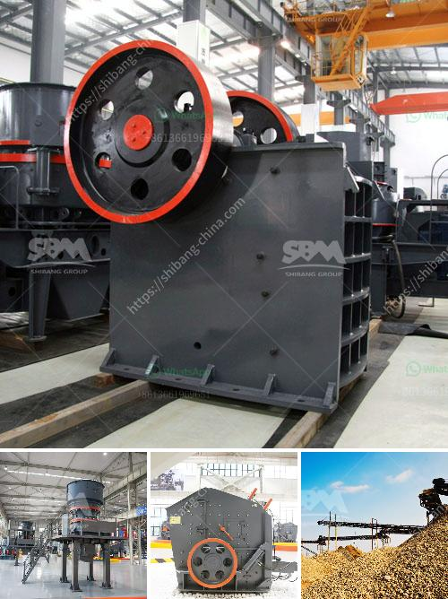

<h3>100tpd mini cement plant project cost in india</h3>
The 100tpd mini cement plant project cost is affordable for small and medium scale operators. As a leading mini cement plant manufacturer in China, we provide various types of mini cement plants with low cost and high flexibility.

Mini cement plant project cost in India mainly refers to the total cost of the project which includes the expenses for raw materials, construction, equipment and machinery, labor, salaries, and other miscellaneous expenses. However, the 100tpd mini cement plant project cost can be lower or higher due to different production capacity and raw materials.

According to different cement plant manufacturers, the mini cement plant price ranges from $50,000 to $1,000,000. Some suppliers may offer custom-made mini cement plant solutions, so the final cost will vary depending on the chosen plant size and specifications.

To better understand the project cost of 100tpd mini cement plant in India, let's consider the core factors affecting the project cost.

1. Capacity: The capacity of the cement plant mainly determines the size of the equipment. A 100tpd mini cement plant could be a vertical shaft kiln or a rotary kiln. If the capacity is higher, the size of the kiln will also be larger, which will lead to higher construction and equipment costs.

2. Technology: The technology used in the mini cement plant plays a crucial role in determining the project cost. Advanced technology can enhance the production efficiency and reduce energy consumption, while outdated technology may require more investment in maintenance and repairs.

3. Location: The project cost may also vary depending on the location of the mini cement plant. If the plant is located in a remote area, the transportation cost for raw materials and finished products may increase, adding to the overall cost.

4. Raw materials: The availability and cost of raw materials, such as limestone and gypsum, can affect the project cost. If the raw materials are locally available, it will lower the transportation cost and reduce the project cost.

5. Labor and energy: Labor and energy costs are significant components of the project cost. The labor cost varies from region to region, depending on the prevailing wage rates. Energy costs can be reduced by adopting energy-efficient technologies and using alternative fuels.

In conclusion, the 100tpd mini cement plant project cost in India varies depending on various factors. It is crucial to conduct thorough research and consider all the aspects before making any investment decisions. Additionally, consulting with experienced professionals can provide valuable insights and help achieve a cost-effective and successful mini cement plant project.
<h3>Contact us</h3><ul><li><strong>Whatsapp:&nbsp;<a href="https://wa.me/8613661969651">+8613661969651</a></strong></li><li><a href="https://swt.shibang-china.com/?git&amp;zhl&amp;100tpd mini cement plant project cost in india"><strong>Online Service(chat now)</strong></a></li></ul><h3>Related</h3><ul><li><a href='advantages and disadvantages of ball mill grinding.md'>advantages and disadvantages of ball mill grinding</a></li><li><a href='how to set up a granite quarry crusher.md'>how to set up a granite quarry crusher</a></li><li><a href='types of diaphragm in ball mill.md'>types of diaphragm in ball mill</a></li><li><a href='small scale gypsum powder plant.md'>small scale gypsum powder plant</a></li><li><a href='jual jaw stone advanced bauxite crusher.md'>jual jaw stone advanced bauxite crusher</a></li></ul>