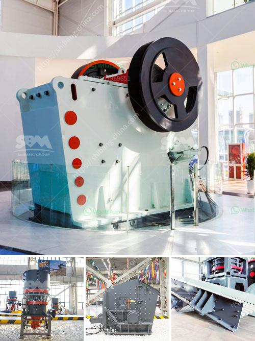

<h3>100tph stone crusher</h3>
Stone crushing industry is an important industrial sector in the country engaged in producing crushed stone of various sizes depending upon the requirement which acts as raw material for various construction activities such as construction of roads, highways, bridges, buildings, canals etc. It is estimated that there are over 12,000 stone crusher units in India. The number is expected to grow further keeping in view the future plans for development of infrastructure of roads, canals and buildings that are required for overall development of the country.

In India, the Stone Crushing Industry sector is estimated to have an annual turnover of Rs. 5000 crore (equivalent to over US$ 1 billion) and is therefore an economically important sector. The sector is estimated to be providing direct employment to over 500,000 people engaged in various activities such as mining, crushing plant, transportation of mined stones and crushed products etc.

Over the years, the stone crushing industry has been exporting its products to various neighboring countries like Nepal, Bangladesh, Bhutan, and Afghanistan to name a few. The vast majority of those owning these stone crushing plants have applied for and been granted licenses allowing them to operate in those locations.

Today, the industry is run by a handful of players who dominate the market. The global leader in stone crushers, Mesto Minerals, successfully created a high-quality product with the ability to attain a gradual reduction in size. Norberg Crushing Inc is another company that is achieving the properties necessary for producing the most durable, reliable, and productive stone crushers on the market. Norberg Crushing Inc has developed these crushers to be able to process various materials and meet the requirements of the construction industry, serving a variety of purposes.

According to Metso, a manufacturer of stone crushers, it is possible to use as many as three crushers in a single crushing production line, meaning that purchasing one single stone crusher can produce cost-saving benefits for users. Crushing equipment needs to consume a significant amount of diesel during the production process, and portable diesel crushers are the perfect solution to this problem. The use of these diesel engines has been approved by environmental protection agencies, making them the most efficient crushers on the market.

Each stone crusher has a fixed feed standard and processing time, so we need to choose the stone crusher with higher crushing efficiency according to the feeding condition and processing time of the crushing equipment. Therefore, when choosing a stone crusher, we should choose according to the actual situation rather than blindly following the trend.

Generally speaking, the working principle of stone crushers, which consists of a movable jaw and cone crushing cavity, mainly applies to the specific operation of crude crushing, medium crushing, and fine crushing. The stone crusher must have a stronger structure, lower operating cost, higher working efficiency, and have better environmental protection performance to meet the demands of the market.

Aiming at the concern of the environmental issues caused by stone crushers, an expert team has made a comprehensive analysis of the stone crushing equipment market and developed a series of stone crushers including high-efficiency hydraulic cone crushers, single-cylinder hydraulic cone crushers, energy-saving screening plants, crushing and screening equipment, etc. We provide a full range of stone crushing machines, such as jaw crushers, impact crushers, cone crushers, and various mobile crushers, which are widely used in various industries.

In 100tph stone crushing line, jaw crusher is often used as primary crushing machine. There are many types of jaw crusher like PE500*750, PE600*900, PE750*1060, PE900*1200, etc. In order to meet different demands of customers, the crusher is usually equipped with various optional devices such as dust collector, steel cutter, and iron separator.

In conclusion, the stone crusher is that the indispensable equipment for the stone crushing line. The equipment used in stone crushing line has advanced operating technology and reliable performance, which is rare in the manufacturing field. The equipment with good quality has a large processing capacity, high output, and the proportion of stones with different specifications is less.

With the progress of mine development and the improvement of crushing technology, more and more stone crusher types and models will make their appearance in the market. The continuous expansion of the global construction industry will also drive the growth of stone crusher industry.
<h3>Contact us</h3><ul><li><strong>Whatsapp:&nbsp;<a href="https://wa.me/8613661969651">+8613661969651</a></strong></li><li><a href="https://swt.shibang-china.com/?git&amp;zhl&amp;100tph stone crusher"><strong>Online Service(chat now)</strong></a></li></ul><h3>Related</h3><ul><li><a href='sell mill of hammers malaysia.md'>sell mill of hammers malaysia</a></li><li><a href='3 raymond roller mill.md'>3 raymond roller mill</a></li><li><a href='coal washing plant for sale grinding mill china.md'>coal washing plant for sale grinding mill china</a></li><li><a href='fly ash processing plant.md'>fly ash processing plant</a></li><li><a href='hammer mill and ball mill.md'>hammer mill and ball mill</a></li></ul>