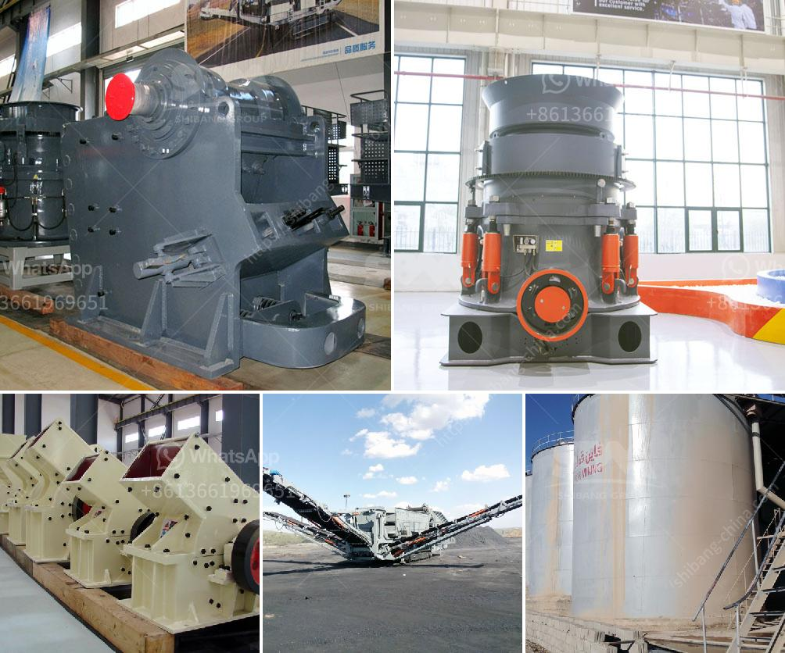

<h3>100tph stone crushing and screening plant</h3>
The stone crushing and screening plant has been successfully manufactured and delivered to a client in Asia earlier this year. With its efficient 100tph crushing capacity, it easily meets the high demands of the construction and mining industries.

The plant consists of a primary jaw crusher, secondary cone crusher, tertiary vertical shaft impact crusher, and vibrating screens. These machines are operated in a closed-circuit system, ensuring minimal pollution and further enhancing the efficiency of the crushing process.

The primary jaw crusher, which breaks down the large stones into smaller pieces, operates through the use of an electric motor. It has a feed opening of 950 x 380 mm and a maximum feed size capacity of 75-200 mm. This allows for a quick and efficient crushing process, reducing the time and energy required for the subsequent stages.

The secondary cone crusher operates through a powerful electric motor, ensuring a high crushing efficiency. It has a feed opening of 1000 mm and a maximum feed size capacity of 120-200 mm. The cone crusher is known for its versatility and can handle a wide range of materials, making it suitable for various applications.

The tertiary vertical shaft impact crusher, known for its superior shaping capabilities, operates through an 185 kW electric motor. This crusher is especially designed to produce high-quality cubical end-products and is an ideal choice for the production of sand and aggregate.

The vibrating screens, which are powered by electric motors, efficiently separate the crushed materials into different sizes, thus ensuring a uniform final product. They are designed with multiple decks, allowing for the separation of different size fractions simultaneously.

Overall, the 100tph stone crushing and screening plant provides an efficient, reliable and superior crushing solution for the construction and mining industries. With its low environmental impact, it is a cost-effective and sustainable option for large-scale quarry operations.

In conclusion, the 100tph stone crushing and screening plant is an ideal choice for producing high-quality end products from a wide range of materials. Its efficiency and reliability make it an excellent investment for the future.
<h3>Contact us</h3><ul><li><strong>Whatsapp:&nbsp;<a href="https://wa.me/8613661969651">+8613661969651</a></strong></li><li><a href="https://swt.shibang-china.com/?git&amp;zhl&amp;100tph stone crushing and screening plant"><strong>Online Service(chat now)</strong></a></li></ul><h3>Related</h3><ul><li><a href='iron ore cruseher plant price.md'>iron ore cruseher plant price</a></li><li><a href='how to make a talcum powder.md'>how to make a talcum powder</a></li><li><a href='talcum powder making formulation.md'>talcum powder making formulation</a></li><li><a href='small cone crushers.md'>small cone crushers</a></li><li><a href='cement clinker grinding unit.md'>cement clinker grinding unit</a></li></ul>