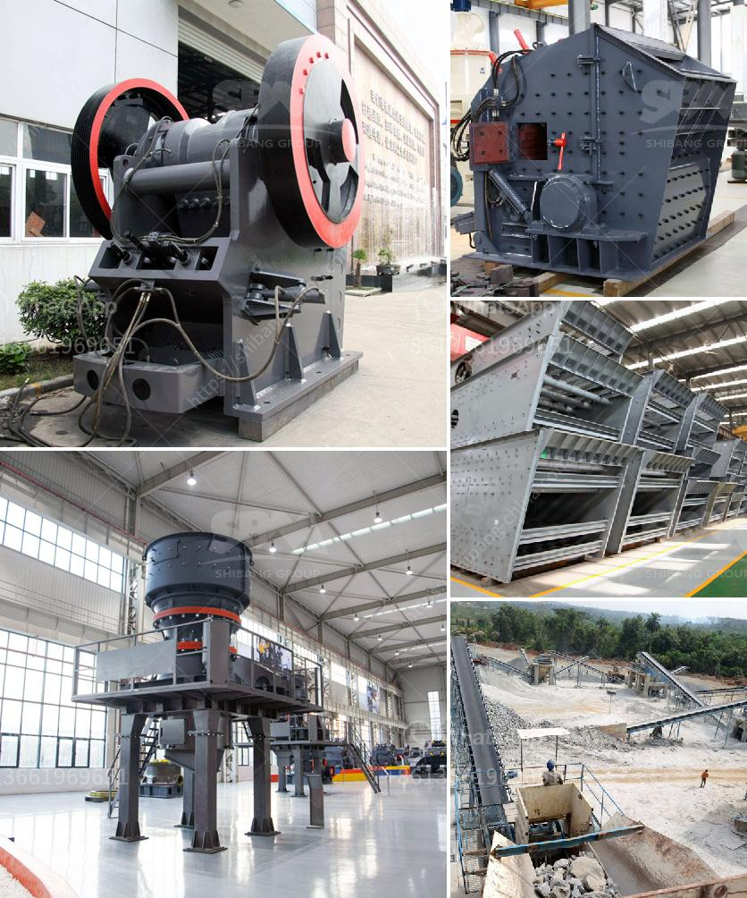

<h3>100tph used crusher plant for sale</h3>
Are you in need of a reliable and efficient crusher plant for your construction projects? Look no further than the 100tph used crusher plant for sale. This well-designed and sturdy machine can deliver high productivity and efficiency while ensuring optimal performance and minimal downtime. In this article, we will explore the features and advantages of the 100tph used crusher plant, which guarantees exceptional results for your crushing needs.

The 100tph used crusher plant is an ideal choice for medium-sized to large-scale construction projects. Its versatile design allows it to handle a wide range of materials and ensure excellent crushing performance. This plant is equipped with a powerful jaw crusher, which ensures efficient processing of even the hardest and most abrasive materials. It can easily crush various types of stones, rocks, and ores, making it suitable for both primary and secondary crushing.

One of the key advantages of the 100tph used crusher plant is its high productivity. With its robust construction and advanced crushing technology, this plant can deliver consistent and uniform crushed materials, maximizing the output. Whether you need to crush large quantities of gravel, limestone, or granite, this machine can handle the task with ease. The adjustable settings of the jaw crusher allow you to control the size of the crushed materials, ensuring optimal results for your specific requirements.

In addition to its excellent performance, the 100tph used crusher plant is also highly efficient. It is designed to minimize energy consumption while maintaining high levels of productivity. The advanced technology used in this plant reduces the wastage of materials, resulting in cost savings for your projects. Furthermore, the machine is equipped with a reliable and low-maintenance engine, which contributes to its overall efficiency and reliability.

Another notable feature of the 100tph used crusher plant is its mobility. This machine can be easily transported to different locations, allowing you to use it in multiple construction sites. Its compact design and robust construction make it suitable for both indoor and outdoor use. The integrated control panel and user-friendly interface ensure hassle-free operation and easy maintenance. This plant can be set up and ready for operation in a short period, saving you valuable time and effort.

When it comes to purchasing a used crusher plant, it is crucial to ensure reliable performance and long-term durability. The 100tph used crusher plant undergoes thorough quality checks to ensure that it meets the highest standards. Additionally, it comes with a warranty and after-sales support, providing you with peace of mind and the confidence that you are investing in a superior quality machine.

In conclusion, the 100tph used crusher plant is a reliable and efficient solution for your crushing needs. With its high productivity, excellent crushing performance, and low maintenance requirements, this plant is suitable for various construction projects. Its mobility and versatility make it a valuable asset for contractors looking to optimize their operations. Invest in the 100tph used crusher plant today and experience the benefits of a high-quality and cost-effective crushing solution.
<h3>Contact us</h3><ul><li><strong>Whatsapp:&nbsp;<a href="https://wa.me/8613661969651">+8613661969651</a></strong></li><li><a href="https://swt.shibang-china.com/?git&amp;zhl&amp;100tph used crusher plant for sale"><strong>Online Service(chat now)</strong></a></li></ul><h3>Related</h3><ul><li><a href='crusher mill for china price.md'>crusher mill for china price</a></li><li><a href='ballast crushing equipment in kenya.md'>ballast crushing equipment in kenya</a></li><li><a href='cone crushers for sale south africa.md'>cone crushers for sale south africa</a></li><li><a href='vsi crusher suppliers in europe.md'>vsi crusher suppliers in europe</a></li><li><a href='mobile limestone crusher for sale indonessia.md'>mobile limestone crusher for sale indonessia</a></li></ul>