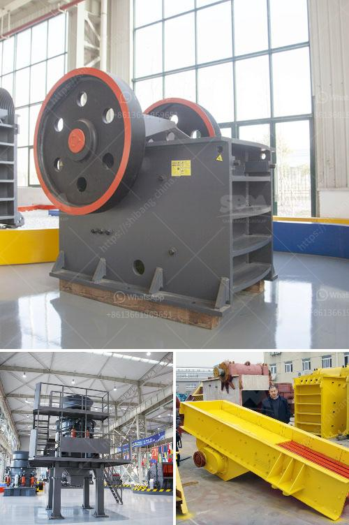

<h3>150 tpd cement line price</h3>
The cement industry plays a crucial role in the infrastructure development of any country. With increasing population and urbanization, the demand for cement is continuously rising. To meet this demand, cement manufacturers need to expand their production capacity. One such way to achieve this is by setting up a new cement line.

A 150 TPD (tonnes per day) cement line is a popular choice among small to medium-sized cement manufacturers. This capacity allows them to produce a significant amount of cement to meet market demands without overburdening their resources. However, the cost of setting up a 150 TPD cement line can vary depending on various factors.

There are several essential components involved in establishing a cement line, such as crushers, raw material mills, kiln, clinker coolers, and cement mills. The prices of these components can vary depending on their quality, brand, and origin. Additionally, other costs such as transportation, installation, and labor also need to be considered.

On average, the estimated cost of setting up a 150 TPD cement line can range from $2 million to $5 million. However, it is essential to note that this is just an estimate, and the final cost can be higher or lower depending on the specific requirements and conditions of the project.

Apart from the initial investment, there are other ongoing costs involved in maintaining and operating a cement line. These costs include raw material procurement, energy consumption, maintenance, and labor expenses. These factors need to be carefully calculated to ensure long-term profitability and sustainability of the cement line.

In conclusion, the price of setting up a 150 TPD cement line can range from $2 million to $5 million. However, it is crucial for cement manufacturers to carefully evaluate their specific requirements and consider all associated costs before making any investment. Additionally, a thorough analysis of the market demand and competition should also be conducted to ensure the viability of the project.
<h3>Contact us</h3><ul><li><strong>Whatsapp:&nbsp;<a href="https://wa.me/8613661969651">+8613661969651</a></strong></li><li><a href="https://swt.shibang-china.com/?git&amp;zhl&amp;150 tpd cement line price"><strong>Online Service(chat now)</strong></a></li></ul><h3>Related</h3><ul><li><a href='concrete crusher made in japan.md'>concrete crusher made in japan</a></li><li><a href='enquiry impact crusher.md'>enquiry impact crusher</a></li><li><a href='standards sizes of conveyor belts.md'>standards sizes of conveyor belts</a></li><li><a href='tph stone crusher.md'>tph stone crusher</a></li><li><a href='calculations for belt conveyor structural bents.md'>calculations for belt conveyor structural bents</a></li></ul>