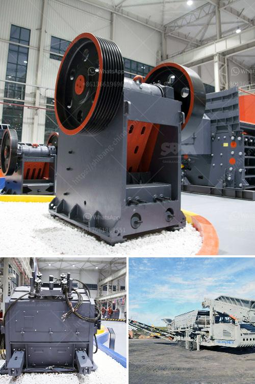

<h3>20 tph ball mills price</h3>
A ball mill is a type of grinder used to grind materials into extremely fine powder for use in mineral dressing processes, paints, pyrotechnics, ceramics, and selective laser sintering. The global ball mill market is segmented on the basis of type, application, and geography. The global Ball Mill market was valued at US$ XX.X Mn in 2018 and is projected to increase significantly at a CAGR of x.x% from 2019 to 2028. Ball Mill Market Scope: By type, the market is segmented into Wet grinding Ball Mill and Dry grinding Ball Mill. By application, the market is divided into Metal Mining and Mineral Mining.

Based on geography, market is analyzed across North America, Europe, Asia-Pacific, Latin America, and Middle East and Africa. Major players profiled in the report include DCD, Metso, FLSmidth, Furukawa, KHD Humboldt Wedag, Gebr. Pfeiffer, Outotec, MIKRONS, CITIC HIC, Shenyang Metallurgy, and Others.

In an insight outlook, this research report has dedicated to several quantities of analysis industry research (global industry trends) and Ball Mill market share analysis of high players, along with company profiles, and which collectively include about the fundamental opinions regarding the market landscape; emerging and high-growth sections of the Ball Mill market; high-growth regions; and market drivers, restraints, and also market chances.

The analysis covers Ball Mill market and its advancements across different industry verticals as well as regions. It targets estimating the current market size and growth potential of the global Ball Mill Market across sections such as also application and representatives.

Additionally, the analysis also has a comprehensive review of the crucial players on the Ball Mill market together side their company profiles, SWOT analysis, latest advancements, and business plans.

1. To equitably share in-depth info regarding the crucial elements impacting the increase of industry (growth capacity, chances, drivers, and industry-specific challenges and risks).

3. To endeavor the amount and value of Ball Mill sub-markets, depending on key regions (various vital states).

4. To analyze Ball Mill Market concerning growth trends, prospects, and also their participation in the entire sector.

5. To examine and study the Ball Mill Market size (volume & value) from the company, essential regions/countries, products, and application, background information from 2013 to 2018, and also prediction to 2029.

6. Primary worldwide Ball Mill Market manufacturing companies, to specify, clarify and analyze the product sales amount, value and market share, market rivalry landscape, SWOT analysis, and development plans for future.

7. To examine competitive progress such as expansions, arrangements, new product launches, and acquisitions on the market.

In this study, the years considered to estimate the market size of the Ball Mill Market are as follows:

This report includes the estimation of market size for value (million USD) and volume (K Units). Both top-down and bottom-up approaches have been used to estimate and validate the market size of the Ball Mill Market, to estimate the size of various other dependent submarkets in the overall market. Key players in the market have been identified through secondary research, and their market shares have been determined through primary and secondary research. All percentage shares split, and breakdowns have been determined using secondary sources and verified primary sources.
<h3>Contact us</h3><ul><li><strong>Whatsapp:&nbsp;<a href="https://wa.me/8613661969651">+8613661969651</a></strong></li><li><a href="https://swt.shibang-china.com/?git&amp;zhl&amp;20 tph ball mills price"><strong>Online Service(chat now)</strong></a></li></ul><h3>Related</h3><ul><li><a href='gold stamp mill for sale zim price.md'>gold stamp mill for sale zim price</a></li><li><a href='ball mill process.md'>ball mill process</a></li><li><a href='small scale gold mining equipment for sale auction.md'>small scale gold mining equipment for sale auction</a></li><li><a href='typical particle size of roll crusher.md'>typical particle size of roll crusher</a></li><li><a href='calculation coal crusher.md'>calculation coal crusher</a></li></ul>