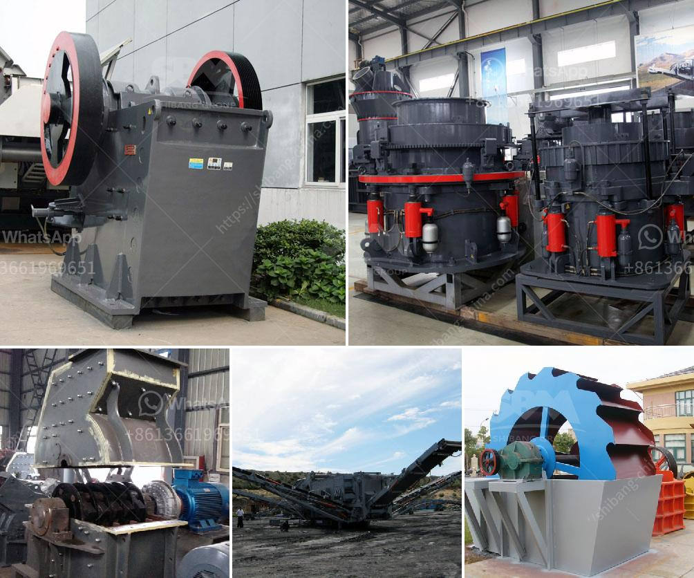

<h3>200 mesh ore grinder cost</h3>
An ore grinder is an essential piece of equipment in various industries that specialize in processing minerals and ores. The 200-mesh ore grinder, in particular, is widely used for finely grinding materials to a particle size of 200 mesh or lower. In this article, we will delve into the cost factors associated with owning a 200-mesh ore grinder and explore the reasons why it is a worthy investment for businesses in the mining sector.

1. Equipment price: The initial cost of a 200-mesh ore grinder can vary depending on several factors, such as the manufacturer, model, and specifications. Generally, the more advanced the features and capabilities, the higher the price tag of the equipment. Other factors that impact the cost include the overall build quality, warranty, and customer support provided by the manufacturer.

2. Operational costs: Apart from the purchase price, it is crucial to consider the ongoing operational costs associated with an ore grinder. These costs typically include electricity consumption, maintenance, and the replacement of consumable parts such as grinding discs or blades. It is important to factor in these costs over the expected lifespan of the machine to get a clear understanding of the long-term investment required.

1. Enhanced productivity: A 200-mesh ore grinder allows for a more efficient grinding process, ensuring a higher level of particle size reduction. This equipment can consistently produce smaller particle sizes, which are often required in mineral processing for various purposes such as mineral separation, extraction, or chemical reactions. By achieving the desired fineness, businesses can enhance productivity and produce higher quality end products.

2. Improved product quality: The ability to finely grind to a 200-mesh particle size ensures that the ground material is consistent and evenly sized. This is particularly crucial for industries that rely on specific particle sizes for downstream processing or customer requirements. By invest in a reliable 200-mesh ore grinder, businesses can consistently achieve the desired product quality, leading to improved customer satisfaction and increased market competitiveness.

3. Energy efficiency: Modern 200-mesh ore grinders are designed to be energy efficient, employing advanced technologies that minimize energy consumption while maximizing productivity. By investing in an energy-efficient grinder, businesses can reduce their operational costs in the long run by consuming less electricity and reducing their overall carbon footprint.

When considering the cost of a 200-mesh ore grinder, it is essential to evaluate both the initial purchase price and the long-term operational costs. While the initial investment might seem substantial, the benefits offered by a well-designed ore grinder can outweigh the costs over time. Enhanced productivity, improved product quality, and energy efficiency are some key factors that make the acquisition of a 200-mesh ore grinder a sensible investment for businesses in the mining industry. By choosing a reputable manufacturer and investing in regular maintenance, businesses can ensure that their ore grinder operates efficiently and reliably for years to come.
<h3>Contact us</h3><ul><li><strong>Whatsapp:&nbsp;<a href="https://wa.me/8613661969651">+8613661969651</a></strong></li><li><a href="https://swt.shibang-china.com/?git&amp;zhl&amp;200 mesh ore grinder cost"><strong>Online Service(chat now)</strong></a></li></ul><h3>Related</h3><ul><li><a href='ball mill how to grind mineral.md'>ball mill how to grind mineral</a></li><li><a href='project report of dolomite powder plant.md'>project report of dolomite powder plant</a></li><li><a href='stone crusher machine price in philippines.md'>stone crusher machine price in philippines</a></li><li><a href='mining and quarry machines manifactures.md'>mining and quarry machines manifactures</a></li><li><a href='cement crusher machines price in india.md'>cement crusher machines price in india</a></li></ul>