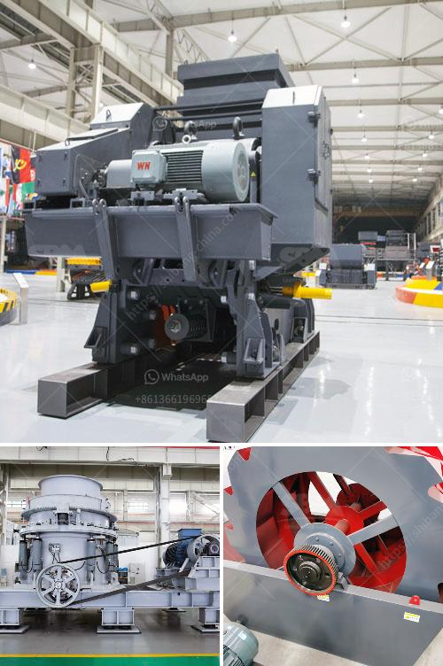

<h3>200 tph rock crusher</h3>
The 200 tph rock crusher is the most commonly used crusher plants for limestone, granite, basalt, conglomerate, dolomite, quartzite, and other types of stones in mining, quarry, construction, and other industries. With its simplicity, compactness, and cost-effectiveness, it has become one of the most popular crushing equipment used globally.

This rock crusher comes with a heavy-duty design and robust construction. It boasts a high capacity and a rugged frame for strength and durability. The crushing chamber is designed deep, which improves the material throughput and ensures reliable operation even for hard and abrasive rocks.

The 200 tph rock crusher features a stable frame, ensuring high-quality construction and efficient crushing performance. It is equipped with a powerful engine, which enables maximum productivity while reducing fuel consumption. The machine is also designed for easy maintenance and serviceability, minimizing downtime and increasing operational efficiency.

Furthermore, the 200 tph rock crusher offers a wide range of applications. It can crush various materials, including limestone, granite, basalt, and more, making it suitable for different projects and industries. Its adjustable settings allow users to produce different sizes of aggregates, making it versatile and adaptable to specific needs.

In conclusion, the 200 tph rock crusher is a reliable and efficient equipment for crushing intermediate and hard rocks. Its robust construction, high capacity, and versatility make it suitable for various applications in the mining, quarry, construction, and other industries. Whether you need to crush limestone, granite, basalt, or any other material, this rock crusher will deliver excellent performance and reliable operation.
<h3>Contact us</h3><ul><li><strong>Whatsapp:&nbsp;<a href="https://wa.me/8613661969651">+8613661969651</a></strong></li><li><a href="https://swt.shibang-china.com/?git&amp;zhl&amp;200 tph rock crusher"><strong>Online Service(chat now)</strong></a></li></ul><h3>Related</h3><ul><li><a href='stone crushing machine manufacturer.md'>stone crushing machine manufacturer</a></li><li><a href='were to buy old rock crusher.md'>were to buy old rock crusher</a></li><li><a href='making of calcium carbonate calcite powder.md'>making of calcium carbonate calcite powder</a></li><li><a href='sample mining project proposal.md'>sample mining project proposal</a></li><li><a href='cement plant in turkey.md'>cement plant in turkey</a></li></ul>