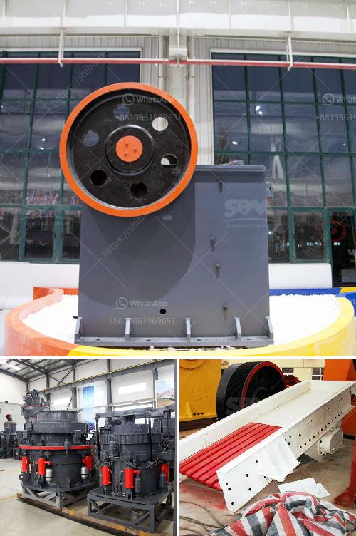

<h3>2000 kilos hammer mill</h3>
The 2000 kilos hammer mill is a powerful tool used in various industries for grinding raw materials into smaller particles. With its robust construction and high-speed rotating hammers, this mill is capable of reducing even the toughest materials to fine powders. 

One of the key features of the 2000 kilos hammer mill is its ability to handle large quantities of raw material. Equipped with a spacious grinding chamber, it can process up to 2000 kilograms of material per hour. This makes it highly efficient and suitable for heavy-duty applications.

In addition to its impressive grinding capacity, this hammer mill offers adjustable settings that allow for precise particle size control. By simply adjusting the hammers' speed or the spacing between them, operators can achieve the desired particle size distribution. This flexibility makes the mill suitable for a wide range of applications, including the production of animal feed, biomass pellets, and various industrial products.

Another advantage of the 2000 kilos hammer mill is its durability. Built with high-quality materials and designed for continuous operation, this machine can withstand the rigors of daily use in demanding environments. Its robust design ensures minimal downtime and maintenance, making it a reliable and cost-effective solution for businesses.

Furthermore, the mill's compact size and ease of operation contribute to its popularity. With a relatively small footprint, it can fit into tight spaces, making it suitable for both large-scale industrial facilities and smaller workshops. Additionally, its user-friendly interface and straightforward controls make it easy for operators to learn and operate, minimizing the learning curve.

Overall, the 2000 kilos hammer mill is a versatile and efficient tool for grinding raw materials. Its high grinding capacity, adjustable settings, durability, compact size, and ease of operation make it an excellent choice for various industries. Whether used for animal feed production, biomass processing, or other industrial applications, this mill is sure to deliver consistent and high-quality results.
<h3>Contact us</h3><ul><li><strong>Whatsapp:&nbsp;<a href="https://wa.me/8613661969651">+8613661969651</a></strong></li><li><a href="https://swt.shibang-china.com/?git&amp;zhl&amp;2000 kilos hammer mill"><strong>Online Service(chat now)</strong></a></li></ul><h3>Related</h3><ul><li><a href='calcium carbonate processing plant cost.md'>calcium carbonate processing plant cost</a></li><li><a href='conventional hammer mill.md'>conventional hammer mill</a></li><li><a href='technical specification belt conveyors.md'>technical specification belt conveyors</a></li><li><a href='second hand conveyor belt adelaide.md'>second hand conveyor belt adelaide</a></li><li><a href='industrial micronized powder grinding mill.md'>industrial micronized powder grinding mill</a></li></ul>