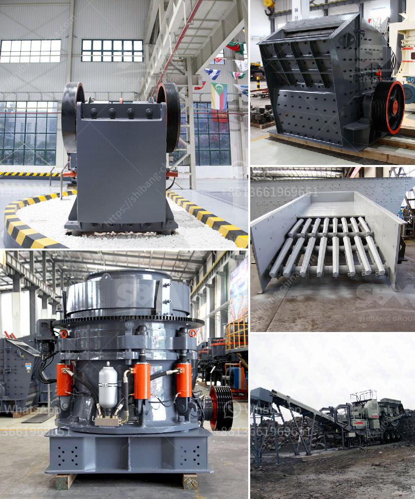

<h3>24 x 15 jaw crusher zenith</h3>
The 24 x 15 jaw crusher manufactured by Zenith is a highly efficient and cost-effective jaw crushing solution for the construction industry. It is equipped with a proven jaw crusher mechanism that enables it to easily handle even the toughest materials. With a capacity range of 100 to 300 tons per hour, the Zenith 24 x 15 jaw crusher is capable of crushing a variety of rock types, including granite, quartz, and basalt.

One of the key features of this jaw crusher is its simplicity of design and operation. It is easy to operate, with user-friendly controls that allow for quick and efficient adjustments. The jaw crusher also features a large feed opening, which allows it to accommodate larger-sized rocks, reducing the need for additional crushing stages. This not only saves time but also reduces the overall cost of the crushing process.

The Zenith 24 x 15 jaw crusher is built to last, with sturdy construction and high-quality components. It is designed to withstand the harsh conditions of the construction site and can operate reliably even in the most demanding environments. The jaw crusher is also equipped with a hydraulic toggle system, which provides an extra layer of protection against overloading, ensuring optimal performance and extended service life.

In addition to its impressive performance capabilities, the Zenith 24 x 15 jaw crusher is also highly versatile. It can be easily transported to different job sites, thanks to its compact design and lightweight structure. This allows for increased flexibility and efficiency in the construction process, as the jaw crusher can be quickly and easily moved to wherever it is needed.

Overall, the Zenith 24 x 15 jaw crusher is a reliable and efficient crushing solution for the construction industry. With its robust design, high capacity, and ease of operation, it offers contractors a cost-effective and practical option for their crushing needs. Whether for small-scale projects or large-scale construction sites, this jaw crusher delivers superior performance and exceptional value for money.
<h3>Contact us</h3><ul><li><strong>Whatsapp:&nbsp;<a href="https://wa.me/8613661969651">+8613661969651</a></strong></li><li><a href="https://swt.shibang-china.com/?git&amp;zhl&amp;24 x 15 jaw crusher zenith"><strong>Online Service(chat now)</strong></a></li></ul><h3>Related</h3><ul><li><a href='ore processing plant for sale.md'>ore processing plant for sale</a></li><li><a href='quartz stone crusher application.md'>quartz stone crusher application</a></li><li><a href='vsi crusher plants in uae.md'>vsi crusher plants in uae</a></li><li><a href='aggregates crushing flow chart process.md'>aggregates crushing flow chart process</a></li><li><a href='want to increase productivity for stone crushers.md'>want to increase productivity for stone crushers</a></li></ul>