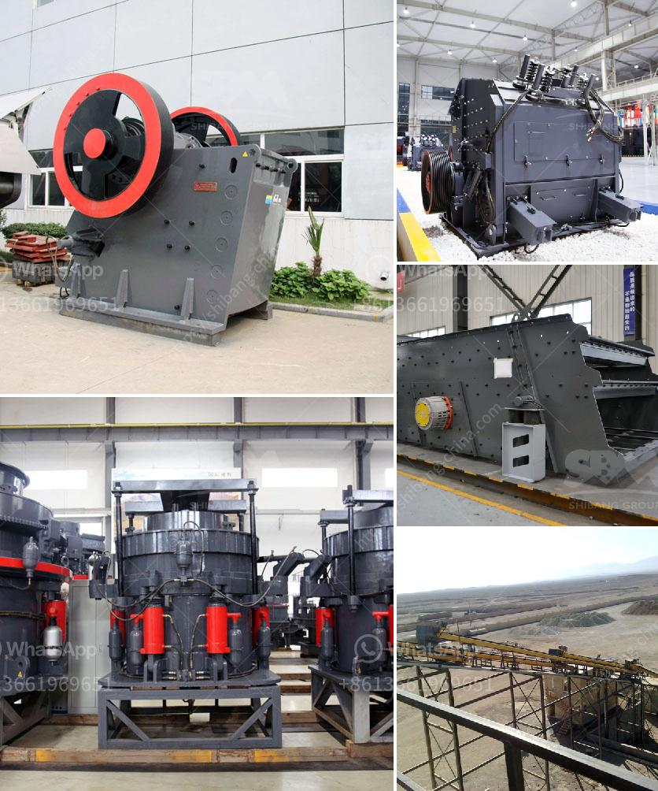

<h3>250 400 pe jaw crusher price list</h3>
PE jaw crusher is an innovative crushing concept, which is designed for flexible applications. It is a popular crushing plant in mining industry; it has optimized performance of big crushing ratio, low energy consumption, low jaw plate wear and easy operation. SBM is a professional jaw crusher supplier and manufacturer in China; we have decades expert experience in crushing technology.

Our PE jaw crusher is for use in mine and quarries. It is of good reliability and high productivity. Feed material size is of 210 to 1200 mm. We have stone crushing machine like cone crusher, impact crusher, vibrating screen and crushing plant for choice. When it comes to price of PE jaw crusher, it varies from 8,000 to 2,000,000 USD, depending on your needs and specifications.

The various models of jaw crusher are designed to handle different capacities of feed. With its deep crushing chamber, large crushing ratio and optimized crushing angle, PE jaw crusher is capable of crushing hard and medium hard ore and rock, such as iron ore, copper ore, limestone, quartz, granite, basalt, diabase, etc.

PE jaw crusher is widely used in stone crushing plant, metallurgy, chemical industry, building materials, mines, railways, water conservancy and much more. The jaw crusher is capable to crush mineral ores, rocks, and slag with crush strength less than 280Mpa. And size of materials fed in the stone jaw crusher should be equal or smaller than the maximum feeding size described in the following technical data.

In conclusion, jaw crusher is the best choice for primary crushing application. It is a high-performance and efficient machine that is tried and tested in different mining and construction fields. SBM will provide you with the best quality in lowest price in the market. Contact us now to get more information about our jaw crusher and a customized quotation according to your specific needs.
<h3>Contact us</h3><ul><li><strong>Whatsapp:&nbsp;<a href="https://wa.me/8613661969651">+8613661969651</a></strong></li><li><a href="https://swt.shibang-china.com/?git&amp;zhl&amp;250 400 pe jaw crusher price list"><strong>Online Service(chat now)</strong></a></li></ul><h3>Related</h3><ul><li><a href='gypsum factory machines in india.md'>gypsum factory machines in india</a></li><li><a href='antimony processing plant design.md'>antimony processing plant design</a></li><li><a href='density of crushed hornfels basalt granite.md'>density of crushed hornfels basalt granite</a></li><li><a href='price crusher price bolivia.md'>price crusher price bolivia</a></li><li><a href='iron processing machine price.md'>iron processing machine price</a></li></ul>