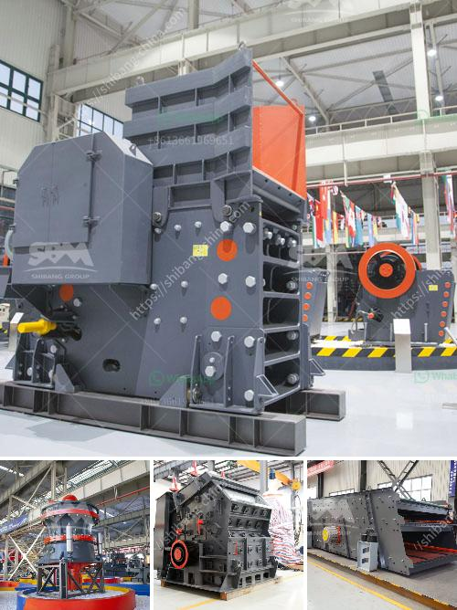

<h3>3 mesh vibrating screen</h3>
The use of vibrating screens in various industries is on the rise due to their efficiency in separating materials of different sizes. One type of vibrating screen that has gained popularity in recent years is the mesh vibrating screen. This article will discuss three types of mesh vibrating screens and highlight their features and advantages.

A woven wire mesh vibrating screen is the most common type of mesh vibrating screen. It is made of high-tensile steel wires that are woven into a mesh pattern. The woven wire mesh provides excellent strength and durability, making it suitable for heavy-duty applications. This type of vibrating screen is commonly used in mining, aggregate, and recycling industries to separate solid materials based on their size. Its precise mesh openings allow for accurate screening and efficient separation of different particle sizes.

A polyurethane mesh vibrating screen is known for its high flexibility, abrasion resistance, and durability. It is made of polyurethane material that has excellent mechanical properties. The polyurethane mesh can withstand heavy loads, making it ideal for applications that involve screening abrasive or corrosive materials. Additionally, this type of vibrating screen offers enhanced screening efficiency due to its self-cleaning ability. It prevents clogging and blinding, resulting in a continuous and uninterrupted screening process.

A perforated plate vibrating screen is a variation of the mesh vibrating screen. Instead of woven wires or polyurethane mesh, it consists of perforated plates with regularly spaced holes. The perforated plates are usually made of stainless steel or carbon steel and offer high strength and rigidity. This type of vibrating screen is commonly used in applications that require maximum throughput and efficient screening of large-sized materials. The perforated plate design allows for better screening of oversized particles, enhancing the overall screening performance.

In conclusion, mesh vibrating screens are a versatile and efficient solution for material separation in various industries. Whether it is a woven wire mesh, polyurethane mesh, or perforated plate, each type offers unique features and advantages. By selecting the appropriate mesh vibrating screen, industries can ensure accurate screening, efficient material separation, and increased productivity.
<h3>Contact us</h3><ul><li><strong>Whatsapp:&nbsp;<a href="https://wa.me/8613661969651">+8613661969651</a></strong></li><li><a href="https://swt.shibang-china.com/?git&amp;zhl&amp;3 mesh vibrating screen"><strong>Online Service(chat now)</strong></a></li></ul><h3>Related</h3><ul><li><a href='conveyor belts in the construction.md'>conveyor belts in the construction</a></li><li><a href='jaw crusher 24x36.md'>jaw crusher 24x36</a></li><li><a href='raymond mill in chennai.md'>raymond mill in chennai</a></li><li><a href='components of mobile coal processing plant.md'>components of mobile coal processing plant</a></li><li><a href='mobile gold processing plant with price.md'>mobile gold processing plant with price</a></li></ul>