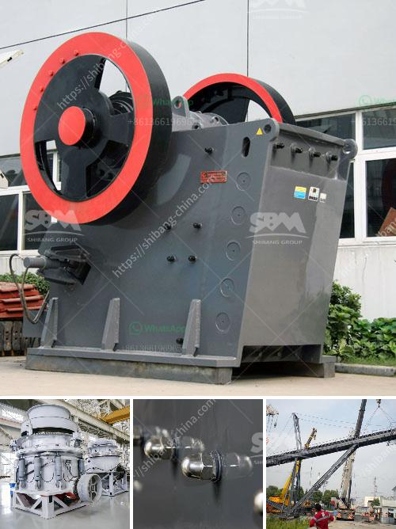

<h3>3 raymond roller mill</h3>
Raymond Roller Mill is a renowned grinding machine that is primarily utilized for processing non-metallic ores into fine powders. With the capability to quickly grind materials to a uniform fineness, this mill is widely used in the industrial sectors of mining, metallurgy, chemical engineering, and others. In this article, we will explore three Raymond Roller Mills and their unique features.

The Raymond Roller Mill 3R2715 is a popular model in the Raymond grinding mill market. With a compact structure, this machine offers a small footprint, making it convenient to use and maintain. The grinding roller assembly is equipped with advanced technical structures that improve the grinding efficiency, ensuring that a high fineness product can be obtained.

The Raymond Roller Mill 3R2715 has a power of 22KW and a production capacity of 1.5-4.5 tons per hour. It is an ideal choice for small-scale powder production projects.

The Raymond Roller Mill 4R3216 is a model with an improved design. Compared to the conventional Raymond mill, it has higher grinding efficiency, lower power consumption, and a smaller system footprint. It is an advanced equipment that helps to enhance production capacity while reducing energy consumption.

This mill is equipped with a high-performance powder concentrator, which enables precise classifying control and improves the particle size distribution. With a power of 37KW and a production capacity of 1.8-5 tons per hour, this model is suitable for medium-scale powder production enterprises.

The Raymond Roller Mill 5R4121 is a flagship model in the Raymond grinding mill market. With a high grinding efficiency, advanced design, and longer service life, this machine stands out among the many competing models. This mill is equipped with a unique patented air-powered dust chute system, which effectively controls the dust emission during the grinding process, providing a cleaner and healthier working environment.

The Raymond Roller Mill 5R4121 has a power of 75KW and a production capacity of 7-16 tons per hour. It is widely used in large-scale and high-demand powder production projects, such as cement plants, power plants, and metallurgical enterprises.

Raymond Roller Mills are well-regarded in the grinding mill market due to their superb grindability and efficiency. These three models, the 3R2715, 4R3216, and 5R4121, are all ideal choices for different application scenarios, catering to the needs of various customers. Whether it is small-scale or large-scale production, these machines provide reliable and stable operation, assisting in achieving excellent grinding results. With continuous technological advancements, the Raymond Roller Mills will continue to be an essential equipment in the powder processing industry.
<h3>Contact us</h3><ul><li><strong>Whatsapp:&nbsp;<a href="https://wa.me/8613661969651">+8613661969651</a></strong></li><li><a href="https://swt.shibang-china.com/?git&amp;zhl&amp;3 raymond roller mill"><strong>Online Service(chat now)</strong></a></li></ul><h3>Related</h3><ul><li><a href='difference between vsi and sand making machine.md'>difference between vsi and sand making machine</a></li><li><a href='stone crushing quarry equipment.md'>stone crushing quarry equipment</a></li><li><a href='raymond mill manufacturer in india.md'>raymond mill manufacturer in india</a></li><li><a href='jaw crushers 100tph.md'>jaw crushers 100tph</a></li><li><a href='pe 500 750 jaw crusher price.md'>pe 500 750 jaw crusher price</a></li></ul>