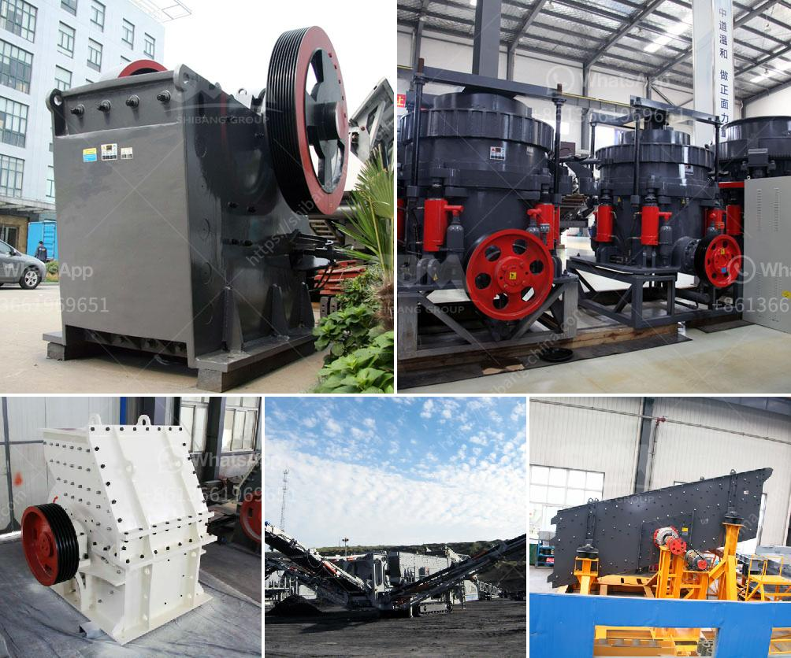

<h3>36 jaw crusher for rent edmonton</h3>
Looking for a jaw crusher for rent in Edmonton? Look no further than the 36 jaw crusher! It is a versatile and powerful machine that is sure to meet your crushing needs. With its ability to crush a wide variety of materials, from hard granite to recycled concrete, the 36 jaw crusher is an ideal choice for any job. 

The 36 jaw crusher features a heavy-duty design that can handle even the toughest materials. Its large feed opening allows for high-capacity crushing, while its hydraulic adjustment system ensures that you can adjust the settings to meet your specific requirements. Whether you need a coarse or fine crushing result, the 36 jaw crusher can deliver.

Renting a jaw crusher in Edmonton offers several advantages. Firstly, it allows you to save money by avoiding the expensive upfront costs of purchasing a crusher. Renting also gives you the flexibility to choose the duration of the rental period that best suits your project's needs. This way, you only pay for the crusher when you actually need it.

Another benefit of renting the 36 jaw crusher is that you can try before you buy. If you are unsure whether this crusher is the right fit for your operations, renting allows you to test its performance and determine if it meets your expectations. This way, you can make an informed decision about whether to invest in buying a jaw crusher in the future.

When renting the 36 jaw crusher in Edmonton, it is crucial to choose a reputable rental company that offers reliable equipment and excellent customer service. Make sure to inquire about maintenance and servicing options to ensure that the machine stays in top condition throughout your rental period.

In conclusion, the 36 jaw crusher is a powerful and versatile machine that is perfect for any job requiring efficient crushing. Renting this crusher in Edmonton can provide you with the flexibility, cost savings, and the opportunity to test its performance before making any long-term commitment. So, if you are in need of a jaw crusher, consider renting the 36 jaw crusher today!
<h3>Contact us</h3><ul><li><strong>Whatsapp:&nbsp;<a href="https://wa.me/8613661969651">+8613661969651</a></strong></li><li><a href="https://swt.shibang-china.com/?git&amp;zhl&amp;36 jaw crusher for rent edmonton"><strong>Online Service(chat now)</strong></a></li></ul><h3>Related</h3><ul><li><a href='chrome ore concentrate plant.md'>chrome ore concentrate plant</a></li><li><a href='ball mill manufacturers gypsum.md'>ball mill manufacturers gypsum</a></li><li><a href='machine to make dolomite powder.md'>machine to make dolomite powder</a></li><li><a href='cost of tph stage crushing plant.md'>cost of tph stage crushing plant</a></li><li><a href='price stone crusher.md'>price stone crusher</a></li></ul>