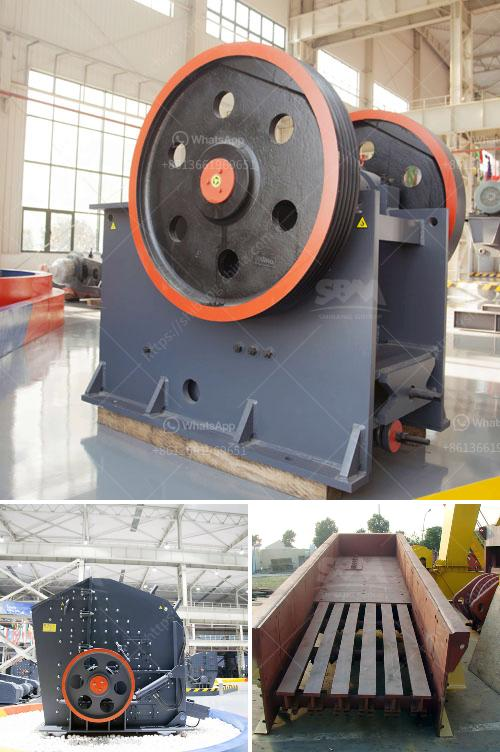

<h3>5 micron grinding mill</h3>
In the world of industrial machinery, there are various types of grinding mills available to grind different materials and achieve different particle sizes. One such mill is the 5 micron grinding mill, which is designed to produce ultra-fine powders with a particle size of less than 5 microns.

A 5 micron grinding mill is widely used in industries such as mining, chemical engineering, pharmacy, and construction materials. It is suitable for grinding various non-flammable and explosive materials with Mohs hardness below 9.3 and humidity below 6%. Some common materials that can be processed by this mill include limestone, calcite, calcium carbonate, dolomite, barite, talc, gypsum, diabase, quartz, bentonite, bauxite, iron ore, and more.

The key feature of a 5 micron grinding mill is its high efficiency and low energy consumption. It is equipped with a powerful motor that can generate a substantial amount of energy, allowing the mill to grind materials at a faster rate. Additionally, the mill is designed with a unique airflow system that helps to improve the grinding efficiency by transporting the fine particles out of the mill and preventing them from sticking to the grinding chamber.

Moreover, the 5 micron grinding mill is equipped with a precision grading system that ensures the produced powders have a uniform particle size distribution. This is crucial for industries that require consistent quality and performance in their end products. The mill also has a user-friendly control system that allows operators to easily adjust the grinding parameters according to their specific requirements.

In conclusion, the 5 micron grinding mill is a versatile machine that offers a cost-effective solution for manufacturers looking to produce ultra-fine powders. With its high efficiency, low energy consumption, and precise particle size control, it is an ideal choice for various industries. Whether you need to grind limestone, calcite, or any other material, this mill can help you achieve the desired particle size, improving the overall efficiency and quality of your production process.
<h3>Contact us</h3><ul><li><strong>Whatsapp:&nbsp;<a href="https://wa.me/8613661969651">+8613661969651</a></strong></li><li><a href="https://swt.shibang-china.com/?git&amp;zhl&amp;5 micron grinding mill"><strong>Online Service(chat now)</strong></a></li></ul><h3>Related</h3><ul><li><a href='mining hammer mill suppliers.md'>mining hammer mill suppliers</a></li><li><a href='coal mill 250 ton.md'>coal mill 250 ton</a></li><li><a href='crusher supplier saudi.md'>crusher supplier saudi</a></li><li><a href='coal pulverisers machines.md'>coal pulverisers machines</a></li><li><a href='prices of stone crusher in dubai.md'>prices of stone crusher in dubai</a></li></ul>