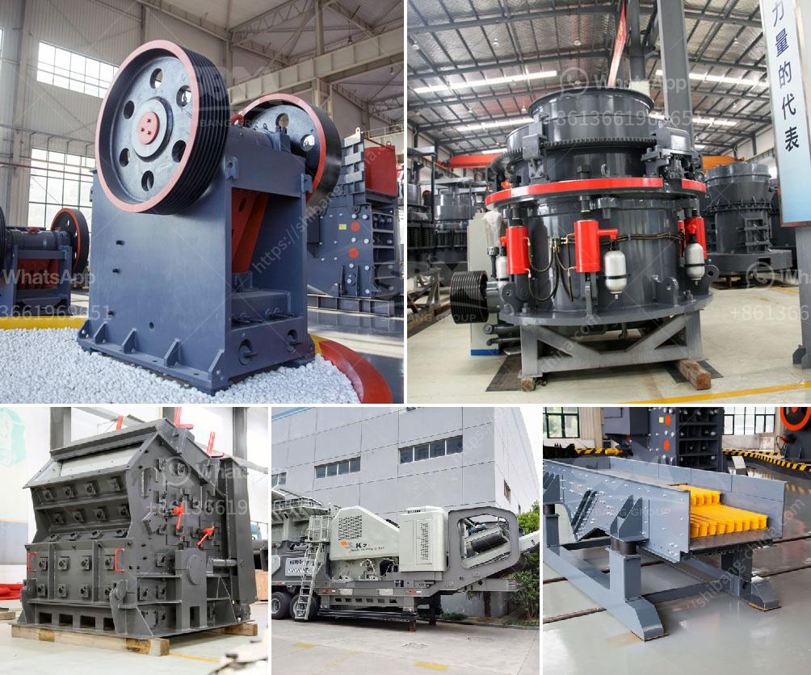

<h3>5 raymond roller mill</h3>
In the world of industrial machinery, Raymond Roller Mill is an essential tool for size reduction processes. A prominent manufacturer, such as Clirik, produces top-quality Raymond Roller Mills, which are specifically designed to handle a wide range of materials. In this article, we will discuss 5 Raymond Roller Mills and their features.

The Classic Raymond Roller Mill, produced by Clirik, is suitable for grinding non-flammable and non-explosive materials with a Mohs hardness of less than 7 and a humidity of less than 6%. It has a wide range of applications in various industries, including mining, metallurgy, chemical engineering, and construction.

The High-Pressure Grinding Mill, another model produced by Clirik, is ideal for processing materials with a hardness level higher than the Classic Raymond Roller Mill. It has a higher output, finer particle size, and better efficiency. This mill is often used in the production of ultrafine powders.

If you are looking for a mill to produce fine powders with high efficiency, then the Micro Powder Grinding Mill is the perfect choice. This model is designed to handle materials with a Mohs hardness of less than 9.3 and a moisture content of 6%. It is widely used in the fields of metallurgy, building materials, chemical industry, and mining.

The Vertical Roller Mill, also known as Raymond Mill, adopts advanced grinding technology to achieve vertical grinding. It is suitable for processing various non-flammable and non-explosive mineral materials with Mohs hardness less than 9.3 and humidity less than 6%. This mill has high grinding efficiency, low power consumption, large feed size, and easy adjustment of product fineness.

For ultrafine grinding applications, the Ultrafine Vertical Roller Mill is a perfect choice. It combines the functions of the Vertical Roller Mill and Micro Powder Mill, and can produce ultrafine powders with fineness reaching up to 3000 mesh. This mill is widely used in the fields of metallurgy, construction, chemical industry, mining, highway construction, and water conservancy.

These 5 Raymond Roller Mills cater to various grinding needs in different industries. They are designed to achieve high grinding efficiency, low energy consumption, and excellent product quality. With their advanced technology and reliable performance, these mills are trusted by many customers worldwide.

In conclusion, Clirik's range of Raymond Roller Mills offer versatile grinding solutions for various materials and applications. Whether you need a mill for general-purpose grinding or ultrafine powder production, these mills are equipped to meet your requirements. Explore the wide range of Raymond Roller Mills, and find the one that suits your needs and preferences.
<h3>Contact us</h3><ul><li><strong>Whatsapp:&nbsp;<a href="https://wa.me/8613661969651">+8613661969651</a></strong></li><li><a href="https://swt.shibang-china.com/?git&amp;zhl&amp;5 raymond roller mill"><strong>Online Service(chat now)</strong></a></li></ul><h3>Related</h3><ul><li><a href='3 raymond roller mill.md'>3 raymond roller mill</a></li><li><a href='turkey of gold refinery project cost.md'>turkey of gold refinery project cost</a></li><li><a href='grinding mill manufacturers.md'>grinding mill manufacturers</a></li><li><a href='cost of stone crushing plant.md'>cost of stone crushing plant</a></li><li><a href='crusher plant dolomite.md'>crusher plant dolomite</a></li></ul>