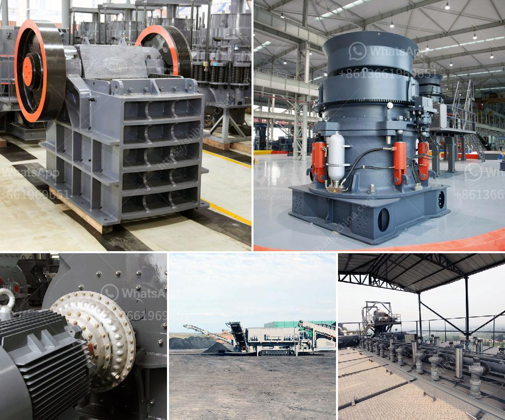

<h3>50tpd slag cement grinding unit cost</h3>
Slag cement is a sustainable alternative to traditional cement, as it is produced from by-products of steel and iron manufacturing processes. The use of slag cement not only reduces carbon emissions but also improves the durability and strength of concrete structures. With growing awareness of sustainability and increased demand for greener construction materials, the establishment of a 50tpd (tons per day) slag cement grinding unit is a promising investment.

The cost of setting up a 50tpd slag cement grinding unit can vary widely depending on factors such as the specific location and market conditions. However, it is estimated to cost around $3 million - $4 million. For smaller-scale operations, a 100tpd unit can be more cost-effective, with estimated costs ranging from $5 million to $7 million. These costs typically include land acquisition, machinery and equipment, installation, and commissioning.

The major cost component in setting up a slag cement grinding unit is the machinery and equipment required. This includes mills, separators, compressors, and electrical control systems. It is essential to choose reliable and energy-efficient equipment to ensure optimal productivity and cost-effectiveness.

Another significant cost consideration is raw material sourcing and transportation. Slag cement is produced by grinding granulated blast furnace slag, which is a by-product of iron and steel manufacturing processes. The availability and cost of slag can vary depending on the location and proximity to steel plants. Establishing a sourcing strategy that ensures a steady and cost-effective supply of slag is crucial for the success of the grinding unit.

Operational costs include labor, utilities, maintenance, and repairs. Hiring skilled personnel and ensuring regular maintenance and inspection of machinery are essential for a smooth operation and to minimize downtime.

Despite the initial investment, a 50tpd slag cement grinding unit can be financially viable, thanks to the demand for sustainable building materials. The unit can generate revenue from the sale of slag cement, a product with a strong market potential. Additionally, the unit can benefit from government incentives and green certifications that promote the use of environmentally friendly construction materials.

To conclude, a 50tpd slag cement grinding unit is an attractive investment opportunity, considering the increasing demand for sustainable building materials. While the initial cost can vary, a well-planned and efficiently operated unit can ensure a significant return on investment. With proper market analysis, sourcing strategies, and cost control measures, this investment can contribute to the growth of the cement industry and the reduction of environmental impact.
<h3>Contact us</h3><ul><li><strong>Whatsapp:&nbsp;<a href="https://wa.me/8613661969651">+8613661969651</a></strong></li><li><a href="https://swt.shibang-china.com/?git&amp;zhl&amp;50tpd slag cement grinding unit cost"><strong>Online Service(chat now)</strong></a></li></ul><h3>Related</h3><ul><li><a href='vertical horizontal ball milling machine.md'>vertical horizontal ball milling machine</a></li><li><a href='coal washing process machine price.md'>coal washing process machine price</a></li><li><a href='small mobile crusher feldspar.md'>small mobile crusher feldspar</a></li><li><a href='stone crusher uganda.md'>stone crusher uganda</a></li><li><a href='cement clinker grinding unit.md'>cement clinker grinding unit</a></li></ul>