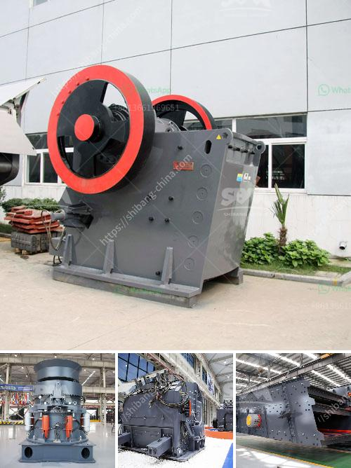

<h3>6inch rock crushing mill in guatemala</h3>
The 6-inch rock crushing mill in Guatemala is a crucial piece of machinery designed to crush rocks into a fine powder. This mill has the potential to significantly improve the efficiency of extracting precious minerals from raw rocks, making it an essential tool for miners and geologists alike.

With its compact size, the 6-inch rock crushing mill is ideal for use in remote locations where larger machinery may not be easily accessible. Its robust construction allows it to withstand challenging conditions and operational demands, ensuring both longevity and reliability.

The mill operates by crushing the rocks against a hard surface, reducing them to smaller fragments. This process exposes more surface area of the rocks, facilitating the extraction of minerals by subsequent techniques such as chemical extraction or flotation. This improved efficiency can potentially increase mineral recovery rates, boosting the economic viability of mining operations.

Additionally, the mill's compact size allows for easy transportation and setup, making it suitable for use in various mining sites across Guatemala. Its versatility is further enhanced by the ability to adjust the size of the crushed rocks, enabling optimization according to specific mineral extraction requirements.

The introduction of the 6-inch rock crushing mill in Guatemala represents a significant step forward in the mining industry. Its efficiency, portability, and adaptability make it a valuable asset for both large-scale mining operations and small-scale prospecting endeavors.

Not only does this mill create opportunities for improved mineral extraction, but it also contributes to the overall growth of the Guatemalan economy. The mining sector plays a vital role in providing employment opportunities and driving economic development, and the availability of advanced machinery such as the 6-inch rock crushing mill only strengthens this contribution.

In conclusion, the 6-inch rock crushing mill in Guatemala promises to revolutionize the mineral extraction process. Its compact size, efficiency, and adaptability make it an essential tool for miners seeking to optimize their operations. By enabling increased mineral recovery rates, this mill serves as a catalyst for economic growth and development in Guatemala's mining sector.
<h3>Contact us</h3><ul><li><strong>Whatsapp:&nbsp;<a href="https://wa.me/8613661969651">+8613661969651</a></strong></li><li><a href="https://swt.shibang-china.com/?git&amp;zhl&amp;6inch rock crushing mill in guatemala"><strong>Online Service(chat now)</strong></a></li></ul><h3>Related</h3><ul><li><a href='crusher stone manufacture from china.md'>crusher stone manufacture from china</a></li><li><a href='copper gold crusher separator.md'>copper gold crusher separator</a></li><li><a href='labratory hammer mill.md'>labratory hammer mill</a></li><li><a href='dolamite 450 mash grinding machine.md'>dolamite 450 mash grinding machine</a></li><li><a href='small scale gold mining equipment for sale auction.md'>small scale gold mining equipment for sale auction</a></li></ul>