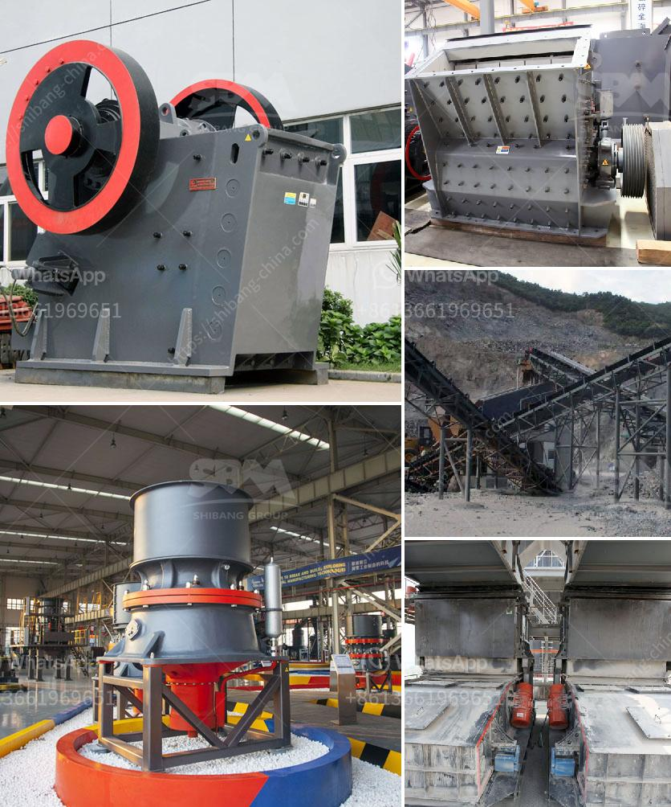

<h3>70 tph limestone crusher weight</h3>
The limestone crusher is a heavy-duty machine that is used to crush limestone into a specific size. It is designed to receive the maximum size of limestone that is delivered from the quarry and produce smaller sizes for various uses in the construction industry. The weight of this crusher is around 70 tons. However, specific weights can vary depending on the size of the model.

The limestone crusher is typically equipped with a jaw crusher or an impact crusher, depending on the required final size. The jaw crusher is responsible for the coarse crushing of the stone. It helps to reduce the size of large rocks into smaller pieces before sending them to the secondary crusher. On the other hand, the impact crusher is used for fine crushing, producing a more uniform and cubical end product.

The 70 tph limestone crusher is a versatile and reliable machine that can handle different types of materials such as coal, limestone, clay, granite, and other minerals. With its compact design, it can be easily transported from one location to another. This crusher is also equipped with a diesel engine that ensures maximum mobility and convenience for both the operator and the machine.

Apart from its weight, the 70 tph limestone crusher has other notable features such as high crushing capacity, adjustable output size, and low energy consumption. This makes it suitable for various applications in the construction industry, including road construction, railway ballast, concrete production, and aggregates for asphalt manufacturing.

In conclusion, the 70 tph limestone crusher is a versatile and reliable machine that is ideal for the crushing of limestone. Its weight and other features make it a suitable choice for various construction applications. Whether it is used in road construction or concrete production, this crusher can deliver consistent and high-quality results.
<h3>Contact us</h3><ul><li><strong>Whatsapp:&nbsp;<a href="https://wa.me/8613661969651">+8613661969651</a></strong></li><li><a href="https://swt.shibang-china.com/?git&amp;zhl&amp;70 tph limestone crusher weight"><strong>Online Service(chat now)</strong></a></li></ul><h3>Related</h3><ul><li><a href='prices of stone crusher in dubai.md'>prices of stone crusher in dubai</a></li><li><a href='stoner cusher price in kenya.md'>stoner cusher price in kenya</a></li><li><a href='how to manufacture jaw crusher.md'>how to manufacture jaw crusher</a></li><li><a href='slag crusher plant.md'>slag crusher plant</a></li><li><a href='cone crushers for 3 mm.md'>cone crushers for 3 mm</a></li></ul>