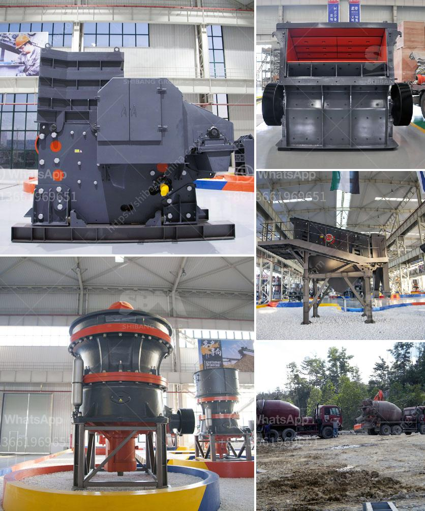

<h3>about used stone crushers in america</h3>
Stone crushing industry in America has been experiencing continuous growth since the beginning of the 21st century. In the United States, crushed stone is primarily used in construction projects, including road construction, building foundations, railways, and cement production. This surge in demand for crushed stone has led to the development of a vast market for used stone crushers.

Used stone crushers are increasingly welcomed by rock processing plants in the United States. Different types of crushers are widely used in the mining industry for reducing the size of rocks and stones. Today, we will focus on the commonly used crushers in the United States.

Jaw Crusher: A jaw crusher is the ideal choice for primary crushing. It has the advantages of high crushing ratio, uniform particle size distribution, simple structure, reliable operation, and easy maintenance. Jaw crushers are commonly used in quarries, mining, demolition, and recycling applications. They are typically used to crush large rocks and stones into smaller sizes for further processing.

Cone Crusher: A cone crusher is used for secondary and tertiary crushing. It is widely used in the mining industry, construction, and demolition debris recycling. With the advancement of technology, cone crushers have evolved to become more efficient and versatile. They can process more materials and provide higher production capacity. Cone crushers are ideal for the production of aggregates for road construction and cement production.

Impact Crusher: An impact crusher is suitable for crushing various materials, including soft and medium-hard stones. It can handle materials with a side length of less than 500mm and a compressive strength of up to 350MPa. Impact crushers are widely used in the mining industry and construction projects due to their high efficiency and excellent performance. They can produce cubic-shaped end products and are commonly used in the production of concrete aggregates.

VSI Crusher: A vertical shaft impact crusher, commonly known as VSI crusher, is often used in the final stage of the crushing process. It can produce cubic-shaped end products and is particularly suitable for manufacturing artificial sand. VSI crushers utilize the rock-on-rock crushing principle, where rocks are accelerated within a rotor and collide with each other, resulting in a crushing process that creates fine particles.

Used stone crushers in America offer numerous benefits over buying new ones. They are usually more affordable, allowing businesses of all sizes to access high-quality crushing equipment. Additionally, used stone crushers are readily available in the market, reducing the lead time for delivery. Furthermore, used crushers have often undergone rigorous inspections and maintenance, ensuring their reliability and durability.

In conclusion, the demand for used stone crushers in America is steadily increasing due to the growth in the construction industry. The various types of crushers available, such as jaw crushers, cone crushers, impact crushers, and VSI crushers, provide versatility and efficiency in crushing different materials. Purchasing used stone crushers can be a cost-effective solution for businesses to meet their crushing requirements.
<h3>Contact us</h3><ul><li><strong>Whatsapp:&nbsp;<a href="https://wa.me/8613661969651">+8613661969651</a></strong></li><li><a href="https://swt.shibang-china.com/?git&amp;zhl&amp;about used stone crushers in america"><strong>Online Service(chat now)</strong></a></li></ul><h3>Related</h3><ul><li><a href='dealers and manufacturers crusher in europe.md'>dealers and manufacturers crusher in europe</a></li><li><a href='price for sand machine.md'>price for sand machine</a></li><li><a href='fairly used stone crusher for sale nigeria.md'>fairly used stone crusher for sale nigeria</a></li><li><a href='high energy ball mill india.md'>high energy ball mill india</a></li><li><a href='mobile limestone crusher for sale indonessia.md'>mobile limestone crusher for sale indonessia</a></li></ul>