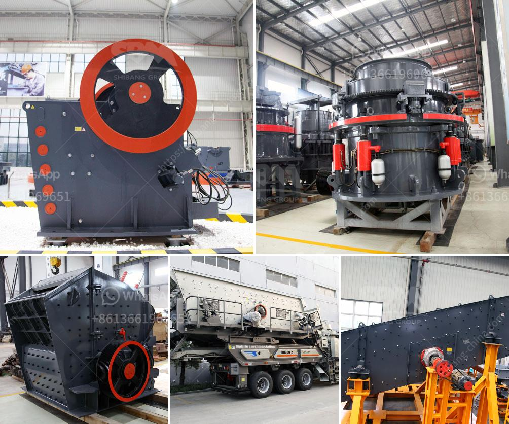

<h3>accounting entry on crushing plant</h3>
When it comes to the accounting aspects of a crushing plant, there are a few key areas to look into. In this article, we will discuss the different accounting entry points for a typical crushing plant, covering the 100-300 words range.

First and foremost, the acquisition of the crushing plant machinery and any related equipment is the starting point for the accounting entries. This includes recording the purchase cost, as well as any additional expenses like transportation or installation fees. These costs should be capitalized and added to the asset's value on the balance sheet.

Once the crushing plant is operational, there are ongoing expenses to consider. These may include fuel costs, maintenance fees, and labor expenses. These costs should be recorded as expenses in the income statement, as they are necessary to keep the plant running smoothly.

Another important accounting entry point is the recognition of revenue from the sales of crushed materials. This can be done by recording the sales revenue and simultaneously reducing the inventory level for any materials sold. It is essential to keep track of the quantity, price, and nature of materials sold to accurately reflect the financial performance of the plant.

Depreciation is a significant accounting aspect to consider for a crushing plant. Over time, the plant's value will diminish due to wear and tear, obsolescence, or other factors. Depreciation should be calculated and recorded periodically to allocate the plant's cost over its useful life. This entry helps in reflecting the accurate value of the plant in the balance sheet and assists in making informed decisions regarding its replacement or upgrade.

Lastly, if any repairs or improvements are made to the crushing plant, these expenses need to be recorded as well. Repairs that maintain or extend the plant's useful life can be capitalized and added to the plant's value. On the other hand, minor repairs or replacements of parts can be recorded as regular expenses.

In conclusion, the accounting entries relating to a crushing plant involve recording costs associated with its acquisition, ongoing expenses, revenue recognition, depreciation, and any repairs or improvements made. Accurate and timely recording of these entries is crucial for maintaining the plant's financial records and evaluating its performance.
<h3>Contact us</h3><ul><li><strong>Whatsapp:&nbsp;<a href="https://wa.me/8613661969651">+8613661969651</a></strong></li><li><a href="https://swt.shibang-china.com/?git&amp;zhl&amp;accounting entry on crushing plant"><strong>Online Service(chat now)</strong></a></li></ul><h3>Related</h3><ul><li><a href='granite milling unit.md'>granite milling unit</a></li><li><a href='manufacturers small concrete brokmachine bangkok.md'>manufacturers small concrete brokmachine bangkok</a></li><li><a href='250 400 pe jaw crusher price list.md'>250 400 pe jaw crusher price list</a></li><li><a href='concrete crusher made in japan.md'>concrete crusher made in japan</a></li><li><a href='granite crushing machine for sale.md'>granite crushing machine for sale</a></li></ul>