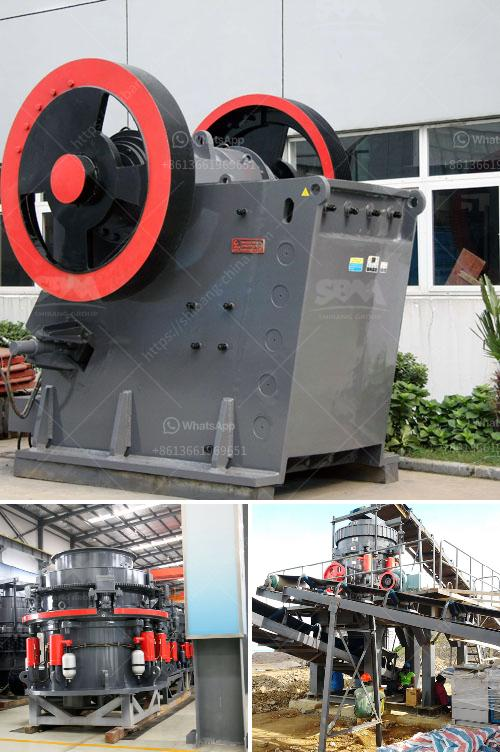

<h3>advantages and disadvantages of ball mill grinding</h3>
A ball mill is a type of grinder used to grind materials into fine powder. It is a cylindrical device used in grinding or mixing materials like ores, chemicals, ceramic raw materials, and paints. Ball mills rotate around a horizontal axis, partially filled with the material to be ground plus the grinding medium.

1. Low energy consumption: Ball mill grinding can be done in dry or wet conditions, requiring minimal energy input. In addition, the ball mill consumes less energy per ton of raw material processed, compared to other traditional grinding methods, such as vertical mills or Raymond mills.

2. High grinding efficiency: The grinding efficiency of ball mill is low and efficient. In order to improve the grinding efficiency, various measures can be taken, such as optimizing the structure of the mill, adjusting the operational parameters of the mill, and adding grinding aids, which can improve the grinding efficiency of the mill and reduce the particle size of the product.

3. Wide range of applications: Ball mill grinding can be used for grinding various materials, such as cement, building materials, metal ores, non-metallic minerals, ceramics, etc. It is widely used in the production of industries such as cement, silicate products, new building materials, refractory materials, fertilizers, black and non-ferrous metal beneficiation, and glass ceramics.

1. Contamination of product: As the grinding media used in the ball mill is non-reactive and hence non-corrosive, metal contamination of the product can be a problem. This is especially true when grinding materials with high hardness or abrasiveness.

2. High maintenance cost: The ball mill requires regular maintenance and repair to keep it in optimal condition. This includes replacing the worn out liners, lubricating the gears, and checking and adjusting the alignment of the mill.

3. Noise and dust pollution: Ball mill grinding produces a significant amount of noise and dust, which can be a nuisance in the workplace and may require additional measures to control the pollution.

In conclusion, ball mill grinding offers several advantages and disadvantages over other traditional grinding methods. While it is an efficient and versatile process, it also has its limitations, such as contamination of product, high maintenance cost, and noise and dust pollution. Therefore, it is important to carefully consider these factors when choosing a grinding method for a specific application.
<h3>Contact us</h3><ul><li><strong>Whatsapp:&nbsp;<a href="https://wa.me/8613661969651">+8613661969651</a></strong></li><li><a href="https://swt.shibang-china.com/?git&amp;zhl&amp;advantages and disadvantages of ball mill grinding"><strong>Online Service(chat now)</strong></a></li></ul><h3>Related</h3><ul><li><a href='harga dan tipe stone crusher indonesia.md'>harga dan tipe stone crusher indonesia</a></li><li><a href='iron ore crushing equipment.md'>iron ore crushing equipment</a></li><li><a href='were to buy old rock crusher.md'>were to buy old rock crusher</a></li><li><a href='feldspar grinding machine chennai suppliers.md'>feldspar grinding machine chennai suppliers</a></li><li><a href='ballast crushing machine small.md'>ballast crushing machine small</a></li></ul>