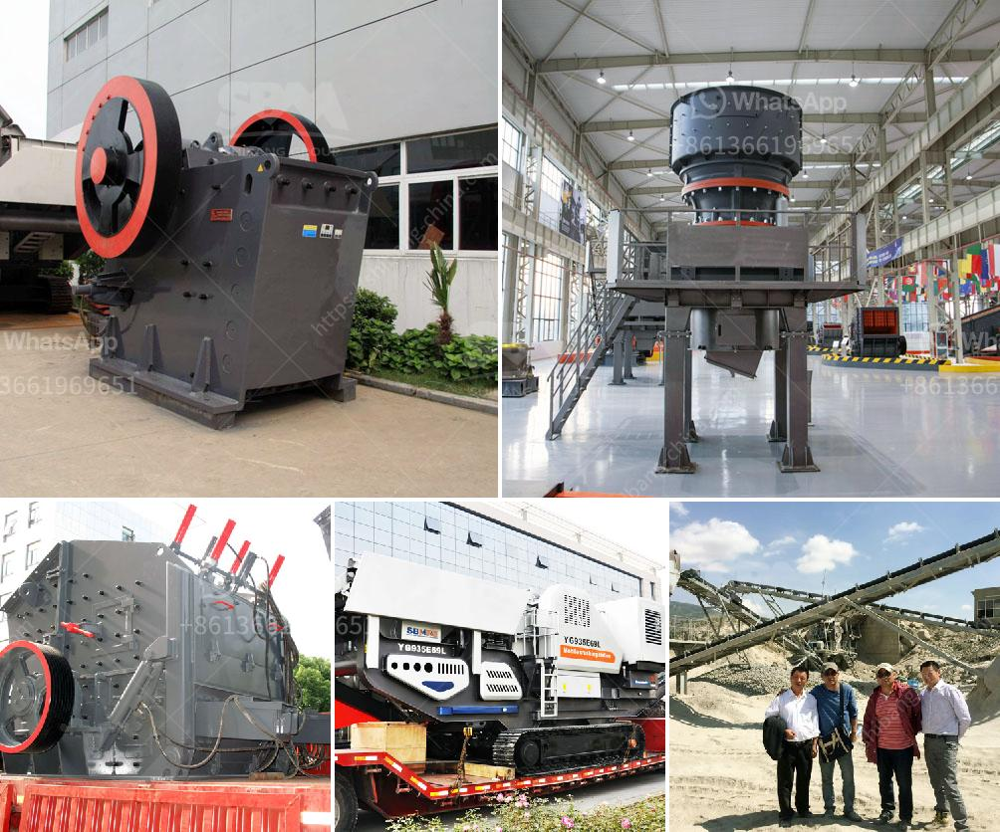

<h3>advantages of reversible impact hammer crusher</h3>
Reversible impact hammer crusher is widely used in the current mining market. It is available for coal, salt, chalk, gypsum, tile, limestone and also fiber structure and broken wood and paper with strong elasticity and tenacity.

1. The hammer crusher has a high speed, a large crushing ratio, and a lot of crushing materials. Thanks to the professional hammer head design, it is more durable and straight. So, the impact crusher can be used for coarse, medium, and fine crushing with a feed size of no more than 1200mm and a compressive strength of no more than 350MPa.

2. A reversible impact hammer crusher can freely adjust the impact plate and clearance between counterattack frame and rotor frame, which can adjust the size of the discharge particle size and particle shape. So, it is suitable for brittle materials with a compressive strength of less than 150MPa, such as coal, limestone, dolomite, cement clinker, and shale.

3. The reversible impact hammer crusher has a long service life of more than 10 times, which can save operation cost and greatly reduce maintenance cost in many industries where raw materials are processed into finished products for chemical industry, hydropower, metallurgy, building materials, and other industries.

4. The current reversible impact hammer crusher improvement shows its advanced structure, reliable performance, stable operation, and low energy consumption. It has forms: a hammer crusher single rotor, a hammer crusher double rotor, and a hammer crusher single-stage hammer. The performance of combined material depends on the hammer head, quality of material, wear resistance, and range of crushed stone.

In summary, reversible impact hammer crusher is the optimal choice, especially for some large-scale construction projects that can achieve efficient crushing, reduce energy consumption, and reduce investment. It can process granite, limestone, concrete, and other materials into required aggregate for construction projects with the advantages of flexible operation, high crushing efficiency, and excellent performance.
<h3>Contact us</h3><ul><li><strong>Whatsapp:&nbsp;<a href="https://wa.me/8613661969651">+8613661969651</a></strong></li><li><a href="https://swt.shibang-china.com/?git&amp;zhl&amp;advantages of reversible impact hammer crusher"><strong>Online Service(chat now)</strong></a></li></ul><h3>Related</h3><ul><li><a href='small scale sand washer machines.md'>small scale sand washer machines</a></li><li><a href='coal washing plant for sale grinding mill china.md'>coal washing plant for sale grinding mill china</a></li><li><a href='cost of vertical roller mill.md'>cost of vertical roller mill</a></li><li><a href='principle of impact crusher.md'>principle of impact crusher</a></li><li><a href='crushers double toggle.md'>crushers double toggle</a></li></ul>