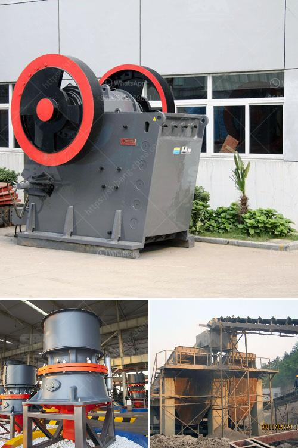

<h3>aggregate crusher for sale in philippines</h3>
Aggregate crusher equipment is an important part of the construction industry and its major application is to produce gravel, sand or rock dust for road and building construction. In recent years, with the rapid development of the construction industry, the demand for aggregate crusher equipment has also increased significantly.

The Philippines is rich in various mineral resources and it is an important producer of sand and gravel aggregates. With the rapid economic development, infrastructure development has become a top priority, which drives the demand for construction aggregates.

Aggregate crusher equipment in the Philippines requires a lot of regular maintenance and regular inspection of equipment components. Common maintenance methods are regular inspection, lubrication, maintenance and adjustment. Aggregate crusher equipment maintenance tips: Tighten the bolts regularly, the moving jaw is cracked or damaged, the bearing has a severe impact sound, the side plate is disconnected, the frame is cracked or broken, etc.

When choosing the right crusher for your construction needs, it’s important to consider not only the type, but also the capacity, price, and manufacturer reputation. There are several types of crushers available in the market including compression crushers, impact crushers, and cone crushers. Each type has its own advantages and disadvantages, so it’s important to carefully evaluate your specific needs before making a decision.

Compression crushers are typically used for primary crushing, while impact crushers and cone crushers are used for secondary or tertiary crushing. The choice of crusher depends on the hardness of the stone and the desired product size. For example, an impact crusher is best suited for producing cubical shaped aggregates for construction projects.

Price is another important factor to consider when purchasing an aggregate crusher. Different types of crushers have different prices based on their features, capacity, and quality. It’s important to compare prices and choose the one that offers the best value for your money.

In the Philippines, there are many reliable crusher manufacturers and suppliers operating in the market. You can find a wide range of crushers from reputable manufacturers such as Sandvik, Metso, and Terex MPS. Some of the leading suppliers of aggregate crusher equipment include:

1. Sandvik – Sandvik is a Swedish company specializing in mining, rock drilling, and materials technology. They offer a wide range of crushers, including jaw crushers, impact crushers, and cone crushers.

2. Metso – Metso is a leading manufacturer of equipment used in the construction, mining, and aggregates industries. They offer a wide range of jaw crushers, impact crushers, and cone crushers, as well as screens and feeders for the mining and quarrying industries.

3. Terex MPS – With over 200 years of experience in crushing and screening equipment, Terex MPS is a leading global supplier of aggregate processing solutions. They provide equipment for the construction, mining, recycling, and demolition industries.

In conclusion, the Philippines’ growing construction industry is driving the demand for aggregate crusher equipment. As a leading manufacturer and supplier of aggregate crusher equipment, we have been dedicated to providing our customers with personalized solutions and the highest quality of service. Our range of crushers are suitable for various applications and we offer competitive prices to meet your specific needs. Choose the right crusher for your construction needs and ensure the smooth progress of your construction projects.
<h3>Contact us</h3><ul><li><strong>Whatsapp:&nbsp;<a href="https://wa.me/8613661969651">+8613661969651</a></strong></li><li><a href="https://swt.shibang-china.com/?git&amp;zhl&amp;aggregate crusher for sale in philippines"><strong>Online Service(chat now)</strong></a></li></ul><h3>Related</h3><ul><li><a href='100tph stone crusher.md'>100tph stone crusher</a></li><li><a href='ball mill manufacturers gypsum.md'>ball mill manufacturers gypsum</a></li><li><a href='concrete crusher business proposal.md'>concrete crusher business proposal</a></li><li><a href='hand crank oyster shell crusher.md'>hand crank oyster shell crusher</a></li><li><a href='crushers mobile crushers american mobile.md'>crushers mobile crushers american mobile</a></li></ul>