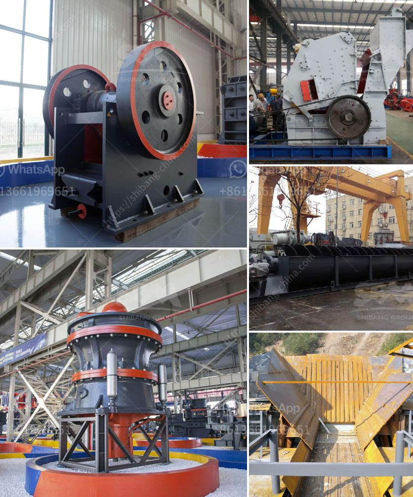

<h3>aggregate crushing plant for sale philippines</h3>
The Philippines is blessed with various natural resources, including granite, marble, sand, and gravel. These materials are essential for the construction industry, which is why there is a constant demand for them. With the growing infrastructure projects in the country, the need for high-quality aggregates is becoming more significant. This is where an aggregate crushing plant comes in.

An aggregate crushing plant is a machine that grinds various types of rock into small pieces or aggregates. These machines can crush hard or soft rocks, including basalt, limestone, river stone, granite, and construction waste. Recycled aggregates are an excellent alternative for natural aggregates, especially when it comes to economic and environmental factors.

When looking for an aggregate crushing plant in the Philippines, customers should consider the following factors:

   - High-quality machines can withstand harsh environments and ensure efficient and consistent production.

   - Durable equipment can withstand heavy usage and reduce the need for frequent repairs and replacements.

   - The plant's capacity should be suitable for the production needs of the customer. It should be able to produce enough aggregates to meet the demand.

   - The output of the plant should also be considered. A higher output means higher efficiency and productivity.

   - The cost of the plant should be within the customer's budget. However, it is also important to consider the long-term cost since cheaper equipment may require more maintenance and have a shorter lifespan.

   - The ease of maintenance is another crucial factor. A plant that is easy to maintain will save time and resources for the customer.

   - A reputable supplier should provide excellent after-sales service and support, including technical assistance, spare parts availability, and maintenance guidance.

   - Good customer service ensures a seamless experience for the customer and helps address any issues that may arise during the operation of the plant.

Investing in an aggregate crushing plant in the Philippines can bring great benefits to the construction industry. Not only can it provide high-quality aggregates for various infrastructure projects, but it can also generate income for the owner. An aggregate crushing plant for sale Philippines can be a profitable investment if you know where to purchase it and how to choose a suitable supplier.

In the Philippines, crusher machines have been sold widely. However, few people understand its unique features, therefore choose the wrong one. However, an excellent crusher plant manufacturer in the Philippines can provide customers with high-quality machine. From the introduction, you can learn more about the aggregate crushing plant for sale in the Philippines. By understanding how the equipment works and what customers need, you can ensure that you choose the right supplier. With the right supplier, you can earn the expected profits!
<h3>Contact us</h3><ul><li><strong>Whatsapp:&nbsp;<a href="https://wa.me/8613661969651">+8613661969651</a></strong></li><li><a href="https://swt.shibang-china.com/?git&amp;zhl&amp;aggregate crushing plant for sale philippines"><strong>Online Service(chat now)</strong></a></li></ul><h3>Related</h3><ul><li><a href='raymond mill manufacturer in india.md'>raymond mill manufacturer in india</a></li><li><a href='iron ore crushing equipment.md'>iron ore crushing equipment</a></li><li><a href='mini cement plant for sale 500tpd.md'>mini cement plant for sale 500tpd</a></li><li><a href='cost of vertical roller mill.md'>cost of vertical roller mill</a></li><li><a href='used ft crusher for sale.md'>used ft crusher for sale</a></li></ul>