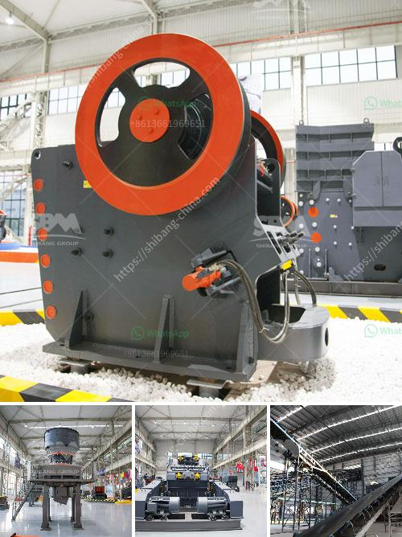

<h3>aggregate processing equipment</h3>
Aggregate processing equipment refers to various machines that are used in the process of extracting and processing aggregates from raw materials such as limestone, sand, and gravel. These materials are essential in the construction industry, as they are used to create roads, buildings, and other infrastructure.

One of the key machines in aggregate processing is a crusher. Crushers are used to break down larger rocks into smaller pieces, making them easier to transport and work with. There are different types of crushers available, including jaw crushers, cone crushers, and impact crushers, each suited to different applications.

Another important piece of equipment is a vibrating screen. Vibrating screens are used to separate aggregates of different sizes, ensuring they meet specific requirements for a particular project. They work by shaking the material on a mesh screen, with the smaller particles falling through while larger ones are retained and further processed.

Conveyors are also crucial in aggregate processing. They are used to transport materials from one part of the processing plant to another. This eliminates the need for manual handling, making the process more efficient and reducing the risk of injuries.

In addition to these machines, aggregate processing equipment may include feeders, washers, and storage bins. Feeders ensure a consistent flow of material into the processing plant, while washers help clean and remove impurities from the aggregates. Storage bins are used to store the processed materials before they are dispatched for use.

Overall, aggregate processing equipment plays a vital role in the construction industry. It enables the extraction and processing of aggregates, which form the foundation of many construction projects. By using efficient and reliable equipment, construction companies can ensure the production of high-quality aggregates that meet the specifications of their clients.
<h3>Contact us</h3><ul><li><strong>Whatsapp:&nbsp;<a href="https://wa.me/8613661969651">+8613661969651</a></strong></li><li><a href="https://swt.shibang-china.com/?git&amp;zhl&amp;aggregate processing equipment"><strong>Online Service(chat now)</strong></a></li></ul><h3>Related</h3><ul><li><a href='south africa jaw crushers.md'>south africa jaw crushers</a></li><li><a href='manufacturer of slag roller crusher in philippines.md'>manufacturer of slag roller crusher in philippines</a></li><li><a href='business proposal for stone crushing plant.md'>business proposal for stone crushing plant</a></li><li><a href='vibrating screen for recycling costs.md'>vibrating screen for recycling costs</a></li><li><a href='coal mining process machinery.md'>coal mining process machinery</a></li></ul>