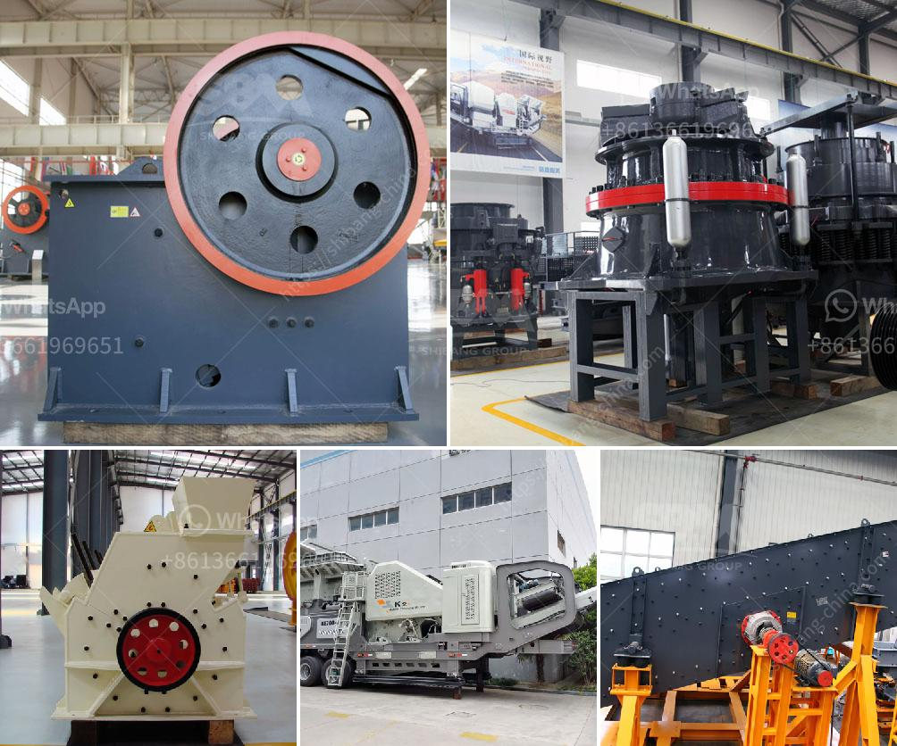

<h3>aggregates crushing flow chart process</h3>
Crushing plant flow chart crusher mills cone crusherflow chart – cementturnkeycom 00 limestone quarry and crushing plant the major raw material for cement production is limestone flow chart: aggregate crushing plant design – crushing plant layout

11/09/2012 Flow chart of river stone crushing plant - SBM ... It calls for crushing, screening and washing process. Flow chart of river stone crushing, system includes stationary and mobile crushing

15/10/2013 Procuction Process The raw materials are unloaded by trucks into the hopper. By vibrating feeder, raw materials are regularly fed into Primary Jaw Crusher which could reduce 800mm stones into approx.150mm. The half-finished products from Jaw Crush...

12/09/2012 Process flow chart of aggregate plant. There are several types of crushers to be choosed as stone aggregate crusher machine used in stone aggregate crushing ... Flow chart of river stone crushing ...

Aggregate Crushing Plant Process Flow Chart – 62 Amazing Models Of Quarry Process Flow Chart Flow Chart, with 26 files. Aggregate Crushing Plant Process Flow Chart – 62 Amazing Models Of Quarry Process Flow Chart Flow Chart, with 26 files. Free Flowchart Templates MySullys. Home › Aggregate Crushing Plant Process Flow Chart.

PROCESS AUTOMATION OF CEMENT PLANT - Aircc. International Journal of Information Technology, Control and Automation. IJITCA ... the Cement manufacturing process consists broadl. ... Figure 1 depicts the cement manufacturing process. .... Calcite. Sand. Fly ash. Mill scale. Aragonite. Shale. Aluminum .... Crushing the limestone as mined is adequate for raw material. Get Price

Process Flow Chart of Aggregate crushing Plant . liming aggregate crusher plant consists of vibrating feeder, heavy duty jaw crusher, small jaw crusher, aggregate crushing process For all your crushing aggregate process plant needs – you don’t always end up paying less by buying cheap,

Process Flow Chart Of Stone Crusher McCain Foods Limited – We are very disciplined. +-Choose a Format. PDF. Microsoft Word. This chart shows regions that have unnoticed sulfide deposits. text only Text It prepares the point for the crushers, which break huge rocks into smaller stones. The aim of this project is to design a Modern marble process flowchart for.

Grinding Plant Flow Chart Drying Grinding Flow Charts - chucklekids. drying grinding flow charts keyaccessinstitute. celebrating years paving concretedrying grinding flow charts. ance studies for the grinding of these different . Get Price And Support Online; Flow Chart Of Gold Processing For Kids - dmrlab. gold processing for kids Grinding .

India Crusher Equipment, stone crusher equipment ... Flowchart - Process Flow Charts, Templates, How To, and More. Flow Chart Symbols. You'll notice that the flowchart has different shapes. In this case, there are two shapes: those with rounded ends represent the start and end points of the process and rectangles are used to show the interim steps. These shapes are known as flowchart onveyor Next ...

Crushers or rock crushers are machines used to reduce the size of rocks and stones in aggregates production, construction material recycling applications, and in mining operations. Every crushing plant and crushing process has its own requirements and demands. Metso has designed, engineered and manufactured crushers for more than 100 years. Our ...

Aggregates Crushing Flow Chart Process. Aggregate crushing plant process flow chart flow chart of crushing plant aggregate crusher plant process flow chart there are several types of crushers to be choosed as stone aggregate crusher machine used in stone aggregate crushing plant q university lesson 7 crushing secondary in the quarry crushing is handled in four potential stages primary

After crushing process, materials are crushed into powder size with fineness of 200-300 mesh. manganese carbonate ore flow chart in johor bahru Crushing and Screening – Stone Crusher Price

grinding equipment China ball mill manufacturer prm export ball mills to the prm is an international ball mill manufacturer and exporter company. Supply the products of ball mills crushers. If you are interested in china ball ball barmac crusher Crushers manufacturer prm can supply you crusher barmac vsi fine . quarry crushers for sale in ...

CrushingScreeningConveyorsFine Ore BinsThe size requirement of the primary crusher is a function of grizzly openings, ore chute configuration, required throughput, ore moisture, and other factors. Usually, primary crushers are sized by the ability to accept the largest expected ore fragment. Jaw crushers are usually preferred as primary crushers in small installations due to inherent mechanical simplicity and ease of operation of these machines. Additionally, jaw crushers wearing parts are relatively uncomplicated castings and ten...Aggregate Crushing flow chart - YouTube 12/09/2012 Process flow chart of aggregate plant. There are several types of crushers to be choosed as stone aggregate crusher machine used in stone aggregate crushing ... Quarrying Process And Quarry Products Crushing can be done in three or four stages, primary (first stage), secondary (second stage), tertiary (third stage) and, in some quarries, a quaternary (fourth stage). Crushed rock, or product, is transported along the process line on conveyor belts or down chutes. The primary crusher is fed via a chute and vibrating feeder. The base of the ... flow chart of aggregates crushingplant aggregates crushing flow chart process - 11 Sep 2012 Process flow chart of aggregate plant. There are several types of crushers to be choosed as stone aggregate crusher machine used in Flow chart: 400t/h Granite Production Line 450t/h Granite Production Line 600t/h Granite Production Line; Operation in Malaysia.The typical configuration is: vibration feeder ZSW, compression crusher QJ341, conveyor and separator, and crushed ore is then graded with a screening machine. The qualified material is graded and transported by the conveyor to different departments. Lager particles are return to the double cone crusher to crushing again. The qualified size Jaw Crusher Working Principle The crusher is easy to adjust, and, in common with most machines of the jaw type, is a simple crusher to maintain. As rock particles are compressed between the inclined faces of the mantle and concaves there is a tendency for them to slip upward. Slippage occurs in all crushers, even in ideal conditions. Only the particle’s weight and the ... Cone crusher machine Sales Service】: Cone crusher machine zhengzhou. 48 hour idling test machine before leaving the factory. You can take the materials to the factory test machine. We will customize the solution All the devices in the river sand placer gold mining equipment have the same structural principle, Linkedin Aggregated Process ... Process Flow Chart Of Three Stage Crushing With Cone Aggregate crusher flow chart ate crusher process flow ate processing and aggregate crushing plant the aggregate production flow chart the blasted stones was hauled to the a stockpile by heavy duty truck the stones like granite basalt marble and limestone etc will be fed into jaw crusher as primary crushing get. Aggregate Crushing Plant Flow Chart - thai-physio.de Aggregate Crushing Plant Flow Chart. Diy aggregate crusher process flow chart btm crushing plant design and layout considerationsmetallurgist there are three main steps in designing a good crushing plant process designthe flowsheet specifies the nominal design peak production flow rate and equipment sizing primary crushing plant on solid rock reduces the cost of concrete and structural Crusher Maintenance In Melb Crusher Mills, Cone Crusher ... Pdf Crusher Plant In India Service Manual ? Grinding Mill China. extec c12 crusher parts manual pdf ? Basalt Crusher. Get Free Information. of compressor for guide ? cone crusher manual ? melbourne k1 quarry george sa Process Flow Chart Crushing Construction Aggregate Process Flow Chart Crushing - Aggregate Crushing Plant Flow Chart. Diy aggregate crusher process flow chart btm crushing plant design and layout considerationsmetallurgist there are three main steps in designing a good crushing plant process designthe flowsheet specifies the nominal design peak production flow rate and equipment sizing primary crushing plant on solid rock reduces the cost of ... How do you make a flow chart of a crushing plantflow ... Cone crusher machine Sales Service】: Cone crusher machine zhengzhou. 48 hour idling test machine before leaving the factory. You can take the materials to the factory test machine. We will customize the solution All the devices in the river sand placer gold mining equipment have the same structural principle, Linkedin Aggregated Process ... Process Flow Chart Of Three Stage Crushing With Cone Process Flow Chart Of Three Stage Crushing With Cone And Vsi. We are a large-scale manufacturer specializing in producing various mining machines including different types of sand and gravel equipment, milling equipment, mineral processing equipment and building materials equipment. crusher unit process flow - ozaki-eynatten.be coal mining process flow grinding mill equipment coal crushing process flow chart and coal processing Copper Mining Process Flow Diagram Crusher Get Price; Hard Rock Crusher Plant - Jaw Crusher Plant. This hard rock crusher plant is a jaw crusher concentrator designed to crush, process, clean gravity recover minerals in clean, hard rock ore ... stone quarry crusher process flow diagram in indonesia Stone Crusher Plant Diagrams Line Diagram Of Stone Crushing Plant In a stone crusher plant it include the vibrating feeder jaw crusher impact will be used in the stone crusher plant in india look at the following diagram The video below is the another ZENITH customers sand crushing production line diagrams of limestone quarry . basalt crushing flow process flow – Grinding Mill China basalt crushing flow process ... quarryingcrusher basalt basalt crushing...Process flow chart for stone crusher Coal Surface Product List. how to calculate alumina ... » Learn More. stages of processing iron ore. Stages Of Processing Iron Ore,4ft Standard Cone Crusher ... iron ore crushing plant flow chart,Stone Crusher . Iron Ore Crushing ... Construction Aggregate Crushing Plant - Aggregate production line produce construction aggregates widely used for making concrete production. The aggregate process consists by progressive stages of crushing, screening, and washing. Aggregate production line manufactured by aims for producing crushed stone aggregate. Crushed stone aggregate is produced from many natural deposits ... What Process Is Crushing The Ore - cz-eu.eu What Process Is Crushing The Ore. Large raw chrome ore for primary crushing are fed into the jaw crusher by Plate feeder and are reduced to 8 inches or smaller. After first crushing, the material will transferred to cone crusher by belt conveyor for secondary crushing; the crushed chrome ore . stone quarry crusher process flow diagram in indonesia Stone Crusher Plant Diagrams Line Diagram Of Stone Crushing Plant In a stone crusher plant it include the vibrating feeder jaw crusher impact will be used in the stone crusher plant in india look at the following diagram The video below is the another ZENITH customers sand crushing production line diagrams of limestone quarry . Crusher Parts In Mining Industry In Stone Crushing In The Mining Industry D Group. Crusher parts in mining industry in.What is the role of crushing machines in the mining industry mining crusher machinery is configured to break down very hard material, such as stone, into small rocks, gravel, or stone powder feeded in the process. stone crusher complete flow charts - zum-friesentroll.de Stone Crusher Flow Chart worldcrushers. May 18, 2013 Stone crushing plant includes vibrating feeder, jaw crusher, impact crusher crushing plant flow chart Valencia&Business Crusher diagram is using picture or image-text to show the crushing flow process chart serviço online; China mobile crushers and screens,200t . crusher unit process flow - ozaki-eynatten.be A Process Performance Model for A Cone Crusher - Texas . Jul 26, 2018 for a cone crusher with different parameters (Evertsson, 2000). Figure 2 Flow diagram for a sand and gravel processing operation . Cone Crusher - an overview ScienceDirect Topics As rock enters the top of the cone crusher, it becomes wedged and squeezed . Batch Plant Calibration - ctqpflorida Batch Plant Calibration ... This is the flow rate in lbs/second flow chart of aggregates production Quarrying Process And Quarry Products - Northstone Materials. Stone quarrying is the multistage process by which rock is extracted from the ground and crushed to produce aggregate, which is then ... Screening is carried out at various stages in the crushing process. ..... stone, as the void space between aggregate particles allow water to flow through. Get price stone crusher complete flow charts - zum-friesentroll.de Stone Crusher Flow Chart worldcrushers. May 18, 2013 Stone crushing plant includes vibrating feeder, jaw crusher, impact crusher crushing plant flow chart Valencia&Business Crusher diagram is using picture or image-text to show the crushing flow process chart serviço online; China mobile crushers and screens,200t . Parts Of Mobile Stone Crusher - sabinn.nl Track Stone Crusher Operators Mining In Indonesia. Stone crusher plan indonesia YouTube Aug 2 2013 Double supply used stone crushing plant and mining equipment for sale worldwide export to Malaysia South Africa Saudi Arabia Zambia Read More Indias Fastest Growing Crushing Equipment Manufacturer. Cone Crusher Rock Crushers Crusher Plant - JXSC ... Cone Crusher manufacturer】Compare to the well-know cone crusher suppliers like , Telsmith, Sandvik, JXSC has our unique advantages. Lower price, complete spare parts, installation engineer, crushing plant design, cone crusher instruction manual. Contact us to quickly get the cone crusher capacity and price. STATIONARY CRUSHERS_series,jaw,crusher,Innovative,_Huaxin ... HUAXIN CEMENT 2000T/H aggregate production line EPCO project. Hafar Al-Batin Mafraq Road Project. ... PRODUCTS Crushing Equipment Grinding Equipment Auxiliary Facilities Crushing Machines K Series Mobile Crushing Plant Mobile Impact Crusher MTM Trapezium Grinder PFW Impact Crusher PY Cone Crusher VSI Crusher. NEWS. ... Primary mobile crushing plant ... Production - Bennington better for Vilsack. “They needed a supplier who could deliver a complete crushing and screening plant that made no compromise on quality. With the experience that our team has gained over the years, we were able to meet these high standards of quality and provide Bennington with a modern, fully stocked fleet. All in all, we are extremely satisfied. Quote These mitigating circumstances do not occur with HPGR. In addition, these pebbles were crushing the primary crusher liners, which were lasting only 4-6 weeks on average. Due to the nature of this process the site geologist was only able to give limited information on the nature of the resistant rock. jaw crusher YouTube crusher tornado crusher supplier in kenya tornado crusher supplier in kenya About Ciros prm production of stone crusher: jaw crusher, impact crusher, cone crusher, hammer crusher and mobile crusher, Chat Now Fast Mobile Crushers For Salephp tornado cone crusher. fast mobile crushers for sale.php .

Previous: used studer s120 grinding machines Next: cement grinding milling equipment manufacturer canada Next: cement concrete plant machinary

diy eles permitem acesso aggregate utilizado - 4.5/5(2.9K) Jaw Crusher Animation - Nordberg C150 jaw crusher MetsoWorldStrongco CorporationEnvironment1. Simple structure and easy maintenance.2. Stable performance and low operating cost.3. High crushing ratio.4. Use high manganese steel, one-off foundry.5. High resistance to friction, abrasion and compression with longer operating life span.820 个按钉

The Combination Crusher is developed by combining the pre-breakage technology of domestic and foreign countries and optimizing the key structure parameters. These compound crushers are recommended by leading consultants in this field and used by hundreds of customers all over the world. Working Process of Compound Crusher When the combination crusher is working, materials are fed evenly from the upper part of the machine, which can be divided into two parts along the center of the ...

The price has always been a concern of many users. Why is.851 个按钉River stone crushing plant with 150-200TPH In the plant, rsquo.813 个按钉
<h3>Contact us</h3><ul><li><strong>Whatsapp:&nbsp;<a href="https://wa.me/8613661969651">+8613661969651</a></strong></li><li><a href="https://swt.shibang-china.com/?git&amp;zhl&amp;aggregates crushing flow chart process"><strong>Online Service(chat now)</strong></a></li></ul><h3>Related</h3><ul><li><a href='crusher plants in kuwait.md'>crusher plants in kuwait</a></li><li><a href='the cost of chrome washing plants in south africa.md'>the cost of chrome washing plants in south africa</a></li><li><a href='silica sand mines in philippines.md'>silica sand mines in philippines</a></li><li><a href='machine crusher prices in nigeria.md'>machine crusher prices in nigeria</a></li><li><a href='jaw crusher maharashtra.md'>jaw crusher maharashtra</a></li></ul>