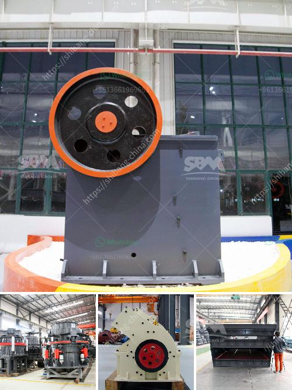

<h3>alluvial gold processing plant for small scale</h3>
Alluvial gold refers to the type of gold dust found in that kind of soil. When the beds of rivers or streams are scooped and panned for gold dust, the product is referred to as alluvial gold. Best way to extract such alluvial/soil gold is using gravity separation method, which is most cost-effective choice for miners now.

Alluvial gold processing plant Flow Sheet Design. Above gold wash plant design suits for sandy type alluvial ore or little clay content alluvial ore. and those machines could recover >200mesh gold grain / gold powder. Scope of Supply. We can supply the whole line of gold washing plant, including: 1. gold trommel, vibrating screen,etc.

In order for processing plants to be able to generate massive amounts of gold, the deposits must be situated in such a way that enables easy and efficient extraction. Depending on the location and depth of the gold deposit, the cost of equipment to undertake mining in such cases could be quite expensive. In general, alluvial gold has some impurities such as sand, stone and clay, so the first step is to remove these impurities.

To effectively extract gold, the ore needs to be processed by gold processing plant. The gravity separator is usually the best choice as it can effectively remove the coarse and medium-sized impurities without leaving any residuals. The most common method used is a trommel, where a rotating drum allows fine particles of gold to fall through the holes and get collected in a sluice box or centrifugal concentrator, which are used to separate the gold from the other impurities.

For small-scale miners, a proper and reliable alluvial gold processing plant can greatly increase the mining efficiency and minimize the cost. The operated plant is loed in Sierra Leone and now the investment certifiion is still under the negotiation by government of Sierra Leone with the company. Meanwhile, DOVE filed a request to have a park for gold refinery.

There are many challenges faced by small-scale miners, from outdated equipment and lack of financial resources to difficulty in obtaining the necessary permits. However, with the right equipment and a proper processing plant, small-scale miners can now more effectively compete with large mining companies for the extraction of alluvial gold.

The use of a trommel and subsequent gravity separation will reduce the cost of hiring heavy equipment, making it more affordable for small-scale miners. The use of a dedicated processing plant for alluvial gold will also reduce the amount of chemicals required to extract the gold, minimizing the impact on the environment.

In conclusion, the establishment of an alluvial gold processing plant to extract gold from alluvial deposits is a crucial step for small-scale miners. It will enhance their ability to achieve significant economic returns and contribute to the sustainable development of local communities. With the right equipment and proper processing techniques, small-scale miners can effectively compete with large mining companies and contribute to the growth and development of the mining sector.
<h3>Contact us</h3><ul><li><strong>Whatsapp:&nbsp;<a href="https://wa.me/8613661969651">+8613661969651</a></strong></li><li><a href="https://swt.shibang-china.com/?git&amp;zhl&amp;alluvial gold processing plant for small scale"><strong>Online Service(chat now)</strong></a></li></ul><h3>Related</h3><ul><li><a href='rock crusher from china.md'>rock crusher from china</a></li><li><a href='magnesite ore mining process.md'>magnesite ore mining process</a></li><li><a href='process of gravel quarrying crusher.md'>process of gravel quarrying crusher</a></li><li><a href='small scale gold ball mill.md'>small scale gold ball mill</a></li><li><a href='hammer mill for oregano.md'>hammer mill for oregano</a></li></ul>