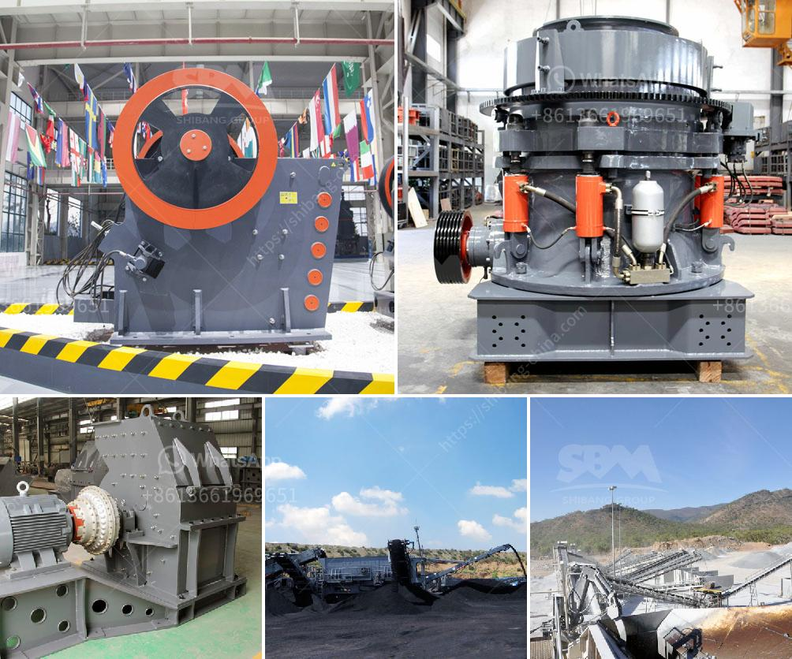

<h3>andhra pradesh coal crusher equipment price</h3>
Coal is one of the primary sources of energy worldwide. With the ever-increasing demand for power, coal is an essential fuel for generating electricity. With abundant coal reserves in Andhra Pradesh, the demand for coal crusher equipment is surging.

Coal is extracted from the ground by mining, either underground or in open pits. Dust concentration and harmful emissions are prevalent in the coal mining process. To tackle these issues, advanced coal crusher equipment has been developed in recent years.

The essential purpose of a coal crusher is to break coal into smaller sizes suitable for transportation and handling. It enables efficient combustion by ensuring the complete combustion of all volatile gases and preventing the escape of fly ash.

Several types of coal crushers are available in the market. Some crushers reduce coal to particles of 3-4 inches (75-100mm) while others produce smaller sizes, such as ¾ inch (19 mm). These crushers efficiently handle primary crushing in large-scale coal mines, which significantly reduces the operational costs.

One common problem faced by coal crushers is the crushing of coal lumps or agglomerates present in the feed stream. This issue reduces the crushing efficiency and output, causing the coal crusher to operate in suboptimal conditions.

To tackle this problem, specialized coal crushers are manufactured that target specific types of coal, such as frozen coal and lignite. These crushers prevent the coal from sticking to the crusher surfaces, thereby improving the efficiency of crushing and reducing maintenance costs.

The cost of coal crusher equipment is directly proportional to its production capacity. The price of coal crusher is also affected by the market demand, regional differentiation, and the specific manufacturers. In terms of coal crushing, various types of crushers are available, such as jaw crusher, impact crusher, cone crusher, hammer crusher, etc.

Dust suppression, automatic dust removal, and automatic lubrication are the main features of all crushers. However, each crusher has distinct specialties. For instance, jaw crushers are suitable for primary crushing operations while cone crushers are best for secondary and tertiary crushing applications.

In conclusion, the demand for coal crusher equipment is likely to surge in Andhra Pradesh in the coming years. The primary reasons behind this growth are the presence of abundant coal reserves in the region and the increasing demand for power generation. The cost of coal crusher equipment is directly proportional to its production capacity, which requires exhaustive analysis and study before making a purchase. Choosing the right coal crusher not only ensures high efficiency but also saves a substantial amount of time and money in the long run.
<h3>Contact us</h3><ul><li><strong>Whatsapp:&nbsp;<a href="https://wa.me/8613661969651">+8613661969651</a></strong></li><li><a href="https://swt.shibang-china.com/?git&amp;zhl&amp;andhra pradesh coal crusher equipment price"><strong>Online Service(chat now)</strong></a></li></ul><h3>Related</h3><ul><li><a href='crush molybdenum equipment.md'>crush molybdenum equipment</a></li><li><a href='stone crusher machine price in philippines.md'>stone crusher machine price in philippines</a></li><li><a href='used crushers in america.md'>used crushers in america</a></li><li><a href='stone crushing machine zimbabwe.md'>stone crushing machine zimbabwe</a></li><li><a href='granite crushing process.md'>granite crushing process</a></li></ul>