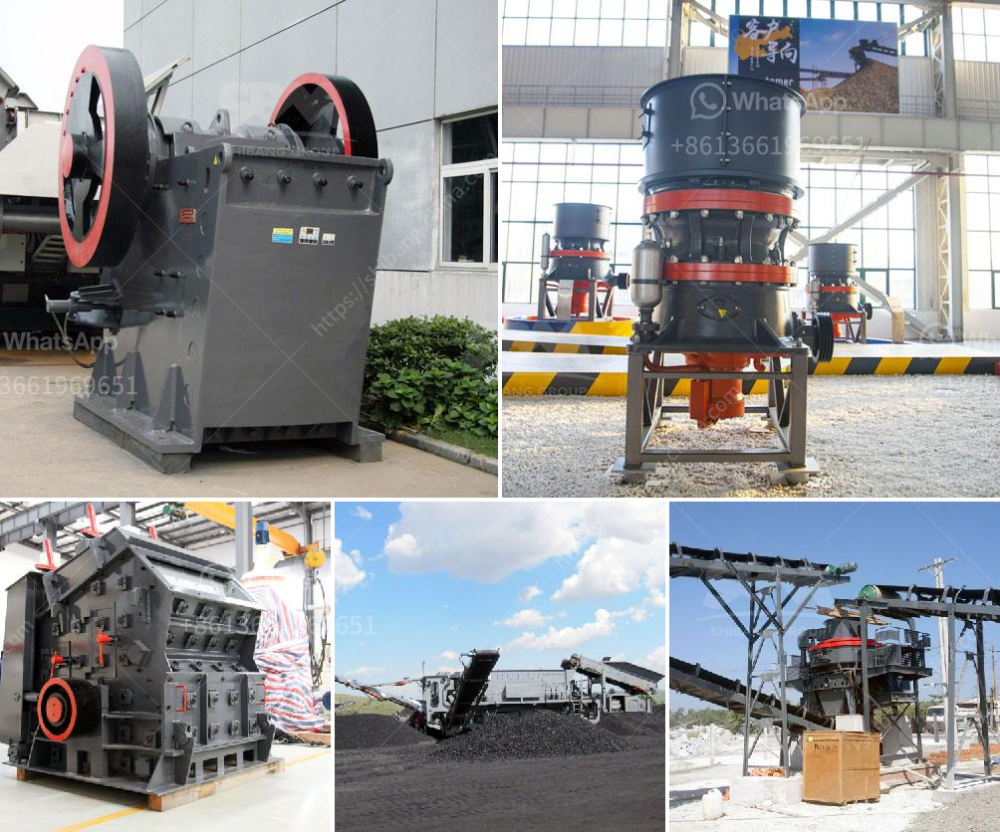

<h3>antimony processing plant design</h3>
Antimony is a brittle, silvery-white metal commonly used in the production of flame retardants, plastics, and electronic devices. Additionally, it is a key component in the production of batteries. Due to its versatile nature and high demand, the design of an efficient and sustainable antimony processing plant is crucial.

When designing an antimony processing plant, several factors must be taken into consideration. Firstly, the sizing of the plant should be based on the anticipated production requirements. This involves assessing the current and projected demand for antimony, as well as the availability of raw materials.

Secondly, the plant layout should be optimized for efficient material flow and process automation. This can be achieved by integrating advanced technologies and equipment, such as conveyor belts, automated sorting systems, and robotic arm assistance. By minimizing manual handling and streamlining processes, production can be increased while reducing the risk of accidents and errors.

Furthermore, environmental sustainability should be at the forefront of the plant design. Antimony processing can generate waste streams containing potentially harmful chemicals. To minimize environmental impact, effective waste management systems, such as filtration and purification processes, should be implemented. Additionally, the plant should be equipped with proper air and water pollution control measures to comply with regulatory standards.

Moreover, energy efficiency is a crucial aspect of plant design. Implementing energy-saving technologies, such as heat recovery systems and energy-efficient machinery, can significantly reduce operating costs and minimize the plant's carbon footprint.

Lastly, the design should also consider the safety and well-being of the plant personnel. This involves incorporating proper ventilation, ergonomic workstations, and safety protocols to minimize the risk of exposure to hazardous materials.

In conclusion, the design of an antimony processing plant should prioritize production efficiency, environmental sustainability, energy efficiency, and worker safety. By considering these factors, a well-designed plant can contribute to the sustainable production of antimony while meeting the demands of the industry.
<h3>Contact us</h3><ul><li><strong>Whatsapp:&nbsp;<a href="https://wa.me/8613661969651">+8613661969651</a></strong></li><li><a href="https://swt.shibang-china.com/?git&amp;zhl&amp;antimony processing plant design"><strong>Online Service(chat now)</strong></a></li></ul><h3>Related</h3><ul><li><a href='price for sand machine.md'>price for sand machine</a></li><li><a href='cement formation process.md'>cement formation process</a></li><li><a href='best stone crushers india.md'>best stone crushers india</a></li><li><a href='project report of dolomite powder plant.md'>project report of dolomite powder plant</a></li><li><a href='high efficiency manganese ore raymond mill in india.md'>high efficiency manganese ore raymond mill in india</a></li></ul>