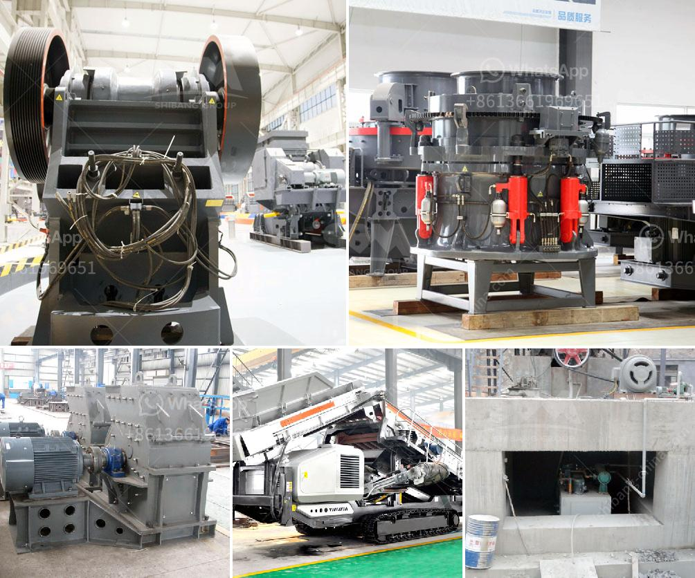

<h3>artificial sand machine</h3>
In recent years, the demand for sand has skyrocketed due to its role in the construction industry. However, the availability of natural sand is becoming scarcer, leading to a need for alternative solutions. This is where artificial sand machine comes into play – a revolutionary tool that produces high-quality sand, mimicking natural sand's characteristics.

Artificial sand machines are made up of various elements such as feeders, crushers, and screens, all working together to manipulate raw materials into the desired product – sand. The machine starts by crushing larger rocks into smaller particles, which are then further refined into sand-like consistency. The size and shape of the particles can be tailored to meet specific construction requirements.

One key advantage of using artificial sand machines is that their production is not reliant on natural weather conditions or geographical limitations. Unlike natural sand sources, such as riverbeds and lakeshores, artificial sand machines can be installed anywhere, including in landlocked areas. This allows for a steady and reliable supply of sand, regardless of the region's location.

Furthermore, the use of artificial sand can help preserve natural ecosystems. The extraction of sand from rivers and seabeds often disrupts the delicate balance of these habitats. By utilizing artificial sand machines instead, we can minimize our impact on the environment and protect natural resources.

Artificial sand also offers several performance benefits compared to natural sand. Its consistent particle size distribution ensures greater strength and durability in construction materials. Additionally, the absence of impurities and contaminants guarantees a cleaner and safer sand that meets quality standards.

Investing in artificial sand machines can prove to be a cost-effective solution in the long run. While the initial setup costs may be higher than conventional sand sources, the reduced maintenance and environmental expenses make it a prudent choice. Moreover, the ability to produce sand on demand eliminates the need for costly transportation from remote natural sand deposits.

In conclusion, artificial sand machines are transforming the construction landscape by providing a sustainable and reliable solution to the diminishing supply of natural sand. With their ability to produce high-quality sand, adjust particle sizes, and reduce environmental impact, these machines are revolutionizing the industry. Embracing this innovation will not only meet the increasing demand for sand but also contribute to a greener and more sustainable future.
<h3>Contact us</h3><ul><li><strong>Whatsapp:&nbsp;<a href="https://wa.me/8613661969651">+8613661969651</a></strong></li><li><a href="https://swt.shibang-china.com/?git&amp;zhl&amp;artificial sand machine"><strong>Online Service(chat now)</strong></a></li></ul><h3>Related</h3><ul><li><a href='how much investment in bauxite crushing plant.md'>how much investment in bauxite crushing plant</a></li><li><a href='sell mill of hammers malaysia.md'>sell mill of hammers malaysia</a></li><li><a href='quarry crusher machinery for sale.md'>quarry crusher machinery for sale</a></li><li><a href='mobile crusher capacity 200 ton per hour.md'>mobile crusher capacity 200 ton per hour</a></li><li><a href='crusher for dolomite.md'>crusher for dolomite</a></li></ul>