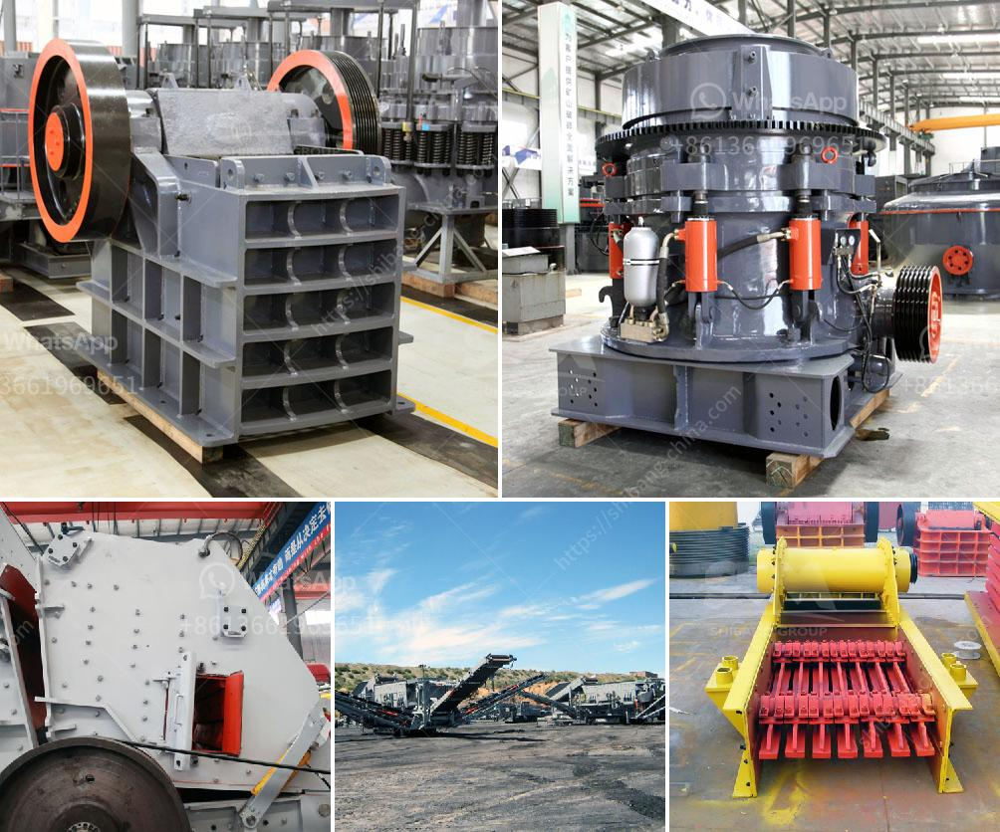

<h3>automatic feeder for ball mill customer case</h3>
Ball mills are widely used in the grinding and processing of minerals, ceramics, and other materials during the industrial process. In order to minimize downtime, maintain an efficient operation, and increase productivity, ball mills must be regularly fed with materials to be ground. This is where an automatic feeder for ball mills comes into play, ensuring a smooth and uninterrupted operation.

One prominent customer case that highlights the advantages of using an automatic feeder for ball mills is that of a mining company operating several ball mills in a copper mine. Grinding the ore to achieve the desired particle size for flotation is crucial. The company had been relying on manual feeding, which was both time-consuming and inconsistent. Additionally, the manual feeding process required frequent monitoring, resulting in unnecessary downtime.

To address these challenges, the mining company decided to invest in an automatic feeder specifically designed for ball mills. This feeder is equipped with advanced technology that allows for precise and controlled feeding of materials into the ball mill. By automating the feeding process, the company was able to achieve several significant benefits.

Firstly, the automatic feeder increased operational efficiency by eliminating the need for manual feeding. This resulted in time savings and a reduction in labor costs. Moreover, the continuous and consistent feeding ensured a stable and optimized grinding process, leading to higher ore throughput and improved productivity.

Secondly, the automatic feeder improved the overall reliability of the ball mill operation. By eliminating manual feeding, the risk of human error and inconsistencies in the feeding process were significantly reduced. This resulted in a more reliable operation with fewer disruptions, minimizing downtime and optimizing overall equipment effectiveness.

Lastly, the automatic feeder enhanced the safety of the operation. The advanced technology integrated into the feeder ensured a controlled and uniform feeding process, eliminating the risk of sudden surges or overloading. By maintaining a steady feed rate, the probability of equipment malfunctions or accidents related to material handling was greatly reduced.

In conclusion, the customer case of a mining company investing in an automatic feeder for ball mills proves the effectiveness and benefits of this technology in various industrial applications. The automatic feeder not only improved operational efficiency and productivity but also enhanced the overall reliability and safety of the ball mill operation. By automating the feeding process, companies can achieve a smooth and uninterrupted operation, minimize downtime, and optimize their processing capabilities.

As industries continue to strive for efficiency and innovation, the use of automated systems becomes increasingly essential. In the case of ball mills, an automatic feeder offers a reliable solution, ensuring a continuous and optimized grinding process. With the advantages of time savings, cost reduction, improved reliability, and enhanced safety, investing in an automatic feeder for ball mills is a worthwhile decision for any company looking to streamline their operations and maximize productivity.
<h3>Contact us</h3><ul><li><strong>Whatsapp:&nbsp;<a href="https://wa.me/8613661969651">+8613661969651</a></strong></li><li><a href="https://swt.shibang-china.com/?git&amp;zhl&amp;automatic feeder for ball mill customer case"><strong>Online Service(chat now)</strong></a></li></ul><h3>Related</h3><ul><li><a href='crusher machine manufacturers.md'>crusher machine manufacturers</a></li><li><a href='mobile screen crusher for sale south africa.md'>mobile screen crusher for sale south africa</a></li><li><a href='hammer mill capacity.md'>hammer mill capacity</a></li><li><a href='granite crushing machine for sale.md'>granite crushing machine for sale</a></li><li><a href='salary of crusher operer in philippines.md'>salary of crusher operer in philippines</a></li></ul>