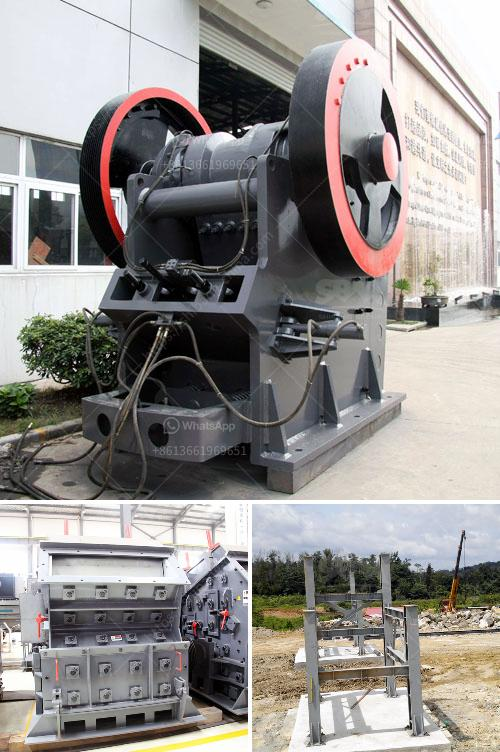

<h3>average cost of graphite mining plant</h3>
Graphite is a mineral with remarkable properties that make it a sought-after resource in various industries. From its application in lithium-ion batteries, aerospace, and electronics to lubricants and refractory materials, graphite plays a vital role in modern society. With the increasing demand for graphite, mining companies are investing in new plants to meet the market needs. However, establishing and operating a graphite mining plant is not without its challenges and costs.

The average cost of a graphite mining plant depends on various factors, including the scale of the operation, location, equipment, and the intended use of the graphite. The scale of the operation refers to the size of the plant and its capacity to produce graphite. A small-scale plant with a capacity of around 1,000 tons per year might cost anywhere between $1 million to $5 million. On the other hand, a large-scale plant with a capacity of 10,000 tons per year or more can cost upwards of $50 million.

Location also plays a crucial role in determining the cost of a graphite mining plant. It affects not only the initial investment but also ongoing expenses such as labor, transport, and utilities. Proximity to graphite sources is a significant advantage as it reduces transportation costs. Additionally, selecting a location with cheaper energy and labor costs can help to minimize operational expenses. Consequently, the cost of establishing a graphite mining plant can vary significantly depending on the location, making careful site selection crucial for economic viability.

The equipment required for a graphite mining plant is another significant cost factor. Depending on the location and scale of the operation, the necessary machinery can range from basic crushers, mills, and flotation cells to more sophisticated technologies such as thermal purification systems. High-quality equipment designed specifically for graphite mining can be expensive, but it is essential for ensuring efficient production and minimizing downtime.

The intended use of the graphite obtained from the plant also influences the cost. Different industries have different graphite quality requirements. For example, high-purity graphite used in industries like aerospace and electronics requires additional refining processes, which can add to the overall cost. On the other hand, lower-purity graphite for lubricants or refractory materials may require less processing and be more cost-effective.

Apart from the initial investment and equipment costs, operating expenses must also be considered. These include labor wages, electricity, water, maintenance, and regulatory compliance. Labor costs can vary significantly depending on the location of the plant. In regions with a high cost of living, wages may be higher, increasing operational expenses. Furthermore, complying with environmental and safety regulations can add additional costs to ensure sustainable mining practices.

In conclusion, the average cost of establishing and operating a graphite mining plant is determined by various factors, such as the scale of the operation, location, equipment, and intended use of the graphite. While smaller-scale plants may cost around $1-5 million, larger-scale operations can require investments exceeding $50 million. Site selection is crucial to minimize transportation and ongoing expenses. The type of equipment required and the quality specifications of the graphite will also impact the costs. Labor wages, utilities, maintenance, and regulatory compliance are additional ongoing expenses. Understanding these cost factors is essential for mining companies and investors venturing into the graphite industry.
<h3>Contact us</h3><ul><li><strong>Whatsapp:&nbsp;<a href="https://wa.me/8613661969651">+8613661969651</a></strong></li><li><a href="https://swt.shibang-china.com/?git&amp;zhl&amp;average cost of graphite mining plant"><strong>Online Service(chat now)</strong></a></li></ul><h3>Related</h3><ul><li><a href='crusher prices of mobile crusher in bolivia.md'>crusher prices of mobile crusher in bolivia</a></li><li><a href='want to increase productivity for stone crushers.md'>want to increase productivity for stone crushers</a></li><li><a href='crushers double toggle.md'>crushers double toggle</a></li><li><a href='limestone processing crusher.md'>limestone processing crusher</a></li><li><a href='machines used for coal mining.md'>machines used for coal mining</a></li></ul>