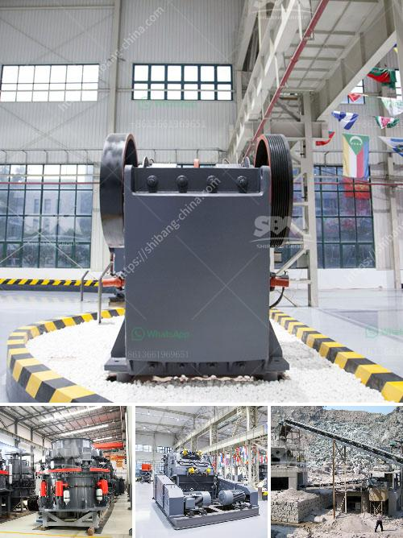

<h3>ball mill for granulated slag</h3>
A ball mill is a cylindrical device used in grinding or mixing materials like ores, chemicals, ceramic raw materials, and paints. Ball mills rotate around a horizontal axis, partially filled with the material to be ground plus the grinding medium. Different materials are used as media, including ceramic balls, flint pebbles, and stainless steel balls.

One of the applications of ball mills is in the grinding of granulated slag. Granulated slag is obtained by rapidly chilling molten slag produced from blast furnaces in water or steam. This results in a granular aggregate that is then dried and ground to a fine powder. It is commonly used in concrete as a substitute for cement, reducing the overall carbon footprint of the industry.

Ball mills are essential for grinding granulated slag to achieve the desired fineness required for its use as a supplementary cementitious material. They can grind granulated slag with a range of moisture content, depending on the specific needs of the application. Ball mills can grind granulated slag particles to different sizes, depending on the application requirements. In addition, they can be used for both dry and wet grinding operations.

The grinding process in a ball mill involves impact and attrition between the balls, grinding media, and the slag particles. The continuous movement of the balls within the mill grinds the slag into a fine powder. The ball mill is commonly used for crushing and grinding the slag to produce granulated slag that meets the standard requirements.

In summary, the ball mill is an efficient grinding tool that can grind granulated slag into a fine powder with a wide range of particle sizes. The ball mill has a high grindability index and can be used to grind various ores and other materials, such as limestone, clinker, and additives. It can be used in both dry and wet grinding operations, making it a versatile choice for any slag grinding application. Additionally, the ball mill can handle abrasive materials and has a low energy consumption, making it a cost-effective option for grinding granulated slag.
<h3>Contact us</h3><ul><li><strong>Whatsapp:&nbsp;<a href="https://wa.me/8613661969651">+8613661969651</a></strong></li><li><a href="https://swt.shibang-china.com/?git&amp;zhl&amp;ball mill for granulated slag"><strong>Online Service(chat now)</strong></a></li></ul><h3>Related</h3><ul><li><a href='track crushing plant.md'>track crushing plant</a></li><li><a href='stone crusher manufactured in new zealand.md'>stone crusher manufactured in new zealand</a></li><li><a href='price of tph stone crusher.md'>price of tph stone crusher</a></li><li><a href='high energy ball mill india.md'>high energy ball mill india</a></li><li><a href='vertical ball mill nigeria.md'>vertical ball mill nigeria</a></li></ul>