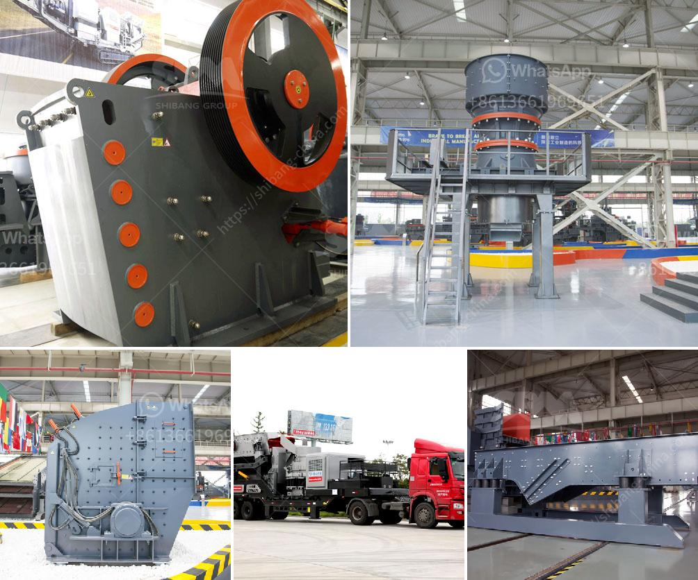

<h3>ball mill for powder</h3>
The ball mill is an efficient tool for grinding many materials into fine powder. The ball mill is used to grind many kinds of mine and other materials, or to select the mine. Ball mill is widely used in building material, chemical industry, etc. There are two ways of grinding: the dry way and the wet way. It can be divided into tabular type and flowing type according to different expelling mine.

The ball mill is a key equipment for regrinding. It is widely used for the cement, the silicate product, new type building material, fire-proof material, chemical fertilizer, black and non-ferrous metal, glass, ceramics and etc. Our ball mill can grind ore or other materials that can be grinded either by wet process or by dry process.

The ball mill is horizontal cylindrical rotation device, driven by brim gearwheel. There are two chambers and grid. Material goes into the first chamber through the feeding inlet. Inside the first chamber, there are stage liners and ripple liners as well as steel balls. The shell rotates so as to generate centrifugal force, and this force brings ball to a certain height and then balls drop down by gravity, which will impact and grind the material. After the primary grinding, materials go into the second chamber through segregate screen. In ball mill second chamber, there are flat liners and steel balls, and materials are further ground. Finally, materials are discharged from the outlet by the forces of dynamic and static, and then achieve the grinding process.

The ball mill is a key equipment for grinding materials, widely used in powder-making production line such as cement, silicate sand, new-type building material, refractory material, fertilizer, ore dressing of ferrous metal and non-ferrous metal, glass ceramics, etc. Ball mill can grind various ores and materials with dry type or wet type.

In conclusion, the ball mill is a very effective tool for grinding powders into fine powder. In the ball mill, materials are finely crushed due to the impact and grinding of the steel balls. This process gives the powders the desired size. The ball mill is extremely useful for grinding powders into powders for further processing. It is widely used in mineral processing, building materials and chemical industries. With the rapid development of technology, the demand for ball mills is continuously increasing. In order to meet the market demand, various types of ball mills have been developed, which greatly expands the range of applications of ball mills. Overall, the ball mill is a reliable and efficient tool for grinding materials into fine powder.
<h3>Contact us</h3><ul><li><strong>Whatsapp:&nbsp;<a href="https://wa.me/8613661969651">+8613661969651</a></strong></li><li><a href="https://swt.shibang-china.com/?git&amp;zhl&amp;ball mill for powder"><strong>Online Service(chat now)</strong></a></li></ul><h3>Related</h3><ul><li><a href='silica sand crusher machinery.md'>silica sand crusher machinery</a></li><li><a href='grinding units of feldspar.md'>grinding units of feldspar</a></li><li><a href='hammer mill crusher batubara.md'>hammer mill crusher batubara</a></li><li><a href='hand ball mill in south africa.md'>hand ball mill in south africa</a></li><li><a href='rock crusher for sale in sudan.md'>rock crusher for sale in sudan</a></li></ul>