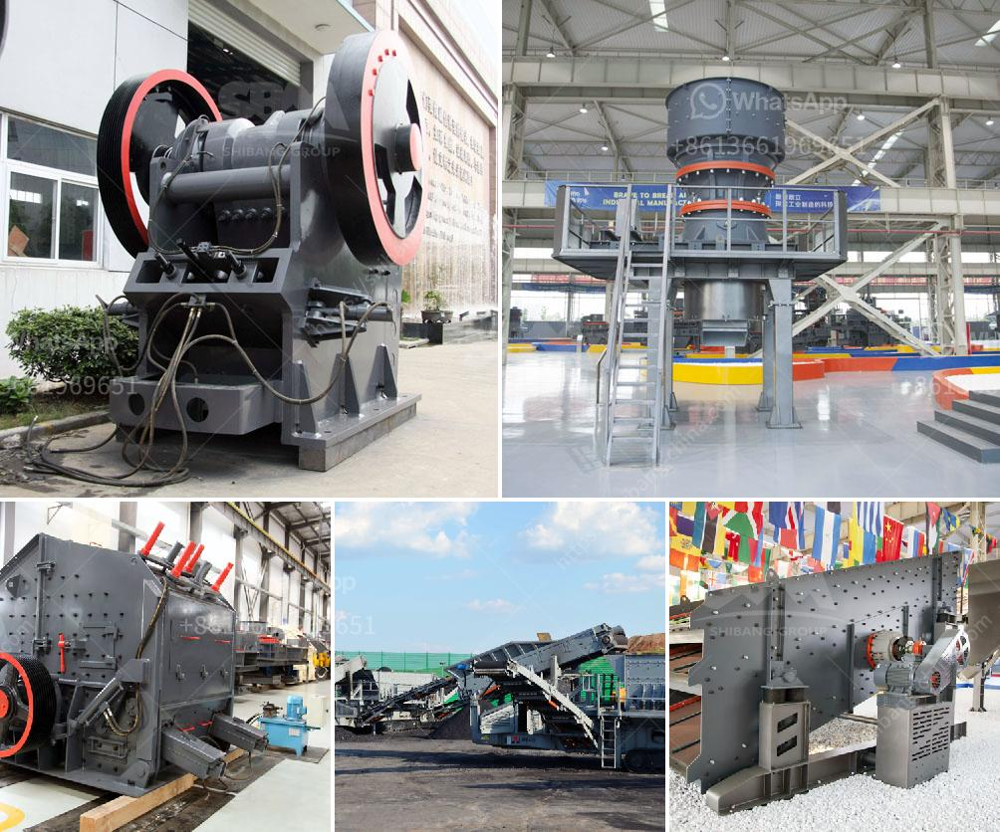

<h3>ball mill grinding and particle</h3>
Grinding and particle size reduction have been key objectives in the field of minerals processing and pharmaceuticals for many decades. Traditional methods of grinding and particle size analysis have relied heavily on subjective observations and manual techniques, which can be time-consuming and prone to errors. However, the advent of ball mill grinding technology has revolutionized the way particles are processed, offering a more efficient and reliable approach to particle size reduction.

A ball mill is a type of grinder used to grind, blend, and sometimes for mixing of materials for use in mineral dressing processes, paints, pyrotechnics, ceramics, and selective laser sintering. It works on the principle of impact and attrition: size reduction is done by impact as the balls drop from near the top of the shell. A ball mill consists of a hollow cylindrical shell rotating about its axis. The axis of the shell may be either horizontal or at a small angle to the horizontal. It is partially filled with balls. The grinding media are the balls, which may be made of steel (chrome steel), stainless steel, ceramic, or rubber. The inner surface of the cylindrical shell is usually lined with an abrasion-resistant material such as manganese steel or rubber.

The size of the balls and the speed of rotation of the mill determine particle size reduction. Larger balls lead to coarser grinding and hence a larger top size for the final product. From an operational point of view, it is important to choose the optimal ball size to achieve the desired particle size distribution. The critical speed of the mill, which is the minimum speed at which the centrifugal force is sufficiently large to cause a small particle to adhere to the shell interior for a complete revolution of the mill, also affects grinding performance.

The particle size distribution resulting from ball mill grinding is influenced by several factors, including the size of the grinding media, the speed of the mill, the size of the particles being ground, and the material properties of the ore being ground. Increasing the size of the balls or speed of rotation generally leads to smaller particle sizes due to increased impact and attrition. On the other hand, smaller balls or slower rotation speeds can lead to larger particle sizes.

Ball mill grinding is often used in combination with other techniques such as classification, magnetic separation, and froth flotation to further enhance the liberation and recovery of valuable minerals. By optimizing the particle size distribution, it is possible to increase the efficiency of downstream processing operations and reduce the consumption of energy and reagents.

In conclusion, ball mill grinding plays a crucial role in the particle size reduction process. It offers a more efficient and reliable approach compared to traditional methods, allowing for better control of the final product's size distribution. Further research and development in ball mill grinding technology will continue to improve grinding efficiency and particle size analysis techniques, making it an essential tool in numerous industries.
<h3>Contact us</h3><ul><li><strong>Whatsapp:&nbsp;<a href="https://wa.me/8613661969651">+8613661969651</a></strong></li><li><a href="https://swt.shibang-china.com/?git&amp;zhl&amp;ball mill grinding and particle"><strong>Online Service(chat now)</strong></a></li></ul><h3>Related</h3><ul><li><a href='stone crushing machines in canada.md'>stone crushing machines in canada</a></li><li><a href='ball mills for cement grinding.md'>ball mills for cement grinding</a></li><li><a href='jaw crusher prices.md'>jaw crusher prices</a></li><li><a href='grinding mill machine malaysia.md'>grinding mill machine malaysia</a></li><li><a href='calcium carbonate multiplication process.md'>calcium carbonate multiplication process</a></li></ul>