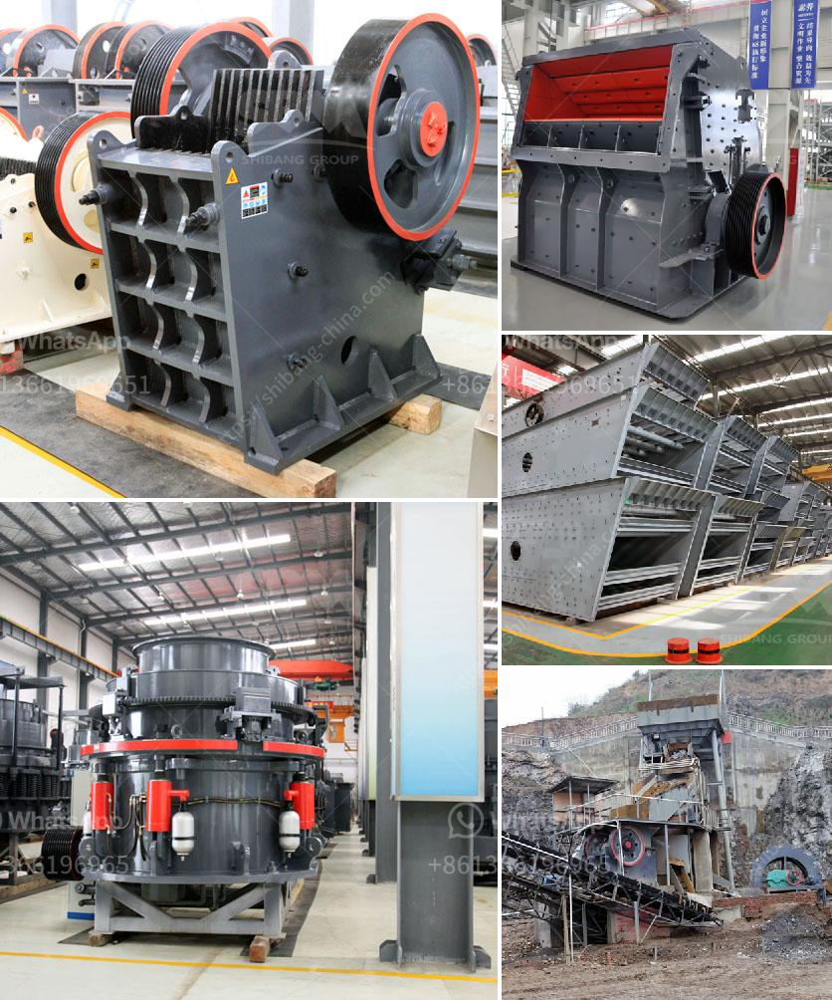

<h3>ball mill how to grind mineral</h3>
Ball mill is a kind of grinding equipment commonly used in the mineral processing industry. In order to grind the ore successfully and obtain the desired particle size, it is necessary to carry out a series of processes such as crushing, screening, grinding, and classification.

The ball mill is equipped with steel balls, which grind the mineral into a fine powder through the collision and friction between the balls and the ore particles. The material is fed into the cylinder through the hollow shaft, and the crushed ore is discharged through the grate plate to complete the grinding process.

To grind minerals effectively, several factors should be considered. Firstly, the size of the grinding media (steel balls) should be selected according to the particle size requirements of the ore. Generally, larger balls are used for coarse grinding, while smaller balls are used for fine grinding.

Secondly, the rotational speed of the ball mill should be optimized to ensure efficient grinding. The speed is influenced by factors like the diameter of the mill, the size of the grinding media, and the hardness of the ore. The optimal speed can be determined through experiments or calculations.

Thirdly, the filling rate of the grinding media should be considered. It is crucial to maintain an appropriate filling rate in order to maximize the grinding efficiency. Too little or too much filling can affect the grinding capacity and even cause damage to the mill.

Lastly, the addition of grinding aids can also improve the grinding efficiency. These chemicals, such as dispersants or grinding aids, can reduce the surface tension between the ore particles and the grinding media, thus enhancing the grinding process.

In summary, the ball mill is an essential equipment for grinding minerals in the mineral processing industry. Through careful selection and control of various factors, efficient grinding can be achieved, resulting in the desired particle size for subsequent beneficiation processes.
<h3>Contact us</h3><ul><li><strong>Whatsapp:&nbsp;<a href="https://wa.me/8613661969651">+8613661969651</a></strong></li><li><a href="https://swt.shibang-china.com/?git&amp;zhl&amp;ball mill how to grind mineral"><strong>Online Service(chat now)</strong></a></li></ul><h3>Related</h3><ul><li><a href='basalt production machinery.md'>basalt production machinery</a></li><li><a href='mobile gold processing plant with price.md'>mobile gold processing plant with price</a></li><li><a href='coal mill reject conveying system.md'>coal mill reject conveying system</a></li><li><a href='crusher run for sale in sabah.md'>crusher run for sale in sabah</a></li><li><a href='sand and quarry importer in singapore.md'>sand and quarry importer in singapore</a></li></ul>