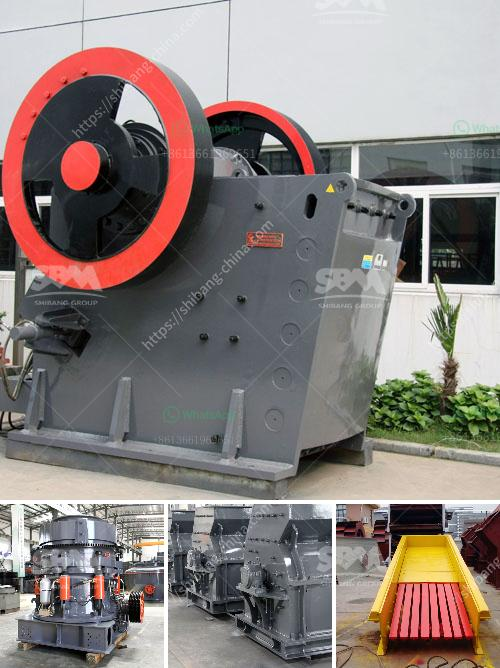

<h3>ball mill in romania</h3>
Romania is a country rich in resources and particularly in natural minerals. Among these minerals, one of great importance is gold. With multiple mining sites spread throughout the country, Romania has a strong tradition in the extraction of this precious metal. However, the process of extracting gold involves various stages, one of which is the grinding of the real-sized ore particles to obtain a fine powder. This is where ball mills play a crucial role in ensuring the success of this operation.

Ball mills are mechanical devices that grind materials and transform them into pulverized particles. They are widely used in mining, construction, ceramics, and other industries. Built with a cylindrical container, filled with metal balls that grind the material, ball mills are crucial equipment for grinding ore particles and ensuring their uniformity, thus enhancing the efficiency of the extraction process.

In Romania, ball mills are commonly used to crush and grind the extracted gold ore. Due to the robust mining industry in the country, these machines have to be strong enough to withstand the demanding conditions and high volumes of materials processed. High-quality ball mills are essential to maintain the mining sector's productivity and ensure the efficient recovery of valuable minerals like gold.

The operation of ball mills requires careful attention, as their efficiency depends on various factors. These factors include the mill's rotational speed, size and quantity of grinding balls, ore feed rate, and the size and hardness of the ore particles. Adjusting these parameters correctly can optimize the grinding process, ensuring a fine and homogeneous output that can be further processed for extraction.

One of the critical features of ball mills used in Romanian gold mines is their ability to operate continuously without causing excessive wear. This is achieved by using high-quality materials for the grinding balls and the inner lining of the mill, which should be resistant to abrasion and corrosion. Additionally, proper lubrication and periodic maintenance are essential to preserve the mechanical integrity of the machines and minimize downtime.

Romania has a long history of mining, and the use of ball mills has significantly contributed to its success in the gold extraction process. The efficient grinding provided by these machines has allowed for higher productivity and increased recovery rates, making Romania a key player in the European mining industry.

In conclusion, ball mills play a vital role in Romania's gold mining industry. They are responsible for grinding ore particles into fine powder, ensuring the uniformity and efficiency of the subsequent extraction process. The robustness and high-quality performance of these machines can handle the demanding conditions often encountered in Romanian mines, guaranteeing the production of valuable minerals like gold. As Romania continues to develop its mining sector, the proper utilization and maintenance of ball mills will remain crucial for the country's success in the gold extraction process.
<h3>Contact us</h3><ul><li><strong>Whatsapp:&nbsp;<a href="https://wa.me/8613661969651">+8613661969651</a></strong></li><li><a href="https://swt.shibang-china.com/?git&amp;zhl&amp;ball mill in romania"><strong>Online Service(chat now)</strong></a></li></ul><h3>Related</h3><ul><li><a href='ball mill in romania.md'>ball mill in romania</a></li><li><a href='mining crusher for gold mining.md'>mining crusher for gold mining</a></li><li><a href='coal pulverisers machines.md'>coal pulverisers machines</a></li><li><a href='how to make industrial talcum powder.md'>how to make industrial talcum powder</a></li><li><a href='impact crusher for iron ore.md'>impact crusher for iron ore</a></li></ul>