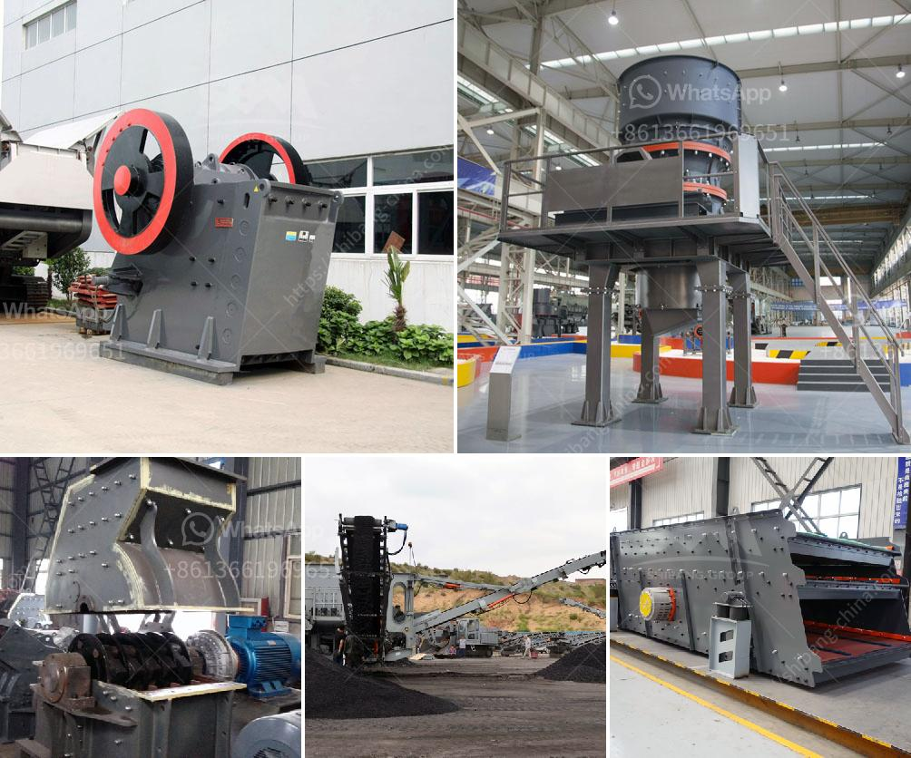

<h3>ball mill installation</h3>
Ball mill installation is a must step before it is put into production, which will affect the subsequent use of the ball mill, and even affect the production volume, crushing rate, service life, etc., so the importance of ball mill installation is self-evident.

In addition, the choice of grinding medium is also crucial. In the grinding process, different grinding medium can be used for different materials. In order to improve the grinding efficiency of the ball mill, the medium filling rate should be reasonably determined according to the actual situation. Generally, the filling rate should not be less than 30%, or the grinding body and materials will be stacked between the steel balls, which will greatly reduce the grinding efficiency of the ball mill.

When installing the ball mill, it is necessary to ensure sufficient feeding and discharging space and reasonable ball loading, so that the steel balls can evenly move in the grinding chamber. When loading the ball mill, the installation team should ensure that the main bearing, girth gear, and pinion are free from distortion, and the tooth height, alignment, and backlash of the gears should meet the installation requirements.

Before installation, it is necessary to conduct a comprehensive inspection on the ball mill equipment, so as to avoid potential safety hazards during operation. The lubrication system should be checked, including the fuel tank, pump, filter, pipeline, and nozzle. The electrical control system, such as the motor, voltage, and current, should also be checked to ensure the normal operation of the ball mill.

In summary, ball mill installation is a complex process that requires coordination with many departments and the meticulous work of installation personnel to ensure the smooth operation of the ball mill and the realization of its maximum value. Therefore, it is necessary to pay attention to every detail in the installation process to achieve the desired results.
<h3>Contact us</h3><ul><li><strong>Whatsapp:&nbsp;<a href="https://wa.me/8613661969651">+8613661969651</a></strong></li><li><a href="https://swt.shibang-china.com/?git&amp;zhl&amp;ball mill installation"><strong>Online Service(chat now)</strong></a></li></ul><h3>Related</h3><ul><li><a href='manufacturer of slag roller crusher in philippines.md'>manufacturer of slag roller crusher in philippines</a></li><li><a href='how much investment in bauxite crushing plant.md'>how much investment in bauxite crushing plant</a></li><li><a href='grinding mills jalandhar.md'>grinding mills jalandhar</a></li><li><a href='types of coal crusher used in industry.md'>types of coal crusher used in industry</a></li><li><a href='sand and quarry importer in singapore.md'>sand and quarry importer in singapore</a></li></ul>