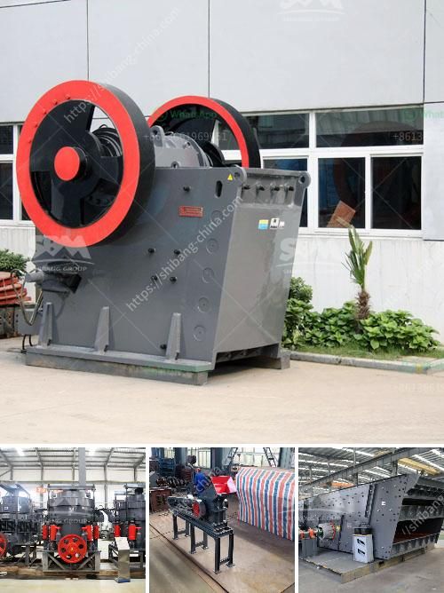

<h3>ball mill manufacturers gypsum</h3>
Gypsum is a widely used building material, which is used as a raw material for cement, mortar, and concrete. It can also be used as a solidifying agent for fillers in the production of plastics, rubber, paints, and paper. In recent years, a growing number of gypsum manufacturers have targeted gypsum powder processing industries. Ball mill manufacturers, as a leading manufacturer of gypsum ball mill, can supply various types of gypsum ball mill for gypsum powder production line.

Gypsum powder can be used in industries such as paint, plastic, rubber, PVC, cables, cosmetics, construction, adhesives, and more. Benefits of using gypsum powder include improved workability, water retention, sound insulation, absorption, and fire resistance. Moreover, gypsum powder is environmentally friendly and has a wide range of applications.

To produce gypsum powder, the raw gypsum ore should be crushed by jaw crusher or impact crusher, based on the size of gypsum ore. After crushing, the crushed gypsum particles should be further ground into powder by using a ball mill. The ball mill is a key piece of equipment for grinding crushed materials, and it is widely used in production lines for powders such as cement, silicates, refractory material, fertilizer, glass ceramics, etc.

When selecting a ball mill manufacturer for gypsum powder production, customers should take into consideration the following factors: equipment quality, technical performance, product quality, after-sales service, and price. These factors will directly affect the economic benefits of the investment. 

Ball mill manufacturers for gypsum grinding should be reliable, manufacturing high-quality equipment. Reliable equipment will provide users with a smooth grinding process and improve the overall production efficiency of gypsum powder. Manufacturers should choose high-quality parts and components during the production process to ensure the overall reliability of the equipment. 

The technical performance of ball mill manufacturers for gypsum grinding should be outstanding. A good technical performance can effectively reduce energy consumption, reduce production costs, and improve the overall competitiveness of enterprises. Manufacturers should regularly conduct technical research and development to improve the performance of equipment.

Product quality is crucial for gypsum powder production. Ball mill manufacturers should strictly control the quality of raw materials, design and manufacture equipment, and implement strict quality control measures. Only by ensuring product quality can manufacturers build a good reputation and win the trust of customers.

After-sales service is also an important factor to consider when selecting a ball mill manufacturer. A reliable manufacturer should provide dedicated after-sales service, including installation, commissioning, training, maintenance, and technical support. Good after-sales service can effectively solve customers' problems in the production process and improve the overall user experience.

Price is another decisive factor in investment decisions. Ball mill manufacturers should provide competitive prices based on product quality, technical performance, and after-sales service. Customers should compare the prices of multiple manufacturers and select the most cost-effective equipment.

In conclusion, when choosing a ball mill manufacturer for gypsum grinding, customers should consider factors such as equipment quality, technical performance, product quality, after-sales service, and price. This will help customers make informed decisions and choose the most suitable equipment for gypsum powder production.
<h3>Contact us</h3><ul><li><strong>Whatsapp:&nbsp;<a href="https://wa.me/8613661969651">+8613661969651</a></strong></li><li><a href="https://swt.shibang-china.com/?git&amp;zhl&amp;ball mill manufacturers gypsum"><strong>Online Service(chat now)</strong></a></li></ul><h3>Related</h3><ul><li><a href='mobile crushers in mining.md'>mobile crushers in mining</a></li><li><a href='mining crusher equipment south africa.md'>mining crusher equipment south africa</a></li><li><a href='stone crushing plant in saudi.md'>stone crushing plant in saudi</a></li><li><a href='calcium carbonate grinding plant.md'>calcium carbonate grinding plant</a></li><li><a href='used crusher price in uk.md'>used crusher price in uk</a></li></ul>