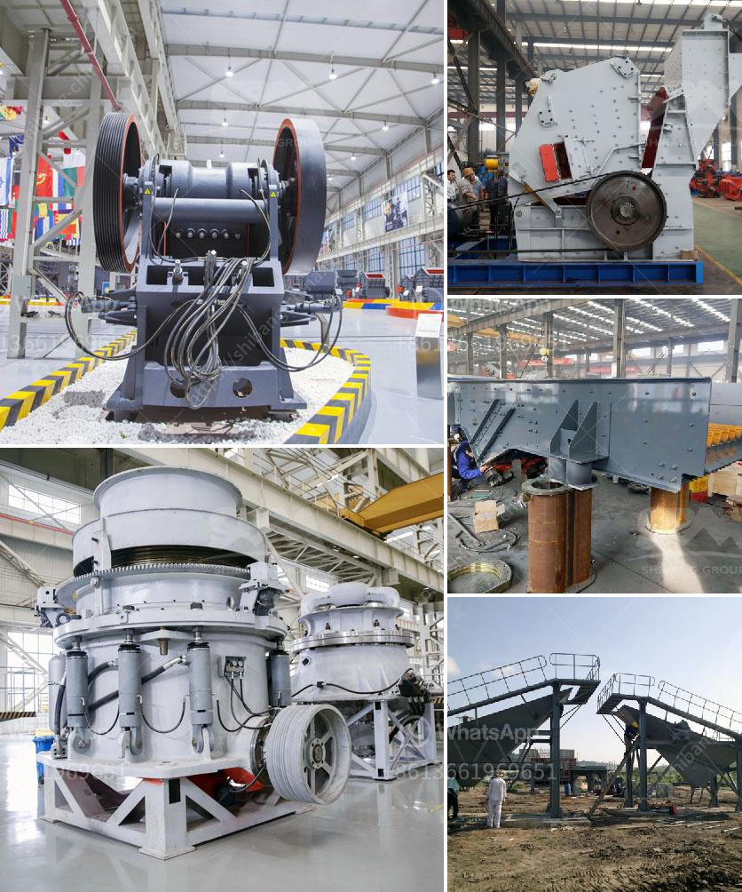

<h3>ball mill manufacturers in bangalore machinery</h3>
Bangalore is the capital of the Indian state of Karnataka and has been dubbed as the "Silicon Valley of India" due to its thriving IT industry. However, the city is also home to several manufacturing industries that contribute to its economic growth. One such industry is the ball mill manufacturing industry that has been constantly evolving and growing in Bangalore.

A ball mill is a type of grinder used to grind materials into extremely fine powder for use in mineral dressing processes, paints, pyrotechnics, ceramics, and selective laser sintering. The ball mill is a key piece of equipment for grinding crushed materials and it is widely used in production lines for powders such as cement, silicates, refractory material, fertilizer, glass ceramics, etc. as well as for ore dressing of both ferrous and non-ferrous metals.

In Bangalore, the ball mill manufacturers typically manufacture equipment using either wet or dry grinding methods. Wet grinding is performed in various industries like cement, chemical, power plant, etc., whereas dry grinding is preferred in mining and mineral processing industries.

The ball mill is extensively used in various industries such as cement, power generation, metallurgy, chemical industry, and many more. It grinds material by rotating a cylinder with steel grinding balls, causing the balls to fall back into the cylinder and onto the material to be ground. The rotation is usually between 4 to 20 revolutions per minute, depending upon the diameter of the mill. The larger the diameter, the slower the rotation.

Bangalore houses several renowned ball mill manufacturers who specialize in providing high-quality machinery for various industries. These manufacturers adopt the latest technologies in their production process to ensure superior quality and excellent performance. They use high-grade materials to manufacture the equipment, ensuring durability and reliability.

Furthermore, these manufacturers emphasize customer satisfaction and offer customized solutions based on specific requirements. They possess state-of-the-art infrastructure and have a skilled workforce to ensure that the manufacturing process is carried out efficiently. They also provide excellent after-sales service, including installation, maintenance, and repair of the machinery.

It is important for industries to choose reliable and experienced ball mill manufacturers in Bangalore to ensure the smooth functioning of their production processes. The quality of the equipment plays a crucial role in the overall efficiency and productivity of the industry. Therefore, it is advisable to conduct thorough research and choose a manufacturer with a proven track record.

In conclusion, Bangalore is a hub for the ball mill manufacturing industry, with several renowned manufacturers producing high-quality machinery for various applications. These manufacturers adopt the latest technologies, offer customized solutions, and provide excellent after-sales service. Industrial players in Bangalore can rely on these manufacturers to meet their grinding requirements and ensure smooth operations.
<h3>Contact us</h3><ul><li><strong>Whatsapp:&nbsp;<a href="https://wa.me/8613661969651">+8613661969651</a></strong></li><li><a href="https://swt.shibang-china.com/?git&amp;zhl&amp;ball mill manufacturers in bangalore machinery"><strong>Online Service(chat now)</strong></a></li></ul><h3>Related</h3><ul><li><a href='coal mining equipment for sale.md'>coal mining equipment for sale</a></li><li><a href='how to increase capacity of cement ball mill.md'>how to increase capacity of cement ball mill</a></li><li><a href='machine for crushing rock.md'>machine for crushing rock</a></li><li><a href='silica sand crusher machinery.md'>silica sand crusher machinery</a></li><li><a href='stone crusher plant philippines.md'>stone crusher plant philippines</a></li></ul>