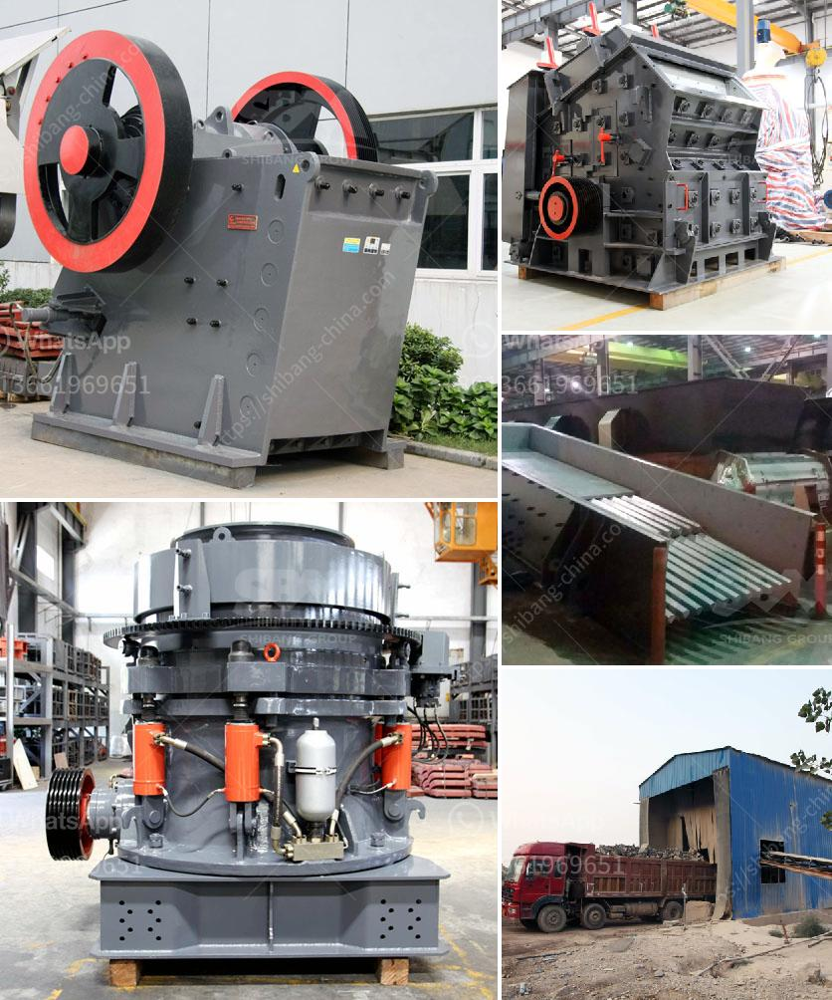

<h3>ball mill manufacturers in bangalore</h3>
Ball mill manufacturers in Bangalore provide prompt and efficient solutions to the customers in the mining and construction industry. Owned and operated by professionals with experience ranging from three to five decades, they specialize in manufacturing different types of ball mills. Crucial equipment for grinding after materials are crushed, these mills are widely used in the manufacturing industries such as cement, silicate, new building material, refractory material, fertilizer, ferrous metal, nonferrous metal, and glass ceramics.

One of the most influential ball mill manufacturers in Bangalore is PROMAC Engineering Industries Limited. Established in 1972, their specialization in cement, mining, and power equipment has helped them become one of the leading manufacturers in the country. The company is backed by a team of experienced professionals who work diligently to deliver quality products to their customers.

PROMAC's ball mills are manufactured with high-quality construction materials and provide excellent performance for a long period. They have a reputation for being reliable machines that require minimal maintenance. With a focus on energy-efficiency, PROMAC constantly strives to develop innovative technologies that reduce power consumption while maximizing production output. This commitment to sustainability has made them a preferred choice for many industries.

Another prominent manufacturer in Bangalore is BHEL. Known for its long-standing history in power generation equipment, BHEL also produces ball mills for various industries. With a track record of delivering high-performance machinery, BHEL ensures that its mills meet international quality standards.

Besides PROMAC and BHEL, there are several other ball mill manufacturers in Bangalore. A few noteworthy ones are Mithra Enterprises, Emtex Machinery Private Limited, and Diamond Group. These companies also provide exceptional products with efficient performance and durability.

When choosing a ball mill manufacturer, it is essential to consider the reputation, research and development capabilities, after-sales service, and customer reviews. Manufacturers with a strong track record of delivering high-quality products and committed customer service are the ones to look out for. Additionally, companies with a strong focus on innovation and energy efficiency are preferred, as they offer solutions that align with the industry's sustainability goals.

It is an established fact that ball mill manufacturers in Bangalore contribute significantly to the growth and development of various industries. Their innovative machines are instrumental in processing raw materials, enhancing productivity, and achieving desired product outcomes. These manufacturers play a crucial role in the overall progress of the country's economy.

In conclusion, ball mill manufacturers in Bangalore are providing top-quality machinery and equipment that cater to the diverse needs of the mining and construction industry. These products are appreciated for their high reliability and durability. With technological advancements and a commitment to sustainability, these manufacturers continue to be a driving force in the industry, ensuring steady growth and development.
<h3>Contact us</h3><ul><li><strong>Whatsapp:&nbsp;<a href="https://wa.me/8613661969651">+8613661969651</a></strong></li><li><a href="https://swt.shibang-china.com/?git&amp;zhl&amp;ball mill manufacturers in bangalore"><strong>Online Service(chat now)</strong></a></li></ul><h3>Related</h3><ul><li><a href='how to make industrial talcum powder.md'>how to make industrial talcum powder</a></li><li><a href='working principle of ball mill pdf.md'>working principle of ball mill pdf</a></li><li><a href='business plan on manganese ore mining crusher.md'>business plan on manganese ore mining crusher</a></li><li><a href='gravel wash plant for sale.md'>gravel wash plant for sale</a></li><li><a href='tractor mounted rock crusher uk.md'>tractor mounted rock crusher uk</a></li></ul>