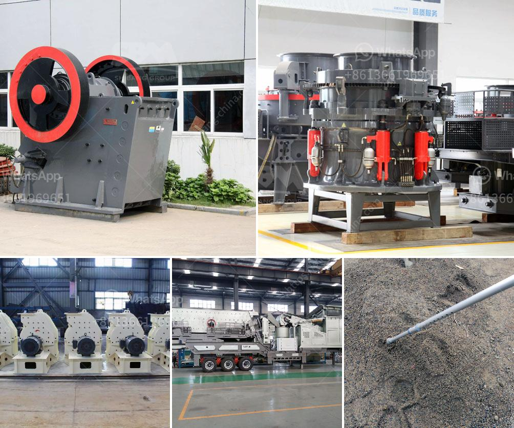

<h3>ball mill manufacturers in pune</h3>
Ball mill manufacturers in Pune are increasingly showcasing their products in the global market. These companies are introducing new, advanced machinery to cater to the growing demands of the construction industry. As the population continues to rise, the need for infrastructure development also increases. This has bolstered the demand for ball mills, which are widely used in the construction and manufacturing sectors.

Ball mills are cylindrical devices used to grind materials like chemicals, ceramics, minerals, and paints. These machines are essential in industries such as construction, mining, and pharmaceuticals. The technology used in ball mills has evolved over the years to ensure enhanced grinding efficiency, accuracy, and smooth operations.

Pune, a city known for its industrial prowess, is home to reputed ball mill manufacturers. These manufacturers have established state-of-the-art manufacturing units to deliver high-quality ball mills that meet international standards. They continuously invest in research and development to incorporate advanced features and improve the overall performance of their products.

One of the key advantages of purchasing ball mills from Pune-based manufacturers is that they offer customized solutions. These manufacturers collaborate with their clients to understand their specific requirements and design and manufacture ball mills accordingly. This ensures that clients receive machines that are tailor-made to meet their unique needs.

In addition to customized solutions, ball mill manufacturers in Pune also provide excellent after-sales support. They offer services such as maintenance, repairs, and spare parts supply to ensure that their customers' machines are always in optimal working condition.

Furthermore, these manufacturers prioritize sustainability by incorporating environmentally friendly practices into their production processes. They adopt advanced technologies to minimize waste generation and optimize energy consumption.

To stay ahead in the market, ball mill manufacturers in Pune constantly upgrade their manufacturing facilities, invest in research and development, and strive to provide innovative and cutting-edge solutions to their customers. With their dedication to quality and customer satisfaction, these manufacturers are contributing significantly to the growth and development of various industries, both locally and globally.
<h3>Contact us</h3><ul><li><strong>Whatsapp:&nbsp;<a href="https://wa.me/8613661969651">+8613661969651</a></strong></li><li><a href="https://swt.shibang-china.com/?git&amp;zhl&amp;ball mill manufacturers in pune"><strong>Online Service(chat now)</strong></a></li></ul><h3>Related</h3><ul><li><a href='aggregates crushing flow chart process.md'>aggregates crushing flow chart process</a></li><li><a href='component of jaw crusher.md'>component of jaw crusher</a></li><li><a href='stone crushing machines for sale in philippines.md'>stone crushing machines for sale in philippines</a></li><li><a href='coal washing plant for sale grinding mill china.md'>coal washing plant for sale grinding mill china</a></li><li><a href='rock quarry crusher machinery.md'>rock quarry crusher machinery</a></li></ul>