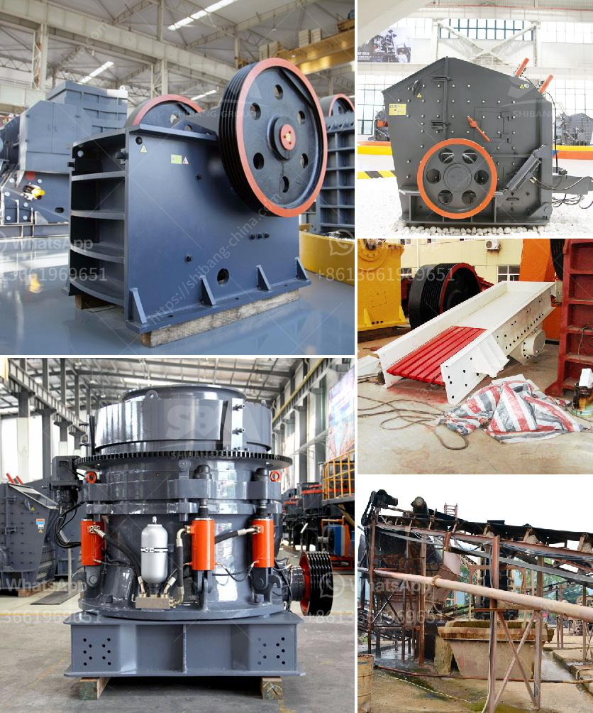

<h3>ball mill material of construction</h3>
A ball mill is a type of grinding equipment used to finely grind materials. Its construction involves a cylindrical shell filled with grinding medium (balls). The main component of this medium is steel, which often provides additional strength to the grinding balls. In some cases, ceramic or rubber materials are added to the mixture to enhance the process even further.

The choice of material for the construction of a ball mill depends on various factors, including the type of material being ground, its hardness, and its abrasiveness. Steel is generally the preferred material because of its cost-effectiveness and durability. High-quality steel balls are resistant to wear and deformation, ensuring that the grinding process remains efficient and consistent over time.

Ceramic materials, such as alumina or zirconium oxide, are sometimes used as an alternative to steel. These materials offer superior resistance to wear and abrasion, making them ideal for grinding certain types of minerals or chemicals that would otherwise damage steel balls. However, ceramic balls often come at a higher cost and are more fragile, requiring careful handling and storage.

Rubber materials may also be used in ball mill construction, particularly for processes that involve the blending or mixing of liquids or pastes rather than solid materials. Rubber lining can help minimize contamination and prevent corrosion in such applications.

In summary, the choice of ball mill material of construction relies on the specific requirements of the grinding process. While steel is the most commonly used material due to its cost-effectiveness and durability, ceramic and rubber materials may be employed in specific applications where their unique properties offer advantages. Ultimately, the goal is to select a material that ensures efficient grinding and extends the lifespan of the ball mill.
<h3>Contact us</h3><ul><li><strong>Whatsapp:&nbsp;<a href="https://wa.me/8613661969651">+8613661969651</a></strong></li><li><a href="https://swt.shibang-china.com/?git&amp;zhl&amp;ball mill material of construction"><strong>Online Service(chat now)</strong></a></li></ul><h3>Related</h3><ul><li><a href='micro powder grinding mill scm series.md'>micro powder grinding mill scm series</a></li><li><a href='crawler portable crusher.md'>crawler portable crusher</a></li><li><a href='used stone crusher machine for sale in philippines.md'>used stone crusher machine for sale in philippines</a></li><li><a href='iron processing machine price.md'>iron processing machine price</a></li><li><a href='crushers mobile crushers american mobile.md'>crushers mobile crushers american mobile</a></li></ul>