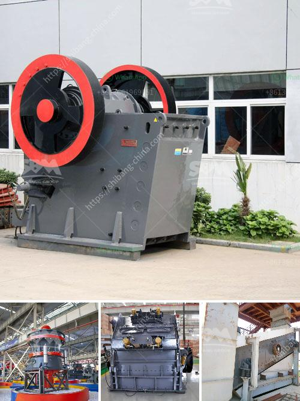

<h3>ball mill process</h3>
The ball mill is one of the most common equipment items in a mineral processing plant. Its job, to grind rock by tumbling it in a large metal cylinder loaded with steel balls, is highly energy-intensive. In fact, the cost of grinding in a mining operation represents a significant proportion of the total energy cost. One way of fully utilizing a ball mill is to convert it from an overflow to a grate discharge.

Considerable operational gains can be achieved by increasing the efficiency of the grinding circuit. Cement ball mills typically have two grinding chambers. The first chamber is filled with larger diameter grinding media and lined with lifting liners. The first chamber coarse-grinds the feed material and prepares it for the second chamber. The second chamber is the fine grinding chamber.

It is lined with classifying-type mill shell liners and provided with finer ball charge. Classifying liners ensure that the ball charge is segregated along the length of the chamber, keeping larger grinding media at the beginning of the compartment and smaller media towards the end of the chamber. An intermediate partition, called the diaphragm, keeps the grinding media in the second chamber, allowing the discharge of finely ground material.

The tromp curve is an important tool in understanding the ball mill grinding circuit. The tromp curve shows the particle size distribution of the mills' products as a function of the separator's rotor speed and air flow rate. The curve indicates the probability of particle classification by the two separators with varying cut sizes. For mills operated below the critical speed, due to the centrifugation principle, the particles tend to be discharged nearly as soon as they enter the diaphragm. This results in a narrower size distribution curve and an optimal fine grinding performance.

Ball mills can be used to grind ceramic material, crystalline compounds, and even some metals. Safety is a concern, as milling some materials generate dust and have hazardous reactions. High-speed ball milling is used to cut powder particles in a slurry. High-energy ball milling, also called mechanical alloying, can successfully produce fine, uniform dispersions of oxide particles in nickel-base super alloys that cannot be made by conventional powder metallurgy methods.

The application of ball mills in the field of mineral processing has been steadily increasing due to their simplicity and ease of operation. Added to this, is the increasing demand for energy-efficient equipment in the industry. Many various ball mill designs exist and there are several key factors to consider when selecting a mineral processing method. These factors include the feed size, product size, and the required production capacity.

The ball mill process is very complicated process governed by many parameters, such as ball size, ball shape, ball filling, slurry loading (with respect to ball amount), powder loading with respect to the amount of total slurry (slurry viscosity), and rotation speed. The detailed analysis of the ball mill process is as follows:

First, the tumbling ball mill has been used to grind mercury subsequent samples of ore. The ball mill is a rotating cylindrical crushing device which contains steel balls which fragment the embedded ore. A series of conveyor belts continuously feed the ore into the mill. The balls inside the mill are in motion, grinding the ore. After the mining the ore is further crushed and ground into fine particles in rotating mills and then transferred into various tanks known as flotation cells. Chemicals are added to the crushed ore to separate the valuable minerals from the waste rock by chemical reactions.

Second, metal balls are already starting to used by the grinding process of ball mill. Ball mill is an important grinding equipment in the beneficiation production line, and it is also an indispensable equipment in the metallurgical industry. When purchasing the ball mill, the user must choose the corresponding type and specification according to the actual production demand and the quantity of the beneficiation unit within the planned period.

Overall, the ball mill process is a reliable and effective method of producing materials with a consistent particle size distribution. It is also capable of manufacturing large quantities of materials in a relatively short period of time. Whether your requirement is grinding powders for pigments or large-scale pharmaceutical manufacturing, ball mills can tackle a wide range of applications.
<h3>Contact us</h3><ul><li><strong>Whatsapp:&nbsp;<a href="https://wa.me/8613661969651">+8613661969651</a></strong></li><li><a href="https://swt.shibang-china.com/?git&amp;zhl&amp;ball mill process"><strong>Online Service(chat now)</strong></a></li></ul><h3>Related</h3><ul><li><a href='kenya sellers of used stone crushers.md'>kenya sellers of used stone crushers</a></li><li><a href='how to increase capacity of cement ball mill.md'>how to increase capacity of cement ball mill</a></li><li><a href='cone crusher manufacturers china.md'>cone crusher manufacturers china</a></li><li><a href='lime stone crusher.md'>lime stone crusher</a></li><li><a href='calcium carbonate plant contractors.md'>calcium carbonate plant contractors</a></li></ul>