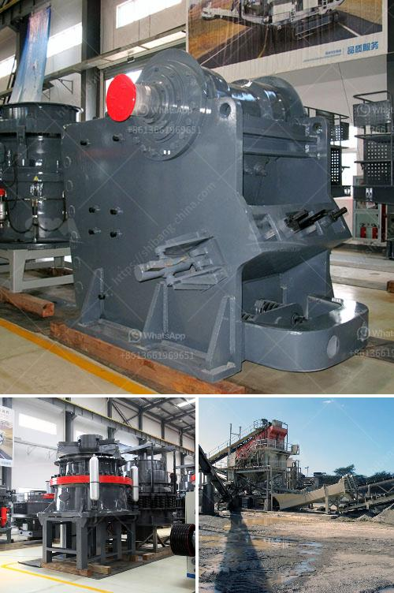

<h3>ball mill specification</h3>
Ball mill is a kind of grinding equipment, which is commonly used in ore dressing process. After having crushed the ore, materials will be sent to ball mill for grinding. Ball grinding mill can conduct wet or dry grinding, hence, it can be divided into wet ball mill and dry ball mill. According to different discharging methods, ball mill can be divided into overflow ball mill and grid ball mill.

Since the mill use advanced control system, it can realize remote control. With its smart operation, it can greatly reduce the worker's labor intensity and improve work efficiency. In addition, ball mill uses rubber/ceramic liner, which has a long service life and stable performance. It can be produced by liner manufacturers to prolong the service life of the liner to ensure the normal operation of the ball mill.

Ball mill is an important equipment in grinding operation, and the quality of steel ball and the lining plate directly determines the grinding efficiency and service life of the equipment. However, there is a lack of unified specification for ball mill in the market. Different ball mill manufacturers produce ball mills with different specifications. The specifications of the ball mill mainly include feeding size, output, and discharge size, etc.

The specifications of the ball mill will be different according to the ore grinding process and operation modes. For example, wet ball mill dry ball mill overflow ball mill energy saving ball mill etc. However, the maximum ball diameter will vary according to the specific type of ball mill, and the maximum ball diameter is usually selected by determining the ball diameter according to the size of the ore block and the grinding requirements. The ball diameter is generally determined by the following formula:

Generally, it is not appropriate to use a grinding ball with a diameter less than 5% less than the maximum size of the ball mill in order to effectively reduce the consumption of steel balls. However, due to the grinding material, hardness, ore size, ore hardness, etc. The ball diameter of the ball mill will affect the proportion of steel balls in the ball mill, and the ratio of the steel ball will affect the grinding capacity of the ball mill.

In summary, ball mill specifications are crucial aspects in the production process because it is a vital tool for grinding various materials into powder. However, there are as yet no general specifications outlining the dimensions, materials, or other features of ball mills, thus facilitating a wide variety of usage scenarios. Therefore, when purchasing a ball mill, it is important to carefully consider the specific requirements of the production process and select an appropriate model that meets those requirements.
<h3>Contact us</h3><ul><li><strong>Whatsapp:&nbsp;<a href="https://wa.me/8613661969651">+8613661969651</a></strong></li><li><a href="https://swt.shibang-china.com/?git&amp;zhl&amp;ball mill specification"><strong>Online Service(chat now)</strong></a></li></ul><h3>Related</h3><ul><li><a href='what is the meaning of 100tph in crusher crusher.md'>what is the meaning of 100tph in crusher crusher</a></li><li><a href='pe 500 750 jaw crusher price.md'>pe 500 750 jaw crusher price</a></li><li><a href='mining hammer mill suppliers.md'>mining hammer mill suppliers</a></li><li><a href='iron ore crusher cost.md'>iron ore crusher cost</a></li><li><a href='price of mini cement plant india.md'>price of mini cement plant india</a></li></ul>