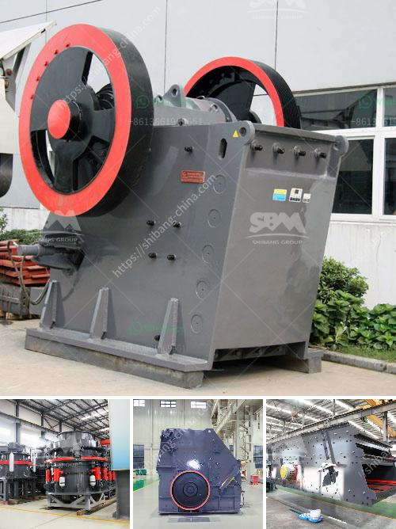

<h3>ball mill suppliers usa</h3>
Ball mills are a fundamental part of the manufacturing industry in the USA as well as around the world. Ball mills crush material into various sizes and extract resources from mined materials. Pebble mills are a type of ball mill and are also used to reduce the size of hard materials, down to 1 micron or less.

Ball mill suppliers in the USA provide machinery and equipment used in the mining industry, including customized ball mills specifically engineered for different applications. These ball mills can be used for both wet and dry grinding operations, making them a crucial piece of equipment in many industries.

One industry that benefits from the expertise of ball mill suppliers in the USA is the pharmaceutical industry. Mills used in the pharmaceutical industry are specially designed to effectively mix and homogenize substances, ensuring the quality and safety of pharmaceutical products. For instance, manufacturers rely on ball mills to achieve particle size reduction and blend materials properly, allowing for the creation of consistent and high-quality medications.

Ball mills are also extensively used in the construction materials industry. These mills are capable of producing a wide range of materials used in the construction of buildings, roads, bridges, and other infrastructure projects. Ball mill suppliers in the USA understand the demands of the construction industry and produce mills that can efficiently grind and mix construction materials, enabling the creation of durable and reliable structures.

In addition to pharmaceuticals and construction, ball mills are essential in other industries such as chemical manufacturing, food processing, and ceramics. The versatility of ball mills allows for their use in a myriad of applications, making them an indispensable tool for manufacturers across different sectors.

When choosing a ball mill supplier in the USA, it is essential to consider their experience, reputation, and the quality of their products. Established suppliers have a wealth of knowledge and experience, providing reliable and efficient equipment tailored to meet specific industry requirements. These suppliers also offer after-sales services, maintenance, and technical support, ensuring the smooth operation of the ball mills throughout their lifespan.

In conclusion, ball mill suppliers in the USA play a vital role in various industries, providing high-quality equipment that helps manufacturers achieve their production goals. Whether it's for pharmaceuticals, construction materials, or other applications, these ball mills are a reliable and efficient solution trusted by manufacturers worldwide.
<h3>Contact us</h3><ul><li><strong>Whatsapp:&nbsp;<a href="https://wa.me/8613661969651">+8613661969651</a></strong></li><li><a href="https://swt.shibang-china.com/?git&amp;zhl&amp;ball mill suppliers usa"><strong>Online Service(chat now)</strong></a></li></ul><h3>Related</h3><ul><li><a href='100tph stone crushing and screening plant.md'>100tph stone crushing and screening plant</a></li><li><a href='coltan processing plant prices.md'>coltan processing plant prices</a></li><li><a href='crushing and screening rustenburg.md'>crushing and screening rustenburg</a></li><li><a href='china cone crushers.md'>china cone crushers</a></li><li><a href='machine de lavage a lattrition du sable de silice.md'>machine de lavage a lattrition du sable de silice</a></li></ul>