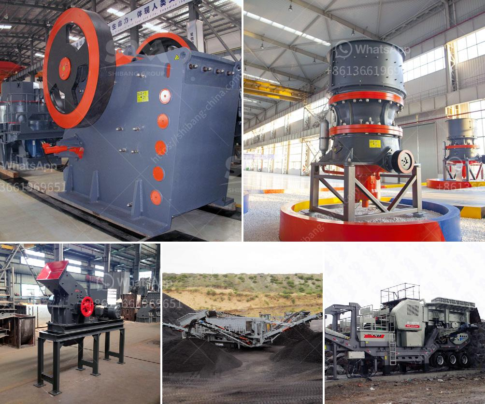

<h3>ball mill tons per hour</h3>
A ball mill is a grinding machine that is used to crush and mix materials into fine particles. It consists of a hollow cylinder that rotates on its axis, and it is filled with the grinding media (balls) which are not only used to grind but also to mix materials. The ball mill has a cylindrical working chamber that is positioned at an angle and is partially filled with grinding media. As the cylinder rotates, the materials inside are lifted to a certain height and then dropped, resulting in a cascading effect that grinds the materials into fine particles.

When it comes to the ball mill's efficiency, one of the key factors is the tons per hour (TPH) capacity of the machine. The grinding capacity of a ball mill is determined by the amount of material to be ground and the amount of grinding media required. The higher the TPH capacity, the more materials the mill can grind at a time, which therefore increases its efficiency.

A ball mill with a TPH capacity of 100-300 means that the mill can process 100-300 tons of raw material every hour. From the feed to the discharge end, the mill grinds and crushes the materials into the desired size. A TPH capacity gives the mill ample power to handle larger and harder materials.

The longer a ball mill operates, the more particles will be produced within the desired size range. With a higher TPH capacity, the mill can process more material, producing a larger output per hour. This higher production rate can translate into increased profitability for the mill's operator, as more products can be produced and sold.

In conclusion, the TPH capacity of a ball mill is a crucial factor in determining its efficiency and productivity. A higher capacity allows for a higher grinding rate, resulting in more materials being ground and crushed per hour. This ultimately translates into improved profitability for the mill's operator.
<h3>Contact us</h3><ul><li><strong>Whatsapp:&nbsp;<a href="https://wa.me/8613661969651">+8613661969651</a></strong></li><li><a href="https://swt.shibang-china.com/?git&amp;zhl&amp;ball mill tons per hour"><strong>Online Service(chat now)</strong></a></li></ul><h3>Related</h3><ul><li><a href='cost of setting up a limestone processing unit.md'>cost of setting up a limestone processing unit</a></li><li><a href='how to increase capacity of cement ball mill.md'>how to increase capacity of cement ball mill</a></li><li><a href='cement grinding station quotations.md'>cement grinding station quotations</a></li><li><a href='large scale gold mining equipment for sale.md'>large scale gold mining equipment for sale</a></li><li><a href='ball mill process.md'>ball mill process</a></li></ul>