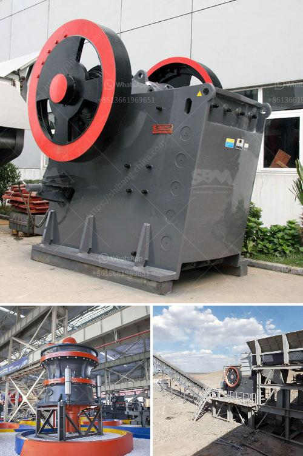

<h3>ball mill turkey fabricant</h3>
Ball mill Turkey fabricant is a professional manufacturer of grinding mills and stone crushers. With more than 20 years of experience in this industry, they have established a distinct reputation for delivering high-quality machinery at competitive prices.

Ball mills are a type of grinding mill used to reduce the size of bulk materials into fine particles. These machines consist of a rotating cylinder filled with steel balls that grind the material as the cylinder rotates. The ground material is then discharged through an outlet, while the grinding balls are retained within the mill and are re-circulated for further grinding.

One of the key advantages of ball mills is their versatility. They can be used for both dry and wet grinding applications, making them suitable for various industries such as cement, mining, and pharmaceuticals. Additionally, ball mills can be used to grind materials of all hardness levels, from soft to extremely hard.

Ball mill Turkey fabricant offers a wide range of ball mills designed to meet specific customer requirements. They have a team of skilled engineers who work closely with clients to understand their needs and provide customized solutions. This ensures that customers get the most efficient and cost-effective grinding solutions for their applications.

Furthermore, quality is a top priority for ball mill Turkey fabricant. They use high-grade materials and advanced manufacturing techniques to produce durable and reliable machinery. Each ball mill undergoes rigorous quality control checks to ensure its performance and longevity.

In addition to manufacturing ball mills, ball mill Turkey fabricant also provides comprehensive after-sales support. Their team of technicians is available to assist with installation, maintenance, and troubleshooting, ensuring that customers have a smooth and hassle-free experience with their equipment.

Overall, ball mill Turkey fabricant is a trusted and reliable choice for those in need of grinding solutions. Their dedication to quality, customization, and customer satisfaction sets them apart from the competition. Whether you require a standard ball mill or a tailored solution, their experienced team is there to assist you every step of the way.
<h3>Contact us</h3><ul><li><strong>Whatsapp:&nbsp;<a href="https://wa.me/8613661969651">+8613661969651</a></strong></li><li><a href="https://swt.shibang-china.com/?git&amp;zhl&amp;ball mill turkey fabricant"><strong>Online Service(chat now)</strong></a></li></ul><h3>Related</h3><ul><li><a href='crusher plant in nigeria pakistan.md'>crusher plant in nigeria pakistan</a></li><li><a href='copper crusher supplier.md'>copper crusher supplier</a></li><li><a href='biggest cone crusher in africa.md'>biggest cone crusher in africa</a></li><li><a href='jaw crusher maharashtra.md'>jaw crusher maharashtra</a></li><li><a href='100tph stone crushing and screening plant.md'>100tph stone crushing and screening plant</a></li></ul>