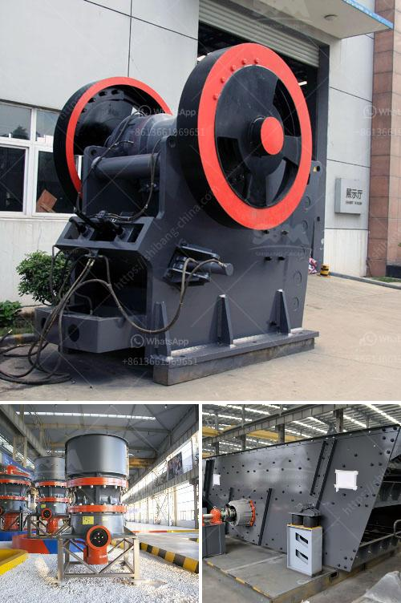

<h3>ball mills for 10 tons of ore</h3>
Ball mills are industrial equipment used to grind materials into fine powders. They are widely utilized in the mining industry to extract valuable metals from the ores. In this article, we will discuss the importance of ball mills in the ore processing and how they efficiently handle large capacities.

Ball mills play a vital role in the extraction of ores from mines by grinding the ore into a fine powder. This powder is then used for further processing, such as separating valuable minerals from the waste materials. The size reduction of the ore particles is achieved by the impact and attrition between the grinding balls and the ore particles.

When it comes to processing a large amount of ore, ball mills are the preferred choice due to their ability to handle tons of material efficiently. With a capacity of up to 10 tons of ore, ball mills provide ample processing capacity to reduce the ore to the desired size. The size of the grinding media, the charge of balls, and the rotational speed of the mill all impact the grinding efficiency and the final product size.

The design of ball mills allows for easy and effective loading and unloading of the ore. The ore is fed into the mill through a hollow cylindrical shell, and the grinding media are added to the mill to assist with the grinding process. As the mill rotates, the grinding media crush and grind the ore into a fine powder.

To ensure optimal performance and reduce maintenance requirements, ball mills are equipped with liners that protect the inner shell from the abrasive ore particles and extend the mill's lifespan. These liners are made from rubber or steel and are designed to withstand the harsh conditions of the grinding process.

Ball mills are also equipped with various mechanisms to control the size of the final product. The discharge, or the ground material, is screened to separate the desired product from the oversized particles, which are then returned to the mill for further grinding. This process allows for the extraction of valuable minerals while minimizing the production of fine particles.

In conclusion, ball mills are essential equipment in the ore processing industry, particularly for large-scale operations. Their ability to handle tons of ore efficiently allows for the extraction of valuable minerals from the ores. The grinding process, assisted by grinding media and liners, reduces the ore to a fine powder. Furthermore, the control mechanisms ensure the production of the desired product size. Overall, ball mills are a reliable and efficient solution for processing large quantities of ore.
<h3>Contact us</h3><ul><li><strong>Whatsapp:&nbsp;<a href="https://wa.me/8613661969651">+8613661969651</a></strong></li><li><a href="https://swt.shibang-china.com/?git&amp;zhl&amp;ball mills for 10 tons of ore"><strong>Online Service(chat now)</strong></a></li></ul><h3>Related</h3><ul><li><a href='how much cost to establish stone crusher south africa.md'>how much cost to establish stone crusher south africa</a></li><li><a href='howhow to set up a stone crushing business.md'>howhow to set up a stone crushing business</a></li><li><a href='hand crank oyster shell crusher.md'>hand crank oyster shell crusher</a></li><li><a href='grind limestone to 60 mesh.md'>grind limestone to 60 mesh</a></li><li><a href='indonesia coal screen machine.md'>indonesia coal screen machine</a></li></ul>